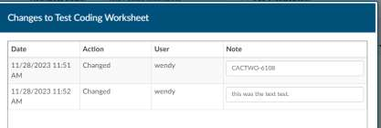
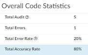

+++
title = 'V2.53 (Dec 2023)'
+++



### New Module (Enhancement)

**Add CDI/Clinical Alerts Module**

The software has a feature called CDI/Clinical Alerts which are automated messages
generated by the software that can be used to prioritize your CDI workflow.
CDI/Clinical Alerts are used to detect potential inaccuracies, inconsistencies and or
discrepancies in clinical documentation. These Alerts help CDI teams to
prioritize the charts based on potential query opportunities available.

The software provides real-time Alerts when potential query opportunities
are identified. Which will then allow CDI staff to prioritize charts based upon
those potential opportunities.

CDI/Clinical Alerts can also be used by coding and auditing charts where CDI did not
review the chart.

> [!note] Contact SME for more information
If you are upgrading, please contact Dolbey’s SME Team for more information on purchasing and 
enabling this feature.

## CACTWO-5378 (Enhancement)

**Allow multiple Denials to be added to a single account**

The Denial Management viewer will now allow multiple sheets to be created.
Sheets can also be deleted via a red X to the right of each Denial heading.
When reporting in Account Search, a new Denials drilldown is available, but it
will only report on the first Denial on each account.

## CACTWO-5423 (Enhancement)

**Add Pending Reasons to Discharge Not Final Coded user report**

A new column for pending reasons has been added to the Discharge Not Final
Coded user report. If there are multiple pending reasons, they will be
separated by a comma.

## CACTWO-5446 (Important)

**Recalculate query counts when saving an account**

Currently, if a user was in an account that had an open physician query, and
an external interface closed that query, the count on the Account List for the
Query Total would still show the query open. This has been changed so that
the query total on the account is updated upon closing the account.

## CACTWO-5481 (Enhancement)

**Users with multiple roles would like column orders to be maintained**

Currently, if a user has multiple roles (e.g., Coder, Auditor, CDI Specialist),
when the columns are changed for one role, the other roles are automatically
set to match. This has been changed so that column changes for Account List,
Charges and Transaction Viewers, and Medication viewers can now all be
unique to each role.

## CACTWO-5537 (Enhancement)

**Allow physician field when embedded on physician query to display**

automatically
A new field option has been added to Form Designer under the +Add Field
selection.. If the Physician field is added to a Physician Query, then the
physician that is assigned will automatically show in that field.

## CACTWO-5667 (Enhancement)

**Add Auditor to ‘run for’ on Scheduled Reports**

The ‘run for’ field in Scheduled Reports will now show an ‘Auditor Only’ option
for these reports:

- Outstanding Queries
- Query Impact Report
- Query Impact by Discharge Date
- Query TAT by Author Report
- Query Template Volume Overview
- Query Template Volume by Discharge Date
- User Session Log

## CACTWO-5873 (Enhancement)

**Display the document author in hover over on Documents pane**

A hover over will now display on the documents pane to provide the author
of the document if it is sent from the interface.

## CACTWO-5955 (Enhancement)

**Allow Validation Rule to add a Pending Reason**

In Validation Management, a new field has been added to the rules that are
created called Pending Reason. This field will have a dropdown with all
available pending reasons. If a rule is triggered on an account and it has a
pending reason attached, then the pending reason will be added and the user
will be able to see the number of the rule. Pending reasons that have a
physician or date requirement will NOT be available in this list. The only way
to remove a pending reason that was added by a rule is to have that rule
cleared.

## CACTWO-5964 (Enhancement)

**Allow Document Search box to be resized**

In an account, when the Document Search is opened, the box can now be
resized by grabbing and pulling the lower right corner.

## CACTWO-5972 (Enhancement)

**Add zoom in and out ability to text based documents**

The ability to zoom in and out has been added as a right click option in
documents, both on the main page and a pop out. This new zoom feature will
work for Chrome and Edge users. When a user selects a zoom level, that level
will be retained for all documents and the last zoom used before log out is the
zoom level the user will get when they sign back in.

## CACTWO-6041 (Enhancement)

**Add Provider Name and Date to the document viewer header**

If there is a physician name and date of service that is sent on the interface
for a document, the physician name and date will now show in the document
viewer header, on the popout, and in the Ctrl+ click of the header.

## CACTWO-6098 (Enhancement)

**Highlight Navigation Tree if Query draft exists**

The Physicians & Queries viewer on the Navigation Tree will now show with
an amber highlight if there is a Query Draft. When the draft is either updated
and sent or deleted, the amber color will go away.

## CACTWO-6107 (Enhancement)

**On HCC codes, display HCC version to support V24 and v28**

A code that is followed by an HCC indicator in account detail will now display
the version of HCC for calendar year 2023 (retroactively) and 2024 when the
user hovers over the H in the Assigned Codes panel. On the Final Code
Summary and the Working CDI History viewer, the code’s HCC designation will
show the HCC number and its version.

## CACTWO-6108 (Enhancement)

**Allow history on changes in Form Designer**

Form Designer will now create a history for changes made in Form Designer.
Once a change is made on a form and saved, a Show History button will show
in the top right of the worksheet. Clicking on it will bring up a notes box
allowing for the end user to make a note as to the change, this function like
the Workflow Management viewer notes.

## CACTWO-6115 (Enhancement)

**Add more fields to Denial Management viewer**

Additional fields for a 3rd appeal and extra DRG information have been added
to the Denial Management viewer. These fields can also be added to Grid
Maintenance.

## CACTWO-6117 (Enhancement)

**Allow all stratums for PSI 04 quality indicators to show in Code Summary**

In the Algorithm for Quality Indicators section of the Code Summary viewer,
only the first PSI 04 indicator is displaying. This has been updated to show all
5 of the indicators.

## CACTWO-6118 (Important)

**CDI Activity Report grand total line is incorrect if users are filtered**

If the CDI Activity Report is being filtered to just one user, the Grand Total line
is showing the total for all users instead of just the one filtered. This has been
corrected.

## CACTWO-6120 (Important)

**OR groups are not showing in new Workflow Management page**

If an OR group is added to workgroup level criteria, it is not appearing within
each criteria group. This has been corrected.

## CACTWO-6122 (Important)

**Audit Management error rate not being reported correctly in reports**

The following reports were not calculating the Audit Management error rate
correctly. They have been corrected.

- Audit Executive Summary
- Inpatient Auditor Productivity
- Inpatient Coder Scorecard
- Outpatient Audit Scorecard
- Outpatient Auditor Productivity
- Outpatient Coder Scorecard

## CACTWO-6125 (Important)

**CDI Activity Report is not reporting Reconciliation correctly**

The CDI Activity Report was reporting a DRG Reconciliation if an account set
for DRG Reconciliation was opened, but then canceled out. This has been
corrected so that accts canceled will no longer be included.

## CACTWO-6126 (Enhancement)

**Allow Users to be excluded from the Inactivity prompt**

New funcitonality has been added so that Role Management now contains an
option to exclude a role type from being triggered.

## CACTWO-6135 (Enhancement)

**Allow Flowsheet to save the collapse function**

If a user collapses or uncollapses a major category on the Flowsheet viewer,
that configuration will remain for all accounts that have the Flowsheet viewer.
Note that if a user collapses/uncollapses a major category in the pop out, it
will not be seen on the main page until the user moves to a different viewer
and back.

## CACTWO-6136 (Important)

**Auditor Physician Query Draft line is not showing on Dashboard**

If an auditor, CDI specialist, or coder has at least one query draft but no sent
queries, the total drafts count will now appear for the role with the open
queries, unanswered, and answer counts displaying as zero on the dashboard.

## CACTWO-6144 (Enhancement)

**Show friendly values in Workflow dropdowns**

Currently the new Workflow Management page is not showing the friendly
value for criteria of a property with a mapping. This has been changed to
show the friendly value, just like the classic Workflow Management page.

## CACTWO-6146 (Important)

**3M is opening another instance when opening a dashboard drilldown**

If a user opens a dashboard drilldown, another window with 3M is opened.
This has been corrected so that there is only ever one 3M open.

> [!info] 3M Web Component Users Only
This fix is only applicable for 3M Web Component users.

## CACTWO-6147 (Enhancement)

**Hide Visit reason fields if there are none on the account**

The Audit Management Worksheet viewer will no longer show all of the Visit
Reason fields if there are no visit reasons on the account left by the coder or
the auditor. If a visit reason is added by the auditor during the audit process,
the Visit Reason fields will open up when the auditor clicks the Update Codes
button.

## CACTWO-6150 (Important)

**Reports are not properly counting intial reviews of accounts**

If a CDI Specialist creates a Baseline DRG (the first Working DRG), then edits
the account further causing the Working DRG to be cleared, and then saves
the account without computing a new Working DRG, the creation of the
Baseline DRG now counts as an initial review.

## CACTWO-6181 (Important)

**New Workflow Management page is holding Note text when it should clear**

Adding text into the Note field in a workgroup was resulting in that same text
appearing in every subsequent workflow This has been corrected.

## CACTWO-6188 (Important)

**Adding workflow is changing the workflow order in User Maintenance**

If new workflow is added to the new Workflow Management page, the users
attached to that workflow are having their order in the User Management
profile change. This has been corrected so that any newly added workflow
will go to the end of the list in the new Workflow Management page and the
User Management profile.

## CACTWO-6195 (Important)

**Reporting is not calculating manually added codes properly**

Two user reports (Coder Suggestion Use by Coder and Engine Results by
Documents) were not calculating codes added manually. This has been
corrected.

## CACTWO-6201 (Enhancement)

**Allow Query to be created and closed in one step**

For customers who do not have a physician query interface and do not createa
physician query until a response is received, a query can now be created and
not sent. When enabled, a physician query will show a “Continue” button in
place of “Send”. Clicking the ‘Continue’ button will refresh the query to open
the physician response fields so that the query can then be closed. This is
common for Epic EHR customers.

> [!note] Additional Configuration Required
Please contact Support to enable this feature.

## CACTWO-6202 (Important)

**Improve performance of encoder calculations with several codes**

When a user performs an encoder computation, the red bar showing that an
encoder is open was taking a few seconds to disappear over the
Compute/Save/Submit buttons. This has been corrected so that it disappers
sooner.

## CACTWO-6204 (Enhancement)

**Update Audit reports to show blank for accuracy**

For the Inpatient Coder Scorecard and the Outpatient Coder Scorecard if there
are no CPT or PCS codes, the CPT Codes and PCS Codes accuracy columns will
now display as blank, rather than 100%.

## CACTWO-6205 (Enhancement)

**Make Accuracy rates stand out in the Audit Worksheet**

To make the accuracy rate lines stand out in the Audit Worksheet, the
backgrounds have been changed to show as light blue.

## CACTWO-6217 (Important)

**Field in worksheet showing as ‘Select an item’ when printed**

On worksheets, dropdowns prompting users to select an item were not
displaying the selection when that worksheet was printed. This has been
corrected.

## CACTWO-6224 (Enhancement)

**Allow DRG Reconcilation to compare DRG weight**

A new setting has been created that, when set to true, will compare DRG
weights as well as the DRG during reconciliation. By default, the comparing of
DRG Weights will be disabled.

> [!note] Additional Configuration Required
Please contact Support to implement this change.

## CACTWO-6225 (Important)

**Account Search not using ‘only contains’ properly with “Assigned Diagnosis with POA N” field**

Account Search will now correctly use the Only Contains criterion.

## CACTWO-6239 (Important)

**Code Suggestion by Coder report is not calculating correctly**

When a code is being added via 3M to an account that is then being
submitted, that code is not showing up in the Direct column of the From Other
Sources section of the Code Suggestion Use by Coder report. This has been
corrected.
