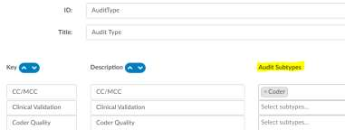
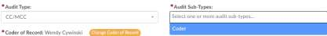
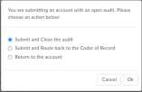
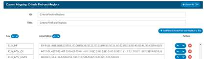
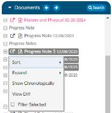
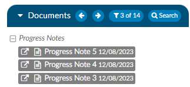
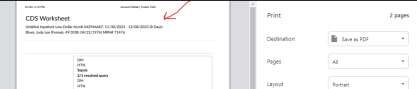
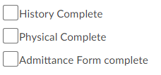
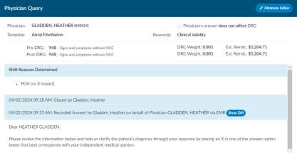
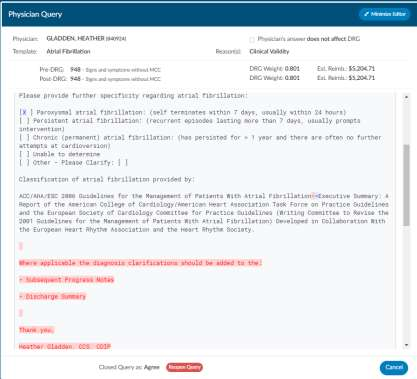

+++
title = 'V2.54'
+++



## CACTWO-5598 (Enhancement)

**Include new accounts when autoloading**

A new database setting has been created to allow a change to how auto-
loading works.

When set to true, if an account is added to a workgroup currently being
worked by a user with auto-load enabled and that new account has a
discharge date before the date of the account being worked, the next account
to autoload will be that new account, rather than the next account in the
workgroup list.

> [!note] Additional Configuration Required
Please contact CAC Support to enable this feature.

## CACTWO-5823 (Enhancement)

**Create symbols to identify Auditor code changes on Audit Worksheet**

The Audit Worksheet will display new symbols next to codes that were
changed between the Coder and Auditor.

- A green ‘plus’ sign indicates the code was added.
- A red ‘minus’ sign indicates the code was deleted.
- A orange up or down ‘arrow’ sign indicates the code location has been changed (ex. a primary and secondary are swapped.)

## CACTWO-5865 (Enhancement)

**Allow Audit Subtypes to be context sensitive based upon what audit type was selected**

A new column has been added to Mapping Configuration for the Auidt Type
mapping. This new Audit Subtype column will allow Administration to limit
the subtypes available for each Audit Type.

When an auditor then selects that Audit type in the Audit Worksheet, instead
of getting the full list of subtypes, the user will only see the subtypes allowed.

In this example, the Audit Type CC/MCC only has a subtype of Coder available,
so that is all that will show in the dropdown selection.

## CACTWO-6030 (Enhancement)

**Add a section for Rebills to the Audit Worksheet**

The end of the Audit Worksheet has been changed to allow for an Auditor to
ask if the audit requires a rebill.

When answered ‘Yes,’ the Auditor can additional record a date for a rebill.

## CACTWO-6033 (Enhancement)

**Allow auditor to submit and route to coder post audit**

An Auditor can now submit an account and either 1) submit and close the
audit, or 2) complete an audit on a chart, submit it as the auditor and then
route it back to the coder without the need to go back into the chart and route
it to the coder. This new box will appear when submitting an audit if the audit
isn’t closed yet and when doing so, will receive this new query box:

## CACTWO-6060 (Enhancement)

**Allow Audit worksheet to be printed**

A new print button at the top right of an audit worksheet will allow the
worksheet to be printed.

> [!note] Additional Configuration Required
Please contact CAC Support to enable printing

## CACTWO-6074 (Enhancement)

**Change the way Forced Autoload works**

Several changes have been made to how Forced Autoload lists to-do accounts
for the user.

- When a Forced Autoload user logs off (and does or does not close
the browser) and logs back in during the same calendar the
application will remember where the user left off and start the
autoload feed there. 

> [!info] Additional Configuration May Be Required
If you would like this changed back to the original ‘start from beginning upon launch
of ‘Go To Next Autoload’; please contact Support.

- If a user has a chart assigned directly to them while they are working
on an assigned list, that chart will be next in the autoload process.
When completed, the user will be taken back to where they left off
within the list they were working.
- If a support personnel re-assigns a chart to a workgroup that is
currently being worked by a forced autoload user and the chart’s
discharge date is older than the one the forced user is currently in,
when the user cancels/saves the account, the earlier chart wll be
next in the list. After the chart is completed, the list will resume
where the user left of

## CACTWO-6116 (Enhancement)

**Add Privilege in Role Management to allow a user to add an account note or bookmark and worksheet**

A new privilege, Edit Only Account Notes, Bookmarks, and Worksheets has
been created in Role Management to disallow any code work. When this
privilege, is checked, the role will be able to only add a Note or Bookmark to
a document, add and edit new worksheets, and add a comment on an
unassigned code. No coding work can be done.

## CACTWO-6168 (Enhancement)

**Allow lists to be attached to keys in Mapping Configuration**

A new Mapping Configuration has been created called
CriteriaFindAndReplace. Once that mapping is created, keys attached to lists
of items can be added. In Account Search,Workflow, and Scheduled Account
Searche, the key can be used after the operator of ‘In List’ or ‘Includes Any Of’
as applicable when creating criteria. The key will allow all items attached to
it to be considered in the equation.

For example, if a user wants to create a key for Elixhauser to be used for the
diagnosis codes within a group, they would add a key of Elixhuaser categories,
with the description being the comma separated list of each of the different
categories for example:

Then, in Account Search, Scheduled Account Search, or Workflow, the user
would use a criteria as shown below. CAC2 will look at ‘ELIX_HF` and apply
the criteria to all of the numbers listed in the Mapping description in the
equation.

If an account had a diagnosis code of I50.20, this criteria would pick it up, since
that code is associated with the key of ELIX_HF.

> [!important] Case Sensitive
This field is case sensitive. Criteria must match the case of the key in
Mappings.

> [!note] Elixhauser Mappings
For Elixhauser users, having the Elixhauser coding updated will
automatically create keys and descriptions for all Diagnosis Codes
associated with Elixhauser in this new mapping.

## CACTWO-6170 (Enhancement)

**Allow filtering of multiple documents in the Documents Viewer**

On an account, the user can now select multiple documents from the
Documents pane by using Shift+Left Click or Ctrl+ LeftClick, then right-clicking
to choose ‘Filter Selected’.

This will hide all unselected documents. A filter button will show in the panel
title showing the total number of documents along with what have been
filtered. In the below example, the account had 14 documents and was
filtered so that only 3 showed. When the filter button is clicked, hidden
documents will reappear. The filter can also be canceled by clicking on any
code in the Unassigned/All Code trees.

## CACTWO-6203 (Enhancement)

**Create error message when computing 3M with dates prior to Oct 1 2015**

Currently, TruCode™ displays a red error message if a user tries to compute a
DRG when an account has an Admit date, Discharge date, or Procedure Date
before October 1, 2015. This error has been extended to include
computations using 3M™.

> [!note] 3M™ Users Only
This feature applies to 3M Users Only

## CACTWO-6219 (Enhancement)

**Allow banner bar to be customizeable for printing**

The banner bar that is printed on the top of each of the document and/or
forms can now be customized.. Your site must allow for printing.

> [!info] Additional Configuration May Be Required
Contact CAC Support for customized `banner-print.html`

## CACTWO-6231 (Enhancement)

**Change size of checkbox in Form Designer**

When Checkbox is chosen as a field in a form in the Form Designer page, the
checkbox will now appear much larger in the document or query.

## CACTWO-6248 (Enhancement)

**Do not show Trauma section if not configured in the E&M Config within the E&M viewer**

If the "Trauma" section of E&M Configuration is configured with 0 or 1
options, then the Trauma section will not appear in the E&M Viewer for an
account where "IsEmergencyRoomVisit" is set to true.

## CACTWO-6251 (Enhancement)

**Add new CDI fields to be used for Workgroup Management sorting**

First and Last CDI Saver fields have been addedto the sort field options in
workflow management per workgroup. These will now show in the dropdown
of the Sort Field, under Properties of a Workgroup. This will allow for that
column to be sorted ascending or descending.

## CACTWO-6292 (Enhancement)

**Create new columns for query draft totals**

Three new fields have been created to show totals for queries in draft status.
Users can add the fields via Grid Column Configuration as needed.

- Physician Query Drafts
- CDI Physician Query Drafts
- Coder Physician Query Drafts

## CACTWO-6325 (Enhancement)

**Allow Physician Query to be quick closed with manual entry**

A new button has been added to the Physician Query viewer. After adding
a manual query response, a user can click Quick Complete, to complete
without having to send the query to the Physician.

## CACTWO-6333 (Enhancement)

**Allow mass editing of modifiers**

When multiple CPT codes are selected in the mass edit window and all the
CPT codes have a common modifier, it will now display in the modifier box so
that it can be removed, if necessary, from all CPT codes.

## CACTWO-6340 (Enhancement)

**Allow Custom Workgroup to be retained upon reassignment**

The Mapping Configuration ‘Workgroup Types’ now has a column called Used
By. This column lists user types, which, when added to a workgroup type in a
custom workgroup, will cause the workgroup to be retained IF the user that
is assigning an account has a profile that matches what is contained in the Use
By column.

As an example, for Workgroup ‘Cardiology Physician’, the Workgroup Type is
set as Physician Coding. In Mapping, Workgroup Type, I have set the Used By
column to Retain Always.
If a user is a Hospital Coder and assigns an account to another user and that
chart was also assigned to the Cardiology Physician Workgroup, it will be
retained.

If the user is a Physicain Coder and assigns that account to another user, then
the custom workgroup Cardiology Physician will be removed along with any
other workgroup on that account.

To configure, examine the mapping for WorkGroupType in Mappings
Configuration. A new column, "Used By," is present.

> [!note] Retain Always
An option of Retain Always can be set in the Use By column of the
WorkgroupType in Mappings, which will cause the Custom Workgroup using
that type to always be retained when an account is reassigned.

## CACTWO-6343 (Enhancement)

**Allow 3M™ to save position on second monitor**

The software will now remember where you last placed the 3M Coding and
Reimbursement window(s) on your screen. When you reopen these windows,
they will appear in the same position as before.

This new feature works by using the Windows Management API. The first time
you log in after the update, you'll see a message asking you to give permission
for this API to run. It's important that all users agree to this, no matter how
many monitors you have or whether you use this feature right now. Saying
yes will help us use this technology for more improvements in the future.

## CACTWO-6350 (Enhancement)

**Add Auditor Activity to several coder reports**

The following user reports will now automatically contain auditor activity in
addition to the coder activity:

- Coder Activity
- Global Productivity
- User Detail
- Weekly Coder Activity

## CACTWO-6351 (Important)

**Prevent the Search Document window from shrinking**

When a Document Search window is used continually, each time the window
is getting smaller. This has been corrected.

## CACTWO-6378 (Important)

**Prevent multiple pop up boxes from resizing themselves**

If more than one pop box is open at once, like a Document Search box and a
Physician Query box, when one is resized, the other is automatically resizing.

This has been corrected so that the second box is not resized.

## CACTWO-6392 (Enhancement)

**Allow Physician Query to show differences**

A new button will now show under a physician (or manual) recorded answer
of a Physician Query, allowing the user to see anything that was added to the
query by the physician that received it.

Clicking the Show Diff button will show any additions or subtractions made to
the query in the response in blue or red highlights.

In this example, the physician has marked a line and added text after it, and
the Show Diff button now shows as Hide Diff since it was deployed to view the
response:

## CACTWO-6399 (Enhancement)

**Add Total Charges to Validation Manager**

The field Total Charges has been added to Validation Management as an
account field.

## CACTWO-6410 (Enhancement)

**Add Calculated Date/Time as a field**

A new field, Calculated Date/Time, has been added. This field shows the last
time the encoder was run. If it's blank, the encoder needs to be run. This can
help the user find accounts that should have an APC, DRG, or if a coder clicked
on the encode to run edits.

## CACTWO-6422 (Important)

**Send proper cancel message rather than blank HL7 to Epic FEWS**

For Epic customers who switched from COM integration to FEWS, an issue
that was causing errors in Epic has been corrected. Previously in the COM
integration, when someone clicked "cancel" in Fusion CAC, an empty message
was sent to Epic to close the communication. With FEWS these same blank
messages cause errors. Now, canceling a chart in the latest version won't lead
to these errors in Epic for those using FEWS integration.

## CACTWO-6458 (Important)

**Update to Elixahuser codes**

There has been an update to use Elixhauser v2024 for Elixhauser coding.
