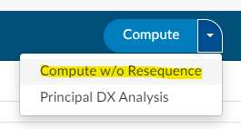

+++
title = 'V2.55'
+++



### Security - Create Two Factor Authentication

**CACTWO-4974 <span style="color:#1F497D">(Enhancement)</span>**

Fusion CAC now allows organizations to use two factor authentication. When
enabled, the first time a user logs in after activation, a new panel will appear
on the login screen with a QR code or setup key to scan/enter into an
authenticator app. In the user’s authentication app, they will see 

```Fusion CAC [the environmentName appSetting] : [User's Login ID]```

When logging in, the user will add the code after their password.

> [!info] Additional Configuration Required
Please contact Support to enable this feature.

### Add Metrics to CDI Query Scorecard Reports

**CACTWO-5677 <span style="color:#1F497D">(Enhancement)</span>**

A new section called CDI Team Metrics has been added to the CDI Query
Scorecard/Scorecard by Admission date reports. This lists the accounts and
reviews per month. The review counts are determined by the discharge date
for CDI Query Scorecard.

### Add Additional Abstracting Questions to the Audit Worksheet

**CACTWO-5677 <span style="color:#1F497D">(Enhancement)</span>**

Several new bullet point style questions can be added to the top of the
Abstracting section of an Audit worksheet. By default, there is no change to
the Audit Management viewer. However, a site can request additional
prompts to be added to the Abstraction section of the Audit Management
viewer.


> [!info] Additional Configuration Required
Please contact Support to enable this feature.

### Allow Workflow to Retain Collapse State in Memory

**CACTWO-6051 <span style="color:#1F497D">(Enhancement)</span>**

The Workflow Magement page will now save how each users collapse/expand
criteria settings. After collapsing or expanding criteria throughout the page,
the user will see that remain when there is movement between pages, or a
signoff/signon action. This is automatically retained; the user does not have
to click the Save Workflow button.

### Allow to Copy a Row as a Single Line

**CACTWO-6190 <span style="color:#1F497D">(Enhancement)</span>**

A new right click menu option has been added to the Flowsheet Viewer. This
will allow the user to highlight a row and choose ‘Copy Row as a Single Line’
to paste it into a text style editor.

### Allow User to Copy Sections of an HTML Document to Clipboard

**CACTWO-6214 <span style="color:#1F497D">(Enhancement)</span>**

lose format
When copying an HTML document into an a text field, forms or Physician
Query, the format was being lost. This has been corrected so that the HTML
will hold its format, while removing code suggestions and extra blank lines.

### Create Coder Detailed Activity Report

**CACTWO-6271 <span style="color:#1F497D">(Enhancement)</span>**

The new report Coder Detailed Activity Report is similar to the Coder Activity
Report, but has 2 new columns. Chart Touches will count the number of
unique times an account was touched, and the times for submitting and for
saving have been split.

### Add New Column to the Query Impact Reports

**CACTWO-6321 <span style="color:#1F497D">(Enhancement)</span>**

Both the Query Impact and the Query Impact by Discharge Date report will
now have a new column; Query Reason.

### Add More Columns to the Pending Reason Report

**CACTWO-6345 <span style="color:#1F497D">(Enhancement)</span>**

The Pending Reason report will now have two additional columns; Attending
Provider (first if there are multiple), and Discharge date.

### Add Last/Prior Login Date to User Profile

**CACTWO-6377 <span style="color:#1F497D">(Enhancement)</span>**

There are now two dates that can be seen in User Profile. It wil show the Last
Login (which is the last, or in some cases current time the user was logged in)
and Prior Login, which is the date previous to the current or last login.


Note that the first time a user logs in after the upgrade that enables this
tracking, there will be no Prior Date. Administrators can open the profiles of
other users from User Management and see their last and prior login
date/times.

### Add Auditor Options to the Validation Manager

**CACTWO-6393 <span style="color:#1F497D">(Enhancement)</span>**

Validation Manager now has two new user options; Is Auditor, and Is Not
Auditor. Please note that for profiles that have multiple roles, using these will
only trigger on an account if the current role is Auditor.


### Create a way to Collapse all Categories in Workflow Management

**CACTWO-6398 <span style="color:#1F497D">(Enhancement)</span>**

A button has been added to the top of the left side Workflow list in Workflow
Management. Clicking this button will perform either a Collapse all or Expand
all Categories as needed.


### Changes Have Been Made to Denial Management

**CACTWO-6451 <span style="color:#1F497D">(Enhancement)</span>**

The “Comments” box in the Denial Management viewer will now wrap text
and auto-expand as needed. Alsoif you highligh overtop of the text it will now
bring up the text edit styling box.

### Allow TruCode to Compute a DRG Without Sequencing Codes

**CACTWO-6460 <span style="color:#1F497D">(Enhancement)</span>**

A new option has been added for TruCode encoder users to the Compute
button’s right side dropdown called ‘Compute w/o Resequence’. This will
compute the DRG without ordering DX codes according to quality indicators.



> [!note] TruCode&#8482; Users Only
This fix only applies to TruCode&#8482; users.

### Add Ability to Reconcile all DRGs, not Just the Primary

**CACTWO-6479 <span style="color:#1F497D">(Enhancement)</span>**

With a new setting that support can enable you can now add the ability for
sites to trigger DRG Reconciliation if any DRGs or DRG Weights.

> [!info] Additional Configuration Required
Please contact Support to enable this feature.

### Create a DRG Reconciliation Viewer

**CACTWO-6480 <span style="color:#1F497D">(Enhancement)</span>**

A new DRG Reconciliation viewer has been created. This will be available for
Inpatient accounts that have been reconciled and submitted by a coder. It is
for view only, and will display the Working DRG on the left, Final DRG on the
right. Symbols will be next to all codes indicating if they have been added,
removed, or moved to a different position.


> [!info] Additional Configuration Required
Please contact Support to enable this feature.

### Add 'Exclude' on Report Filters on *Most* CDI Reports

**CACTWO-6482 <span style="color:#1F497D">(Enhancement)</span>**

These five filters that can be found on CDI user reports will now give the user
the option to filter as ‘ include’ or ‘exclude’. The filters are: Category, Facility,
Financial Class, Hospital Service and Pending Reason.


If the filters are left blank, then Include stands for ‘All’ and Exclude stands for
‘None’. These are the reports it was added to:

- CDI Activity Report
- CDI Executive Summary
- CDI Financial Benefit
- CDI Metric Score Card
- CDI Productivity - Admission Month
- CDI Productivity by Review Type
- CDI Query Detail Report
- CDI Query Score Card
- CDI Query Score Card - Admission Month
- Inpatient Audit Score Card (Audit Management only)
- Inpatient Auditor Productivity (Audit Management only)
- Inpatient Coder Score Card (Audit Management only)
- Outpatient Audit Score Card (Audit Management only)
- Outpatient Auditor Productivity (Audit Management only)
- Outpatient Coder Score Card (Audit Management only)

### CPT Error Rate is not Refreshing Properly in Audit Management

**CACTWO-6494 <span style="color:#2a7d1f">(Important)</span>**

In Audit Management, when there is a change to ‘Total Modifiers Added’ or
‘Total Modifiers Removed’, the CPT error rate is not refreshing. This has been
corrected to update the CPT error rate immediately.

### Some Patient Birth Dates are Showing as 1 Day Earlier in Account Grids

**CACTWO-6499 <span style="color:#2a7d1f">(Important)</span>**

Due to how certain dates are evaluated in Daylight Savings Time, some birth
dates of patients were appearing off by one day between various grids. This
has been corrected.

### Allow Admin Users to Have Access to Create/Edit Documentation Review Without the Need for Privilages to be Added

**CACTWO-6522 <span style="color:#1F497D">(Enhancement)</span>**

Administrators will now be able to create or edit documentation reviews
without having the explicit privilege ‘Create/Edit Documentation Reviews”. It
is uncommon to use documenation reviews for CDI users.

### Incorrect Document is Staying in Focus

**CACTWO-6525 <span style="color:#2a7d1f">(Important)</span>**

If a code from the Show All Codes tree is assigned to more than one
document, and the user clicks on one of those documents, it opens in the
document viewer. But if the user then clicks on a different document and
adds a code to it, the former document shows in the viewer instead of the
currrently opened one. This has been corrected.

### Allow Collapses and Expands to Auto Save in new Workflow Management

**CACTWO-6522 <span style="color:#1F497D">(Enhancement)</span>**

Upon opening up the Workflow Mangement page after updating, all
workgroups will be in a collapsed state. From that point on, Workflow will
save any collapse or expand that the user does without having to click the
save button.

### Add Duplicate Code Icon for 3M™ Users

**CACTWO-6535 <span style="color:#1F497D">(Enhancement)</span>**

When a code is added via 3M™, but is already in the unassigned code tree,
the unassigned code will no longer be visible, but clicking on the Show All
Codes tree will show the code with a duplicate icon.


> [!note] 3M™ Users Only
This fix only applies to 3M Users.

### Valid Value Error Occuring in Some Account Search Filters

**CACTWO-6547 <span style="color:#2a7d1f">(Important)</span>**

An error message asking for a valid value was occuring during some Account
Search filters that used the ‘=’ sign. This was occuring when fields had a
mapping that did not include a blank key. This has been corrected. An
example was if you had Stage = Unbilled then switched the equal to not equal
it would give you the error. Previously you would have to click on unbilled
switch off of it then back on it in the drop down for it to take effect. This has
been corrected.

### Allow Audit Reports to Filter by Audit Type

**CACTWO-6548 <span style="color:#1F497D">(Enhancement)</span>**

Audit Type is now an Include/Exclude filter on all Audit reports


### Add Ability to Remove Quick Complete Button from Physician Query

**CACTWO-6560 <span style="color:#1F497D">(Enhancement)</span>**

A new setting has been created that will allow you to remove the quick
complete button on the Physician queries dialog box. If the setting is set as
false, the user will see a Quick Complete button and the Send button will say
Send to Physician. If the setting is set as true, the Send button will only say
Send.


> [!info] Additional Configuration Required
Please contact Support to enable this feature.

### Create Physician Coder Activity Report

**CACTWO-6562 <span style="color:#1F497D">(Enhancement)</span>**

A new report called Physician Coding Activity has been created to report on
data for Physician Coder and Single Path coder activity.

> [!info] Additional Configuration Required
Please contact Support to add this report with a Physician Coding interface.

### Forced Autoload Limits are Being Ignored

**CACTWO-6566 <span style="color:#2a7d1f">(Important)</span>**

When a forced autoload user has limits on their workgroups, and they are on
the last account of a limit, if an account is manually assigned to them, the limit
restarts. This has been corrected so that the limit amount is never changed
during a manual assignment.

### Add HCC Designation in Charges Viewer

**CACTWO-6568 <span style="color:#1F497D">(Enhancement)</span>**

When a code with an HCC icon is added to the charges viewer by an Physician
Coder, it will now show the designation just like the Assigned Codes tree


### CACTWO-6573 (Enhancement)

**CACTWO-6568 <span style="color:#1F497D">(Enhancement)</span>**

The Denials drilldown in Account Search will now show a Comments field.

### CACTWO-6576 (Enhancement)

**CACTWO-6568 <span style="color:#1F497D">(Enhancement)</span>**

Multiple changes have been made to this report:
- Name changed to Engine Outcome Summary by Coder
- New column Total Codes Assigned added
- The column Added has been split into Added Text and Added Non- Text (which includes worksheet)
- The column Direct will contain codes added via 3M™, but also suggested by FAE
- The column Image has been split into Image (duplicate) and Image (non-duplicate)
- The column Worksheet has been removed
- The calulation of the column Score(now called Usage Score)
  - Score is (Accepted +Edited + Added Text + Image non-duplicate) / Total Codes Assigned.

### CACTWO-6577 (Enhancement)

**CACTWO-6568 <span style="color:#1F497D">(Enhancement)</span>**

The Engine Outcome per Coder (or per CDI) have been changed to Engine
Outcome Detail per Coder (or per CDI). The other changes made are:

- Duplicate codes added to the top of text documents are now counted in the Added Non-Text rather than Added Text
- Added Non-Text will now include codes added via 3M™ but also suggested by FAE
- The column Duplicate is now Added Duplicate
  - It additionally counts codes duplicated on images and worksheets
- The column Duplicate Codes now includes codes duplicated on images and worksheets
- The calculation of User Score is now 1.0 – ((Added Duplicate + Added Nontext) / Total assigned).
- The calculation of Engine Accuracy is now 1.0 – (Added Text / Total Assigned).

These changes are retroactive except the ‘Added Non-text” column
calculatoin. This column will retroactively include codes assigned directly
within 3M™ that were not suggested by FAE

### CACTWO-6584 (Important)

**CACTWO-6566 <span style="color:#2a7d1f">(Important)</span>**

The Elixhauser mapping comes with a bunch of default prefixes. The prefix of
ELIX_ has been added.

### CACTWO-6585 (Enhancement)

**CACTWO-6568 <span style="color:#1F497D">(Enhancement)</span>**

The Query Impact and Query Impact by Discharge Date reports now have
GMLOS columns under the Before Query, After Query and Difference portions
of the report.


### CACTWO-6586 (Enhancement)

**CACTWO-6568 <span style="color:#1F497D">(Enhancement)</span>**

Previously, once an account has been submitted, CDI Specialists could no
longer change the baseline DRG. This has been changed so that the baseline
can also be changed after submission of the account.

### CACTWO-6605 (Enhancement)

**CACTWO-6568 <span style="color:#1F497D">(Enhancement)</span>**

Previously, once a Forced Autoload coder submitted an account that had
directly assigned, if it was manually assigned back it would not appear in that
coder’s list until the next day. This has been changed so that if a manually
assigned account was submitted and then assigned back to the same coder,
they will receive it as their next forced autoload account instead of waiting
one day.

### CACTWO-6627 (Important)

**CACTWO-6566 <span style="color:#2a7d1f">(Important)</span>**

When running the CDI Metric Score Card report, the report description does
not identify what date range is acceptable. This has been added to the
description.

### CACTWO-6638 (Important)

**CACTWO-6566 <span style="color:#2a7d1f">(Important)</span>**

In the Audit Management viewer, the "Abstraction Pre-Audit" calculation is
incorrect, although user reports correctly displayed the accurate calculation
in releases v2.53 and v2.54. In these releases, the calculation omitted the
procedure codes for which users had recorded a procedure date or physician.
This issue affected only the display in the audit viewer, not the Audit user
reports.

### CACTWO-6463 (Enhancement)

**CACTWO-6568 <span style="color:#1F497D">(Enhancement)</span>**

If a discrete value's name appears in more than one category within the
discrete data viewer within a major category when it is linked from the CDI
Alerts viewer, the entire major category will be highlighted in the Flowsheet
viewer. Otherwise, the original functionality of just highlighting its single
category applies.

### CACTWO-6532 (Enhancement)

**CACTWO-6568 <span style="color:#1F497D">(Enhancement)</span>**

Previously, all CDI Alerts were expanded making it hard to view all alerts. This
requests was to initially be collapsed when the account is loaded.

### Add Other Choice With Drop Down on the Close CDI Alert Dialog Box

**CACTWO-6578 <span style="color:#1F497D">(Enhancement)</span>**

Add new option of Other with the ability to add drop down box on the Close
CDI Alert Dialog Box. This allows the user to Close an Alert because it did not
require a query to be sent and not because the Alert was wrong. They state
occasionally even though an Alert triggered appropriately; after reviewing a
query is not needed, they do not want to count it negatively as the alert did
what it was supposed to.

It will only appear if a mapping with the ID
"DrillDownMatchedCriteriaGroups_OtherOutcome" is created in Mappings
Configuration with additional alternate outcomes. The alternate outcomes
will be displayed in the Closed CDI Alert.


### Add Line Spacing to Evidence 

**CACTWO-6580 <span style="color:#1F497D">(Enhancement)</span>**

Previously, the spacing was condensed; this adjustment provides more
vertical spacing, making the alert evidence easier to read.


