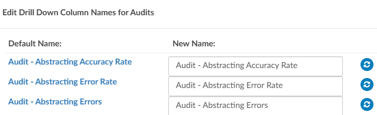
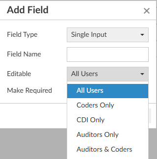
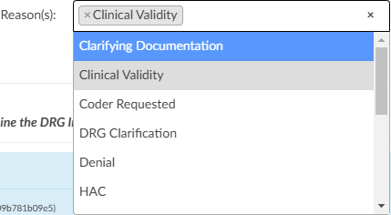

+++
title = 'V2.57'
+++



****************************

### Allow PCS/CPT Codes to be Configured per Category

**CACTWO-4897 (Enhancement)**

A new configuration will allow outpatient accounts to show PCS codes along 
with CPT, and inpatient accounts to show CPT codes along with PCS, for 
specific account categories. 

> [!info] Additional Configuration Required
Please contact Support to enable this feature.

### Allow Users to be Assigned to Managers

**CACTWO-5140 (Enhancement)**

A new field will display within [User Management](https://dolbeysystems.github.io/fusion-cac-web-docs/administrative-user-guide/tools/user-management/) that can be used by 
administrators and managers to assign users to a manager.
The manager field is a dropdown that will only show users with a manager 
role. Clicking the blue button next to the field will allow the addition of more 
users to that selected manager. When a manager has users assigned, then 
when that manager runs User Reports, they will only see the users that are 
assigned to them. A new manager column has been added to the User 
Management grid. 

### Add the Ability to Bulk add Columns in Grid Column Configuration

**CACTWO-5520 (Enhancement)**

A new button has been added to [Grid Column Configuration](https://dolbeysystems.github.io/fusion-cac-web-docs/administrative-user-guide/tools/grid-column-configuration/) that will enable the user to bulk add columns. When the button is clicked, a box will open showing only available columns. 
User can check as many columns as needed and click OK to have them added 
to Grid Column Configuration. 

### Allow Drilldown Column Names to be Changed in Account Search

**CACTWO-5678 (Enhancement)**

In [Account Search](https://dolbeysystems.github.io/fusion-cac-web-docs/administrative-user-guide/reporting/account-search/), for drilldowns other than Accounts, administrators and users with the privilege will see an edit button next to the drilldown field.

 
Clicking the edit button will bring up an edit pane, listing all columns 
associated with that drilldown. The user can then change the name in the 
‘new name’ column. 

Please note that any changes made will be seen in ALL searches that use that 
drilldown. 

### Split Form Designer: Worksheet & Query Designer to Accommodate Separate Queries for CDI vs Coding

**CACTWO-6400 (Enhancement)**

Form Designer has been split into two menu items: [Worksheet](https://dolbeysystems.github.io/fusion-cac-web-docs/administrative-user-guide/tools/worksheet-designer/) Designer and [Query](https://dolbeysystems.github.io/fusion-cac-web-docs/administrative-user-guide/tools/query-designer/) Designer. 
This will allow query templates to be split up by user type, just like 
worksheets. Current queries will initially be in the Shared Query folder, but 
can be changed via the Type field at the top right of the query. Users can be 
assigned a new set of privileges within role management for creating/editing 
templates as needed.
When creating a query in an account, the user will only see the templates that 
are assigned to them by their profile type, with the ability to have access to 
more templates by setting the above privileges.

### Lock Down Certain Sections of a Shared Worksheet

**CACTWO-6363 (Enhancement)**

A new dropdown has been added to the Add Field box in [Worksheet Designer](https://dolbeysystems.github.io/fusion-cac-web-docs/administrative-user-guide/tools/worksheet-designer/). 
displayed as “Editable”, it allows the creator of the worksheet to set what type 
of user can edit that particular field. It defaults to All Users. If a field is set as 
Coders Only, then a CDI or Auditor looking at that worksheet will not be able 
to alter that field. This will appear in **Shared Worksheets only**.

### Create new Worksheets for Auditor Only

**CACTWO-6364 (Enhancement)**

[Worksheet Designer](https://dolbeysystems.github.io/fusion-cac-web-docs/administrative-user-guide/tools/worksheet-designer/) now has a pane for Auditor worksheets. These 
worksheets, once created, will only appear in an auditor’s worksheet drop 
down when the Add button in the [Navigation Tree](https://dolbeysystems.github.io/fusion-cac-web-docs/general-user-guide/account-screen/#navigation-pane) is clicked. Only auditors, 
admins and managers can create a form in Worksheet Designer for Auditors. A new 
privilege has been created in [Role Management](https://dolbeysystems.github.io/fusion-cac-web-docs/administrative-user-guide/tools/role-management/) to assign that ability to other 
types of users.

### New Fields Added to the Account Fields List in Worksheet Designer

**CACTWO-6387 (Enhancement)**

New field options have been added to the Worksheet Designer when using 
Account Fields. These fields will be ‘stamped’ onto the form so that they do 
not change even if changes occur on the account details.

### Add Coder Scorecard to Coder Personal Dashboard

**CACTWO-6389 (Enhancement)**

If enabled, the [Coder Personal Dashboard](https://dolbeysystems.github.io/fusion-cac-web-docs/administrative-user-guide/dashboard/#coder-personal-dashboard) will display the Coder Scorecard
report at the bottom of the dashboard screen. The data can be drilled down 
by clicking on any number other than 0 in the Open Audits and Closed Audits 
columns.

> [!info] Additional Configuration Required
Please contact Support to enable this feature.

### Allow User to Change the 'Reason' Once the Query has Been Sent or Closed

**CACTWO-6404 (Enhancement)**

The reason field on a [physician query](https://dolbeysystems.github.io/fusion-cac-web-docs/general-user-guide/account-screen/account-viewers/physicians-and-queries/) can now be changed after being sent or 
closed. If a user makes a change in that field, a Save Edit button will appear 
at the bottom to save the change.

### Add Charge CPT Code Section to Audit Viewer for Certain Revenue Codes

**CACTWO-6440 (Enhancement)**

CAC now has the ability to audit Charge CPT/HCPCS codes from the [Charges 
Viewer](https://dolbeysystems.github.io/fusion-cac-web-docs/general-user-guide/account-screen/account-viewers/charges-or-transactions/) will now be added to the Pre/Post Outcome section of the audit. 
A new Audited Charges section will show beneath the Pre and Post Outcome 
sections of the Audit.
At the bottom of the list will be an Add button for the auditor to add a hard 
charge if needed. 
The charge CPT codes will will show in the the Pre and Post Outcome lists. 
Further down the Audit, a section called Charge Codes will be showing 
beneath the CPT codes section and will show all of the totals and error rates. 
To enable this feature contact CAC support and provide a list of revenue codes 
you wish to audit.

> [!info] Additional Configuration Required
Please contact Support to enable this feature.

### Add an Escalation Section for Audit Worksheet

**CACTWO-6441 (Enhancement)**

If a coder chooses to rebuttal an audit and the auditor does not agree, a new 
section line for escalation will open in the audit. 
If an escalation is marked as requested, the auditor can add his details, and 
manually assign the acct to another auditor. Workflow can also be used to 
assign to another auditor who has escalation privileges.

### Add APC Changes for CPT Codes to Audit Worksheet

**CACTWO-6443 (Enhancement)**

Auditors can audit APC changes on outpatient accounts, which are 
automatically created upon Computing an APC.
In [Account Search](https://dolbeysystems.github.io/fusion-cac-web-docs/administrative-user-guide/reporting/account-search/), the Audits drilldown will now have 3 more columns; APC 
Changes, APC Error Rate, APC Accuracy. APC columns have also been added 
to the Outpatient user reports. 

> [!info] Additional Configuration Required
Please contact Support to enable this feature.

### Allow When Recording a 'Physician Response' on a Query to Expand

**CACTWO-6486 (Enhancement)**

In a [physician query](https://dolbeysystems.github.io/fusion-cac-web-docs/general-user-guide/account-screen/account-viewers/physicians-and-queries/), the physician response field block was static. It 
has been fixed so that it can become larger as more text is added.

### Create a Return to Query Button in the Shift Reason Window

**CACTWO-6487 (Enhancement)**

A ‘Return to Query’ button has been added to the bottom right of the Shift 
Reason window. When clicked, user will be taken back to the query to make 
any change necessary, including recomputing a drg. Clicking the cancel button 
at this point will remove any work done on that query. Selecting a closing 
reason will again pop the Shift Reason window, where the query can be 
updated and closed. 

### Allow for Tertiary Grouper in Audit, With a Billing tag on Inpatient Accounts

**CACTWO-6516 (Enhancement)**

If a tertiary grouper is present on an inpatient account, then all 3 DRGs will be 
presented in the Pre and Post Outcome panels of the Audit Worksheet. If a 
billing grouper is indicated, the billing grouper will receive a Billing tag.

### Allow Billing Grouper Data in the CDI Metric Scorecard Report

**CACTWO-6609 (Enhancement)**

If an account has a billing grouper with anof APR-DRG, the CDI Metric Score 
Card report will separate reviews and case mix index between MS-DRG and 
APR-DRG.

### Update Denial Management to act Like Audit Worksheet

**CACTWO-6795 (Enhancement)**

The Denial Management viewer has been changed to match how Audit 
Worksheet is opened. Upon opening Denial Management, the user will see a 
button called Add Denial. Clicking this will open the Denial worksheet, and 
will allow for multiple worksheets to be open. Each Denial will open from its 
own button, with the original Denial date.

### Add Setting to Control Mandating a Pre Query DRG on Queries

**CACTWO-6818 (Enhancement)**

This update addresses challenges encountered with pre-query DRGs during 
the query process. Initially, a pre-query DRG is determined based on existing 
diagnosis codes.

However, as new diagnoses are added before closing the query, the post query DRG may not accurately reflect these updates. This discrepancy often 
requires manual adjustments by removing or modifying diagnoses to capture 
the intended impact accurately. Additionally, updates to the pre-query DRG 
can inadvertently change the account-level DRG instead of just the query DRG, 
leading to further manual corrections to re-enter the accurate account 
information.
To streamline this process, we are introducing four configuration settings for 
the "PreDrgQueryRequirement" site configuration, which can be adjusted by 
CAC Support as needed. 
1. Default Behavior: The current system behavior continues, where the 
pre-query DRG is automatically populated from the account and 
required when sending a [physician query](https://dolbeysystems.github.io/fusion-cac-web-docs/general-user-guide/account-screen/account-viewers/physicians-and-queries/). If the pre-query DRG is not 
included, a validation error will prompt correction before 
proceeding.
2. Open: When a query is opened, the pre-query DRG is automatically 
populated from the account (similarly for the post-query DRG, which 
will initially match the pre-query DRG). Both DRGs must be edited 
and confirmed by the user before the query can be closed.
3. Manual: This setting gives full control to the user by not auto populating the pre-query DRG, but it remains a required field to close 
the query. This option suits sites preferring complete manual entry 
of both pre and post-query DRGs without auto-population.
4. Never: Neither the pre-query nor post-query DRG is auto-populated 
under this setting, and neither is required to close the query. This 
setting is suitable for sites that do not require tracking of pre and 
post-query DRG calculations. (Uncommon)
These new settings are designed to reduce the manual workload and improve 
accuracy in DRG documentation during the query process.

> [!info] Additional Configuration Required
Please contact Support to enable this feature.

### Add a PCS to CPT Crosswalk to TruCode™

**CACTWO-6829 (Enhancement)**

A new section will appear in the Research tab of the TruCode™ reference tab 
called CPT to PCS Crosswalk if a CPT code is clicked, or PCS to CPT Crosswalk if 
a PCS code is clicked. 

> [!note] TruCode&#8482; Users Only
This fix only applies to TruCode&#8482; users.

### Allow Pending Accounts to be Hidden for Autoload Users

**CACTWO-6838 (Enhancement)**

A new configuration setting will hide the Pending Accounts grid for all [forced 
autoload](https://dolbeysystems.github.io/fusion-cac-web-docs/administrative-user-guide/tools/user-management/#force-autoload) dashboard page. 

> [!info] Additional Configuration Required
Please contact Support to enable this feature.

### Retain Highlighting of Text When Using 'Add Code'

**CACTWO-6841 (Enhancement)**

When a user highlights text and chooses either Add Code or Add Code From 
Encoder from the right click menu, the text will remain highlighted while the 
dialog is open, previously there was no highlight.

### Add Ability to Edit Codes for Query Pre/Post DRG Without Changing Account Level DRG

**CACTWO-6861 (Enhancement)**

In a query, a new dialog will open if the Compute button is clicked for the Pre 
or Post DRG. In the dialog, the user can change the codes to compute for a 
new DRG by clicking on the plus sign it will add the code from assigned codes 
to either the pre/post query DRG codes the x button will remove them and to 
add all codes from assigned code tree you can click on the button “Overwrite 
All Codes”, but the main account DRG will not be updated.

### Add New Columns to the Audit Report

**CACTWO-6862 (Enhancement)**

Two new columns, Principal Diagnosis Error and Accuracy Rate have been 
added to 4 Audit user reports:
• [Inpatient Auditor Productivity](https://dolbeysystems.github.io/fusion-cac-web-docs/administrative-user-guide/reporting/user-reports/#inpatient-auditor-productivity)
• [Outpatient Audit Scorecard](https://dolbeysystems.github.io/fusion-cac-web-docs/administrative-user-guide/reporting/user-reports/#outpatient-audit-scorecard)
• [Outpatient Auditor Productivity](https://dolbeysystems.github.io/fusion-cac-web-docs/administrative-user-guide/reporting/user-reports/#outpatient-auditor-productivity)
• [Outpatient Coder Scorecard](https://dolbeysystems.github.io/fusion-cac-web-docs/administrative-user-guide/reporting/user-reports/#outpatient-coder-scorecard)

### Create New Workgroup Assignment Report

**CACTWO-6864 (Enhancement)**

A new user report called Current Workgroup Assignment per User has been 
created. This will display the workflow assignment for each activer user from 
the user’s profile. Only active users with at least one assigned workgroup 
appear on this report. A [Forced Autoload](https://dolbeysystems.github.io/fusion-cac-web-docs/administrative-user-guide/tools/user-management/#force-autoload) user will show an asterisk to the 
right of the workgroup name if autoload was launched on that day.

### Allow Customization to Medical Necessity in TruCode™

**CACTWO-6867 (Enhancement)**

This feature adds a configuration setting "SendChargesToEncoder" is set to 
false to prevent charges from importing into 3M CRS, but their new custom 
"charges-filter.js" will inject the charges into the input packet for TruCode's 
medical necessity calculations.

>[!note] 
> This fix only applies to sites using 3M CRS with TruCode Medical Necessity Edits.

### Error Occurring With use of Short Token Highlight

**CACTWO-6869 (Important)**

When text that is only a couple characters long is selected for adding a code, 
an error was occurring if that text occurred in the HTML style attributes earlier 
in the document. This has been corrected. 

### Created by Dropdown in Physician Query has Been Updated

**CACTWO-6883 (Enhancement)**

The Created By dropdown in a [physician query](https://dolbeysystems.github.io/fusion-cac-web-docs/general-user-guide/account-screen/account-viewers/physicians-and-queries/) showed all available users in 
the list. This has been changed so that only administrators or users with the 
privilege from role mangement to create/edit physician queries are listed.

### Add Comment Fields in Denial Management Viewer

**CACTWO-6884 (Enhancement)**

A comment field has been added to each of the three appeals in the Denial 
Management viewer. 

### Change the Coder of Record Dropdown to Only Allow Coders on the Audit Worksheet

**CACTWO-6890 (Important)**

The drop down for ‘coder of record’ in the Audit Worksheet viewer had all 
users show up. CDI should not be included in this dropdown, so this has been 
corrected to only show Coders and Auditors.

### Prevent 'Coder of Record' on a new Audit From Being a CDI Specialist

**CACTWO-6890 (Important)**

Previously, the Audit Worksheet was applying the last user to save the 
account to the Coder of Record field. This could include a CDI, which it 
shouldn’t. Now, the coder of record will be decided by this process:
1. If the account was submitted, default the "Coder of Record" to the 
last submitter. Otherwise...
2. If the account's Owner is not a CDI Specialist, default the "Coder of 
Record" to the owner. Otherwise...
3. If the account's Last Saver is not a CDI Specialist, default the "Coder 
of Record" to the last saver. Otherwise...
4. Leave the "Coder of Record" blank for the user to fill in.

### Display Issue is Happening When a Physiciain Query Form Uses Sections

**CACTWO-6903 (Important)**

Using a [physician query](https://dolbeysystems.github.io/fusion-cac-web-docs/general-user-guide/account-screen/account-viewers/physicians-and-queries/) form with dynmaic sections, if sections were removed 
via the red X on the form, they were scaling in green across the screen 
horizontally instead of vertically. This has been corrected.

### Add Comments to Shift Reason Panel 

**CACTWO-6905 (Enhancement)**

In a [physician query](https://dolbeysystems.github.io/fusion-cac-web-docs/general-user-guide/account-screen/account-viewers/physicians-and-queries/), when a query is closed, a shift reason panel is presented. 
A new comment box has been added to the panel. This field is available in 
[account search](https://dolbeysystems.github.io/fusion-cac-web-docs/administrative-user-guide/reporting/account-search/). Even if no shift reasons are selected, the comment will still 
show back in the query.
 
A new column for shift reason comments can be added to the Physician 
Queries grid.
 
For any shift reasons created prior to this upgrade, the column will appear 
blank.

### Create an Impact Queries Viewer 

**CACTWO-6908 (Enhancement)**

An Impact Queries viewer will show in the Navigation Tree whenever a billed 
account has a CDI created query in place. This will give the CDI a quick look at 
impacts among queries without opening each one. Clicking on the envelope 
will open that specific query for investigation. The field for Assigned Impact 
% is manually filled in by the CDI, and the total of all fields should not be more 
than 100%. To ensure that doesn’t happen, a validation rule should be 
implemented. 
Three new columns and fields have been added to Grid Maintenance, 
Validation Manager, [Account Search](https://dolbeysystems.github.io/fusion-cac-web-docs/administrative-user-guide/reporting/account-search/) and Workflow:
• CDI Query Impact Dollars
• CDI Query Impact Percent
• CDI Query Impact Weight

> [!info] Additional Configuration Required
Please contact Support to enable this feature.

### Buttons not Working if Audit Worksheet is Popped Out

**CACTWO-6910 (Important)**

Several button options have been enabled to work from a popped out audit 
worksheet: Route to Coder, Return to Auditor and Mark as Reviewed. 
1. "Route to Coder," when logged in as an auditor to forward an open 
audit to the Coder of Record
2. "Return to Auditor," when the coder rebuts the open audit assigned 
from the auditor
3. "Mark as Reviewed," when the coder is assigned an account with a 
closed audit and hasn't marked the audit as reviewed previously

### Force Autoload is Skipping an Account Assigned to the Workgroup

**CACTWO-6917 (Important)**

An account that was being added to a workgroup that was being worked on 
by a [forced autoload](https://dolbeysystems.github.io/fusion-cac-web-docs/administrative-user-guide/tools/user-management/#force-autoload) user was not being triggered. This corrects the following 
problem: If an account was skipped in the forced autoload process due to 
various reasons (locked in use, reassigned to a different user or workgroup, 
has an open audit for a different coder), it does not appear for the forced 
autoload later if the account appears again in the forced autoload user's 
workgroup.This has been corrected.

### Add Strength Fields to Each Appeal on Denial Worksheet

**CACTWO-6919 (Enhancement)**

In Denial Management, strength fields have been added to each of the 
appeals in the Denial Management. Strengths are low, medium and high. 
These are also now showing as columns in the Denials drilldown in Account 
Search.

### 'Encoder Not Detected' pops up Sporadically in 3M™

**CACTWO-6921 (Important)**

If a user was accessing 3M™ but not via the website, the ‘Core Encoder not 
detected’ message was popping up in various places. This has been fixed. 

### Created 'CDI Activity Detailed Report' 

**CACTWO-6923 (Enhancement)**

New user report ‘CDI Activity Detailed Report’ has been created. Its similar to 
the CDI Activity Report but, adds account numbers.

### Ignore new Codes Added by Coder Post Audit

**CACTWO-6927 (Important)**

If an auditor submits an account with an open audit, the "post-audit" codes 
will change to reflect what the auditor submitted. If any other user submits 
an account with an open audit, the "post-audit" codes will not change.

### Add Audited by Field to Denials Management

**CACTWO-6935 (Enhancement)**

An ‘Audited By’ field has been added to every denial in Denial Management. 
This field will also show as a column in the Denials drilldown in Account 
Search.

### Audit and Denial Worksheets Should Verify Deletions 

**CACTWO-6936 (Enhancement)**

When deleting an audit or a Denial Management, an ‘are you sure you want 
to delete’ window will pop to verify the user wishes to delete. 

### Allow Secondary DRG to be Expanded by Default on Shift Reasons Dialog

**CACTWO-6944 (Enhancement)**

By default, the first DRG on the Shift Reason dialog is always expanded. If a 
customer wants a secondary DRG to also auto expand, an updated shift-reason-calculator.js will be needed.

> [!info] Additional Configuration Required
Please contact Support to enable this feature.

### Popped out Audit Worksheet is Losing Fields and Minimizing 

**CACTWO-6945 (Important)**

In some circumstances, a popped out Audit Worksheet will be minimized and 
may lose the Recommendations box when changes are being made on the 
main account detail page. This has been corrected. 

### Edit Procedure Details in not Allowing Deletion of Modifiers 

**CACTWO-6946 (Important)**

On the assigned codes tree, if you right click on a CPT code and select Edit 
Procedure Details, the modifier could not be removed. This has been 
corrected.

### Allow Physician Coders to Edit and Delete Code Suggestions 

**CACTWO-6952 (Enhancement)**

Physician coders can now edit and delete code suggestions from documents. 

### Calculations on CDI Query Detail Report are Incorrect

**CACTWO-6957 (Important)**

The calculation of the two ‘chart impact’ columns in the CDI Query Detail
report were comparing Working DRGs with Final DRGs, which it should have 
been comparing Baseline DRGs with Final DRGs. This has been corrected. 

### Correct CDI Review Counts in two CDI Reports

**CACTWO-6966 (Important)**

In both the [CDI Activity](https://dolbeysystems.github.io/fusion-cac-web-docs/administrative-user-guide/reporting/user-reports/#cdi-activity-report) and the CDI Activity Detail reports, a reconciled 
account was showing as both a followup and a Recon touch causing a 
discrepancy between the CDI Dashboard and the reports. This has been 
changed so that a reconciled account will only show in the Recon touch 
columns.

### Workflow is not Moving Charts if the Stage is X for Physician Coders

**CACTWO-6978 (Important)**

Workflow will now process accounts with a Stage of X and a physician coding 
stage that is other than X.

### Discharge Disposition Data in Audit Reports are Incorrect

**CACTWO-7001 (Important)**

Two of the audit user reports, [Audit Abstract Report](https://dolbeysystems.github.io/fusion-cac-web-docs/administrative-user-guide/reporting/user-reports/#audit-abstract-report) and [Inpatient Auditor 
Productivity](https://dolbeysystems.github.io/fusion-cac-web-docs/administrative-user-guide/reporting/user-reports/#inpatient-auditor-productivity) were reporting the opposite result for Disposition changes. This 
has been corrected.