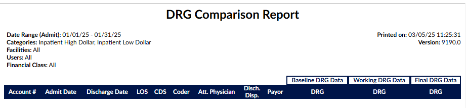

+++
title = 'V2.58 (Mar 2025)'
+++



### Create a Notifications Manager

**CACTWO-5877** **(Enhancement)**

A new page called [Notifications Management](https://dolbeysystems.github.io/fusion-cac-web-docs/administrative-user-guide/tools/notifications-management/) has been added to the [Tools](https://dolbeysystems.github.io/fusion-cac-web-docs/administrative-user-guide/tools/) dropdown.  Here, notifications can be created that can be seen either on the Fusion CAC 2 login screen, the Dashboard, or both.  The notification has a field for a Title and a Description, a start and end date for the notification, a color and the location it will appear.  

### Move the Productivity Panel From the User Drop Down

**CACTWO-5990 (Enhancement)**

In order to make room for more columns, the [Today’s Productivity](https://dolbeysystems.github.io/fusion-cac-web-docs/administrative-user-guide/tools/user-management/#todays-productivity) panel that was originally found when dropping down the arrow next to the user ID at the top of the page has been moved to its own icon.  The icon is found to the left of the question mark next to the user ID.

When clicked, it will open a window box that will show a more robust productivity panel

### Allow Notes to be identified by role

**CACTWO-6424 (Enhancement)**

A new column has been added to the [Notes & Bookmarks](https://dolbeysystems.github.io/fusion-cac-web-docs/account-navigation/navigation-tree/notes-and-bookmarks/) viewer that will show the role of the user.   All columns are now sortable from ascending to descending.

### Prevent the auto-hiding of the Custom Workgroups column

**CACTWO-6493 (Enhancement)**

When a user selects a workgroup that is not custom from the worklist, if there was a custom workgroup column in the account list it was automatically being hidden.  This will no longer happened. 

### Change how date sorting is done in the Document Tree

**CACTWO-6549 (Enhancement)**

Document ordering preventing from ordering in date order [Document Types Management](https://dolbeysystems.github.io/fusion-cac-web-docs/administrative-user-guide/tuning/document-types-management/), then when sorting by date that document was not obeying the new date sort.  This has been changed so that an assigned number is not taken into consideration when sorting by date. 

### Show inactivity logout in the User Audit Trail report

**CACTWO-6758** **(Enhancement)**

New events have been added as triggers for the [User Audt Trail](https://dolbeysystems.github.io/fusion-cac-web-docs/administrative-user-guide/reporting/user-reports/#user-audit-trail-report) report.  If a user is logged out due to inactivity, a new line will now show that in the report. 

### Add new operator for Validation Management only

**CACTWO-6781** **(Enhancement)**

A new operator of ‘does not start with’ has been added to [Validation Management](https://dolbeysystems.github.io/fusion-cac-web-docs/administrative-user-guide/tools/validation-management/). 

### Update how the Coder is defaulted in Denial Management

**CACTWO-6912** **(Enhancement)**

The Coder field of [Denial Management](https://dolbeysystems.github.io/fusion-cac-web-docs/account-navigation/navigation-tree/denial-management/) will now be defaulted to the Owner of the account (as long as it is not a CDI).  If there is no Owner, the field will be left blank for user input.  Otherwise, if there is no Coder but a Submitter, the field will default to the Submitter. 

### Allow CDI permission to view the Audit Worksheet

**CACTWO-6913** **(Enhancement)**

The [Audit Worksheet](https://dolbeysystems.github.io/fusion-cac-web-docs/account-navigation/navigation-tree/add-on-modules-and-viewers/#audit-module) viewer can now be seen by a CDI Specialist if the client wants that option.  The CDI would only have the option to view and print.  All editing, creating, routing and deleting abilities are not available.  

> [!info] Additional Configuration Required
Please contact Support to enable this feature.

### Incorrect number of days worked in CDI Query Scorecard

**CACTWO-6948** **(Important)**

The ‘Number of Days  Worked’ in the [CDI Query Score Card](https://dolbeysystems.github.io/fusion-cac-web-docs/administrative-user-guide/reporting/user-reports/#cdi-query-score-card-report) and Score Card by Admission Month were not showing a correct total.  This has been corrected so that the calculation is now the total number of unique day/user combinations, rather than counting every touch per day per user. 

### Remove Principal Dx from outpatient accounts

**CACTWO-6982** **(Enhancement)**

The dropdown next to the Compute button in an account will now only show the Principal DX option if the account is an inpatient account. 

### Add Pre and Post columns to the Audit Drilldown in Account Search

**CACTWO-6984** **(Enhancement)**

8 new columns have been added to Account Search when the [Drilldown](https://dolbeysystems.github.io/fusion-cac-web-docs/administrative-user-guide/reporting/account-search/#drill-down-level) of Audits is used:
* Pre-Audit GMLOS & Post-Audit GMLOS
* Pre-Audit DRG & Post-Audit DRG
* Pre-Audit ROM & Post-Audit ROM
* Pre-Audit SOI & Post-Audit SOI

### Remove Workflow Management Classic

**CACTWO-7017** **(Enhancement)**

Workflow Management (classic) has been removed from the Tools dropdown. 

### Do not allow fields in workflow to be saved without adding operator and value

**CACTWO-7020** **(Important)**

Workflow was allowing fields to be saved without operator and/or the value.  This has been corrected so that unless the operator doesn’t require a value, the value field must be filled in to save.

### Accounts are not being routed correctly on time-out

**CACTWO-7023** **(Important)**

If a time out occurred when a user was saved an account but was sitting in it, it was being rerouted back to that user instead of moving into a new workflow.  This has been corrected. 

### Add columns to the DRG Comparison Report

**CACTWO-7032** **(Enhancement)**

Two columns have been added to the [DRG Comparison Report](https://dolbeysystems.github.io/fusion-cac-web-docs/administrative-user-guide/reporting/user-reports/#drg-comparison-report)
* Discharge Disposition
* Payor

s

### Allow Criteria to be edited

**CACTWO-7034** **(Important)**

Criteria names can now be edited.  The use of brackets in the name will now be rejected by a red toast message stating that brackets are not available for use, along with the name of the workgroup and criteria. 

### Multiple PCS occurances are not showing correctly in Audit

**CACTWO-7039** **(Important)**

If an audit is created on an account that has multiple occurances of a procedure code, the editing arrows are not showing properly in the audit.  This has been corrected. 

### Popped-out Audit is giving a missing DRG error message

**CACTWO-7040** **(Important)**

If an audit is popped-out and the auditor makes code changes and computes w/o resequence, the popped-out audit is showing a ‘missing DRG’ error message, even if it is on the main page.  This has been corrected. 

### DRG error occurring when Audit Worksheet viewer is popped-out

**CACTWO-7041** **(Important)**

If an Audit is popped-out to its own tab and the user then computes a DRG, while the DRG shows on the main screen, the pop-out continues to show a ‘DRG Required’ error message.  This has been corrected. 

### Moving between viewers is erasing the audit subtype matches

**CACTWO-7050** **(Important)**

When an audit is opened and the audit type is selected, the approved subtypes for that audit are in the subtype popdown.  But if the auditor moves from the audit viewer to another viewer, like code summary, when the audit is reopened, the subtype list shows all subtypes, not just the filtered list for that audit type.  This has been corrected. 

### Add state column to mappings for Medicare

**CACTWO-7054** **(Enhancement)**

In [Mapping Configuration](https://dolbeysystems.github.io/fusion-cac-web-docs/administrative-user-guide/tools/mapping-configuration/), for the mapping MedicareProviderNumber, a new column has been added so that states can be assigned to each number.

### Audit were being routed when other viewers were open

**CACTWO-7061** **(Important)**

Audits were being routed without being saved when other viewers were opened.  This has been corrected so that if a physician query or an encoder are open, an audit cannot be routed until those windows have been closed.

### Allow users to be assigned to PHYS Coder Managers

**CACTWO-7068** **(Enhancement)**

New roles that contain the word ‘Manager’ such as PHYS Coder Managers will now have the ability to have users assigned to them by an Administrator.
b

### Show History legend has been updated with new fields

**CACTWO-7063** **(Important)**

The legend window in a Show History viewer has been updated with more colors and indicators.   There are now indicators for Payor, Financial Class, Admit Source, Admit Type and Discharge Disposition. 

### Rebuttal is not showing if the Coder has not routed to Auditor

**CACTWO-7070** **(Important)**

If a Coder has rebutted an audit, but has not sent that audit back to the Auditor, the rebuttal is not being seen by the Coder when they go back into the audit. This has been corrected. Rebuttal should always be seen whether or not the audit has been routed back to the Auditor. 

### Discrete value is copying over to CDI Alert query

**CACTWO-7073** **(Important)**

This issue has now been prevented by only removing ICD and CPT codes from evidence text that is linked to a document when the text is copied to a physician query. 

### Add Status Indicator (SI) to Code Summary viewer plus info symbol

**CACTWO-7076** **(Enhancement)**

The Status Indicator has been add to the [Code Summary](https://dolbeysystems.github.io/fusion-cac-web-docs/account-navigation/navigation-tree/code-summary/#assigned-cpt-codes) viewer and will appear next to a CPT code that has resulted from an APC Computation.  The indicator will also show in the [Charges or Transactions](https://dolbeysystems.github.io/fusion-cac-web-docs/account-navigation/navigation-tree/charges-or-transactions/) viewers when the Status Indicator column has been added. 

### Allow Query reasons to be separated by role

**CACTWO-7077** **(Enhancement)**

In [Mapping Configuration](https://dolbeysystems.github.io/fusion-cac-web-docs/administrative-user-guide/tools/mapping-configuration/), the mapping of [PhysicianQueryReasons](https://dolbeysystems.github.io/fusion-cac-web-docs/administrative-user-guide/tools/mapping-configuration/#query-reasons-physicianqueryreasons) now has a column called roles, which will allow the user to assign reasons to specified roles.

### TruCode™ standalone is not applying groupers by facility

**CACTWO-7097** **(Important)**

If facilities have groupers assigned to them, the TruCode™  standalone is not applying that facility’s grouper when computing the DRG.  This has been corrected. 

> [!note] TruCode&#8482; Users Only
This fix only applies to TruCode&#8482; users.

### CDI Alerts query template is not being selected

**CACTWO-7112** **(Important)**

If a physician query is opened from CDI/Clinical Alerts and the user has created a signature in their user profile, a chosen query template was showing as blank.  This has been corrected. 

### Audit Subtype values is not being retained on multiple audits

**CACTWO-7114** **(Important)**

If an Auditor selects an audit subtype on the latest audit, then moves to another viewer, upon going back to audits, older audits no longer show an audit subtype. This has been corrected. 

### Physician Coder submit sare removing account from Coder's worklist

**CACTWO-7130** **(Important)**

If an account routed to a coder by an Auditor is subsequently submitted by a Physician Coder, the account is being removed from the routed Coder’s worklist.  This has been corrected.

> [!info] Additional Configuration Required
Please contact Support to enable this feature.

### WorkgroupAssignedData criteria needs additional functionality

**CACTWO-7140** **(Important)**

In [Workflow Management](https://dolbeysystems.github.io/fusion-cac-web-docs/administrative-user-guide/tools/workflow-management/), the criteria WorkgroupAssignedData is missing an additional field that would allow the entry of the Workgroup name to send the account to. This has been added. 

### Edit Procedure Details is not allowing deletion of units

**CACTWO-7147** **(Important)**

When using [Edit Procedure Details](https://dolbeysystems.github.io/fusion-cac-web-docs/general-user-guide/accessing-accounts/editing-codes/) and deleting the number of units, the units were not saving blank.  This has been corrected.

### Missing Workgroup information in Audits

**CACTWO-7150** **(Important)**

When creating an audit, the Workgroup data was no longer showing in the header.  This has been corrected. 

### Autoload is copying TruCode™ edits to no code accounts

**CACTWO-7151** **(Important)**

If Autoload is turned on and an account with no codes is opened after an account with TruCode™ edits, those edits are not clearing and are showing for the account with no codes. This has been corrected. 

> [!note] TruCode&#8482; Users Only
This fix only applies to TruCode&#8482; users.

### Text change needed for PSI-08 algorithm output

**CACTWO-7152** **(Important)**

The text in the PSI-08 algorithm shows ‘hip fracture’.  This has been corrected to show as ‘other fracture’ when the code table is FXID instead of HIPFXID.

