+++
title = 'V2.59 (Jun 2025)'
+++



### Allow Validation Rules for Query Details

**CACTWO-6102** **(Enhancement)**

A [Validation Rule](https://dolbeysystems.github.io/fusion-cac-web-docs/account-navigation/navigation-tree/code-summary/review-validation-rules/) can now be created to trigger based on physician query details. The option of ‘Queries’ has been added in the For Each selection to allow this to be possible. 

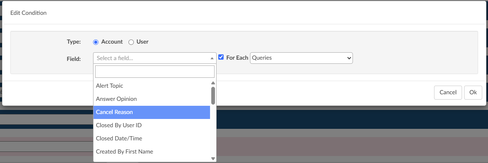

### Add Column to Tuning Dashboard Code drill down

**CACTWO-6508 (Enhancement)**

In the [Tuning](https://dolbeysystems.github.io/fusion-cac-web-docs/administrative-user-guide/tuning/) Dashboard, clicking on a code to open it will now display a new column ‘Submitted By’, with the submitter’s full name. 

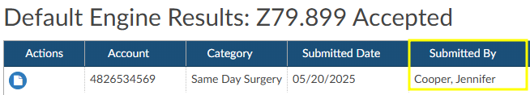

### Add Document Date to hover over

**CACTWO-6777 (Enhancement)**

In the [Document tree](https://dolbeysystems.github.io/fusion-cac-web-docs/general-user-guide/account-screen/#documents-tree), the hover over on the document name provides a physician’s name if it exists. The date of the document will now also show in the hover over if it exists. 

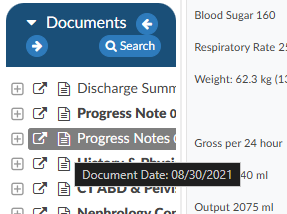

### Change Mapping Values to Descriptions in Show History

**CACTWO-6987 (Enhancement)**

[Show History](https://dolbeysystems.github.io/fusion-cac-web-docs/general-user-guide/account-screen/navigation-tree/code-summary/#show-history) shows the mapping value (key) in the Visual Difference column. This has been changed to use the description of the mapping (friendly name) so that the change is more easily understood. 

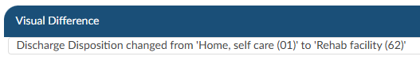

### Add Active CDI/Clinical Alerts as Selectable Criteria

**CACTWO-7024 (Enhancement)**

Active Alerts has been added as a [Grid Column](https://dolbeysystems.github.io/fusion-cac-web-docs/administrative-user-guide/tools/grid-column-configuration/), and has been added to [Workflow](https://dolbeysystems.github.io/fusion-cac-web-docs/administrative-user-guide/tools/workflow-management/) Criteria so that workflow can be created using Active Alerts as a property. 

### Add Option to Consider Differences in Estimated Reimbursement During DRG Reconciliation

**CACTWO-7055** **(Enhancement)**

Adds the optional ability to trigger DRG Reconciliation if the estimated reimbursement between the Working DRG and Final DRG are different, even if the DRGs are the same. 

When a CDI reconciles the account, a reconciliation box is brought up for the CDI to choose which DRG they want to accept. A reibursement column has been added to show the reimbursement to help with that decision. 

> [!info] Additional Configuration Required
Please contact Support to enable this feature.

### Add new Columns for Denial Drill Down in Account Search

**CACTWO-7058** **(Enhancement)**

Two new columns have been added to the Denial [drill down](https://dolbeysystems.github.io/fusion-cac-web-docs/administrative-user-guide/reporting/account-search/#drill-down-level) in the [Account Search](https://dolbeysystems.github.io/fusion-cac-web-docs/administrative-user-guide/reporting/account-search/) menu:
- Denial – Created Date
- Denial – Closed Date
  - will only populate if the “Denial Complete?” box is checked in the denial

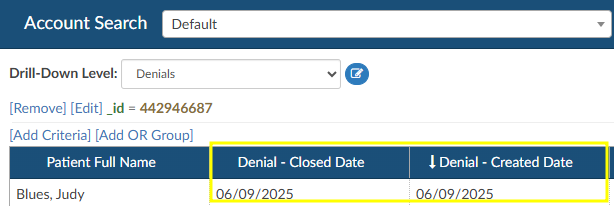

### Allow Workgroups with a ‘0’ Count to Show in Account List

**CACTWO-7118** **(Enhancement)**

A new setting has been created for those users that want to see their assigned workgroups that have a ‘0’ count in their Assigned To dropdown list. 

> [!info] Additional Configuration Required
Please contact Support to enable this feature.

### Remove CPT Codes on Inpatient Accounts With LOS >= 5 days

**CACTWO-7127** **(Enhancement)**

If an inpatient account has a length of stay equal to or greater than 5 days, suggested CPT codes will be automatically removed. The only CPT codes that will show in documents will be those manually added by a user. 

### Add Shift Reason column to Account Search Criteria

**CACTWO-7134** **(Enhancement)**

A new option has been added to the dropdown list when adding criteria for an [Account Search](https://dolbeysystems.github.io/fusion-cac-web-docs/administrative-user-guide/reporting/account-search/): Query Shift Reasons.  This will show all shift reasons per query, including ‘other’ reasons that are based on a Mapping Configuration setting. 

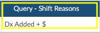

### Add Field for Appeal Received Date to the Denial Worksheet

**CACTWO-7154** **(Enhancement)**

In [Denial Management](https://dolbeysystems.github.io/fusion-cac-web-docs/general-user-guide/account-screen/navigation-tree/denial-management/) in the [Navigation tree](https://dolbeysystems.github.io/fusion-cac-web-docs/account-navigation/#navigation-tree) of an account, a new field has been added called “Decision Letter Received Date” to each denial appeal indicated. The name of this field will change depending on if it is the First, Second, or Third appeal.

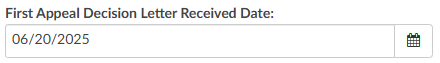

### General TruCode™ Edits are now Accessible in Custom Rules Scripts

**CACTWO-7158** **(Enhancement)**

General edits from [TruCode™](https://dolbeysystems.github.io/fusion-cac-web-docs/trucode-user-guide/) can now be provided to validation rule scripts. 

>[!Note] This is only relevant to the TruCode Encoder.

### Add Detail to the Hover Over of a Grayed out Submit Button

**CACTWO-7160** **(Enhancement)**

When the [submit](https://dolbeysystems.github.io/fusion-cac-web-docs/general-user-guide/accessing-accounts/exiting-a-chart/#submit) button on an account is grayed out, hovering over gives data on that disabling; Errors exist on account. Added to that is that statement: Check Code Summary for Validation Results. 

### Add Columns to the Transfer Codes viewer

**CACTWO-7191** **(Enhancement)**

Additional columns can been added to the [Transfer Codes viewer](https://dolbeysystems.github.io/fusion-cac-web-docs/general-user-guide/account-screen/navigation-tree/transfer-account-codes/) when MRN# is searched. If a user opens the transfer viewer and does a search on the MRN and there are more than 2 accts with that MRN, the MRN choice box will open and the new columns will be displayed there. 

> [!info] Additional Configuration Required
Please contact Support to enable this feature.

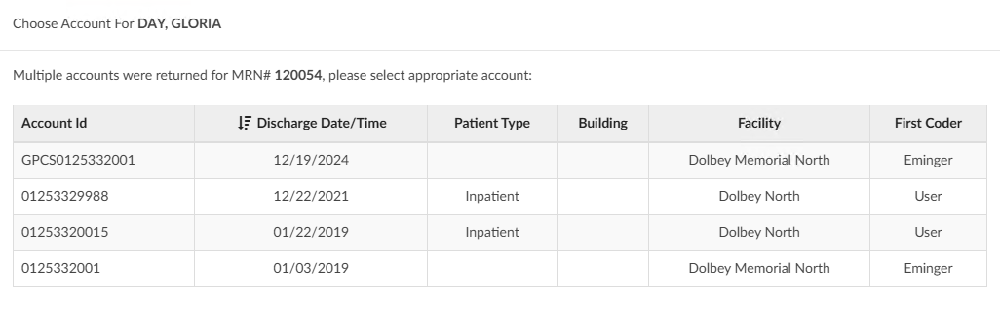

### Audit and Denial Workflow Criteria Does not Work for Multiple Instances

**CACTWO-7193** **(Important)**

 [Audits](https://dolbeysystems.github.io/fusion-cac-web-docs/account-navigation/navigation-tree/audit-worksheet/) and [Denials](https://dolbeysystems.github.io/fusion-cac-web-docs/general-user-guide/account-screen/navigation-tree/denial-management/) worksheets can now have multiple instances. But when [workflow](https://dolbeysystems.github.io/fusion-cac-web-docs/administrative-user-guide/tools/workflow-management/) criteria is created for audits or denials, it is disregarding anything after the first worksheet. So if the first worksheet is closed and a second one is open, workflow is looking at ‘closed’ audits instead of ‘open’ audits. This has been corrected so that if multiple worksheets exist, workflow looks at the most recent. 

### TruCode™ Real-Time Edits Were not Using ASC Groupers When Applicable

**CACTWO-7238** **(Important)**

Outpatient accounts using a primary grouper of ASC were not computing real-time edits. This has been corrected. 

>[!Note] This is only relevant to the TruCode Encoder.

### Audit Management Dashboard is not Allowing Facility Filter

**CACTWO-7230** **(Important)**

The [Audit Management Dashboard](https://dolbeysystems.github.io/fusion-cac-web-docs/administrative-user-guide/dashboard/#audit-management-dashboard) was showing as blank or as spinning circles when using the Facility Filter at the top of the page. This has been corrected. 

### Audits Were Missing from the Audit Dashboards

**CACTWO-7231** **(Important)**

The [Audit Management](https://dolbeysystems.github.io/fusion-cac-web-docs/administrative-user-guide/dashboard/#audit-management-dashboard) and [Aduit Personal](https://dolbeysystems.github.io/fusion-cac-web-docs/administrative-user-guide/dashboard/#audit-personal-dashboard) dashboards were not taking multiple audits into consideration in some instances. Secondary audits were only considered if the secondary audit occurred within 30 days of the first audit. This has been changed to a default of 6 months. 

### Incorrect Values Showing in Timeline of Show History

**CACTWO-7234** **(Important)**

If certain fields were changed by the user, the timeline hover-overs in [Show History](https://dolbeysystems.github.io/fusion-cac-web-docs/account-navigation/navigation-tree/code-summary/#show-history) was not showing the update value, instead showing the previous value. This has been corrected for the following fields: Admit Source, Admit Type, Discharge Disposition, Financial Class, Patient Type, and Payor.

### Force Autoload is not Providing new Accounts After a Workgroup Change

**CACTWO-7244** **(Important)**

If a workgroup assignment was changed for a [Forced Autoload](https://dolbeysystems.github.io/fusion-cac-web-docs/administrative-user-guide/tools/user-management/#force-autoload) user while they were working their list, when they clicked ‘Get Next Account’, there was a chance that autoload was not finding anything. This has been corrected. 

### Add Coder ID to the Recurring Account Productivity Report

**CACTWO-7251** **(Enhancement)**

A column to display the Coder ID has been added to the [Recurring Account Productivity Report](https://dolbeysystems.github.io/fusion-cac-web-docs/administrative-user-guide/reporting/user-reports/#recurring-account-productivity-report) when it is exported as an XLSX.

### Error Assigning Account to a Workgroup

**CACTWO-7257** **(Important)**

When in [Account Search](https://dolbeysystems.github.io/fusion-cac-web-docs/administrative-user-guide/reporting/account-search/) and assigning an account to a workgroup, if the account did not have any prior workflow assignment, an error could occur. This has been corrected. 

### Visual Difference Column is Showing Coding Data

**CACTWO-7261** **(Important)**

In [Show History](https://dolbeysystems.github.io/fusion-cac-web-docs/general-user-guide/account-screen/navigation-tree/code-summary/#show-history), if a workgroup name had a change after the 50th character, it would show in the Visual Difference column with coding data in it. This has been corrected. 

### Display Issues with Mappings Configuration and Scheduled reports

**CACTWO-7268** **(Important)**

In smaller monitor resolutions, the delete buttons of [mappings](https://dolbeysystems.github.io/fusion-cac-web-docs/administrative-user-guide/tools/mapping-configuration/) and [scheduled user reports](https://dolbeysystems.github.io/fusion-cac-web-docs/administrative-user-guide/reporting/scheduled-reports/) could overlap text. This has been corrected. 

### Edit All Codes not Displaying Admit Diagnosis Change

**CACTWO-7277** **(Important)**

When in the [Edit All](https://dolbeysystems.github.io/fusion-cac-web-docs/general-user-guide/accessing-accounts/editing-codes/#mass-editing-codes) Codes window, if the user edited the Admit Diagnosis by clicking the pencil to open the encoder’s code book, the change was not displaying correctly within the window. This has been corrected. 

### Prevent Coder From Closing Account With TruCode™ Codebook Open

**CACTWO-7281** **(Important)**

To stop the possibility of a lockup, if a user tries to close out of an account when the [TruCode™](https://dolbeysystems.github.io/fusion-cac-web-docs/trucode-user-guide/) code book is open, they will see the same red bar alert over the Cancel, Save, Release buttons that they would see if the encoder was open. 

>[!Note] This is only relevant to the TruCode Encoder.

### Audit Worksheet Leaving Escalation box Open When Audit is Closed

**CACTWO-7282** **(Important)**

Once an [audit](https://dolbeysystems.github.io/fusion-cac-web-docs/account-navigation/navigation-tree/audit-worksheet/) is closed, all fields should be read-only. The escalation response box was not following that rule, remaining open to the addition of text. This has been corrected. 

### Days not Showing for Schedules That are Hourly

**CACTWO-7287** **(Important)**

When creating a [scheduled report](https://dolbeysystems.github.io/fusion-cac-web-docs/administrative-user-guide/reporting/scheduled-reports/), if it was set as hourly and days were chosen, the days were not showing in the report data on the left. This has been corrected. Because there are 2 days that start with T and S, Thursday shows as R and Sunday shows as U. 

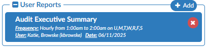

### Scheduled Report Timing Changes Were not Displaying Properly

**CACTWO-7288, CACTWO-7299** **(Important)**

After making a change to the timing of a [scheduled report](https://dolbeysystems.github.io/fusion-cac-web-docs/administrative-user-guide/reporting/scheduled-reports/), the change was not showing on the report itself. This was happening whether the change was made via [Account Search](https://dolbeysystems.github.io/fusion-cac-web-docs/administrative-user-guide/reporting/account-search/), or in the Scheduled Report page. This has been corrected. 

### Validation Rules are Showing Multiple Times When They Shouldn’t

**CACTWO-7300** **(Important)**

A [validation rule](https://dolbeysystems.github.io/fusion-cac-web-docs/account-navigation/navigation-tree/code-summary/review-validation-rules/) can show multiple times if it has a ‘For Each’ criteria in the rule. But when that For Each criteria was removed and the Validation Rule saved, it was still showing up multiple times in the Account. This has been corrected. 

### Show a Tertiary DRG if Applicable

**CACTWO-7302** **(Enhancement)**

If there are 3 DRG’s on an account, all three will now show when printing the [Code Summary](https://dolbeysystems.github.io/fusion-cac-web-docs/account-navigation/navigation-tree/code-summary/) page. 

### Add encoder computations from Baseline Working DRG to Account Search

**CACTWO-7303** **(Enhancement)**

In [Account Search](https://dolbeysystems.github.io/fusion-cac-web-docs/administrative-user-guide/reporting/account-search/), additional columns can be added to Account Search to provide information on Baseline Working DRG computations.

> [!info] Additional Configuration Required
Please contact Support to enable this feature.

### Improved Performance Processing Responses From Solventum™ CRS on Large Accounts

**CACTWO-7307** **(Important)**

To improve application performance, the calculation of validation rules will no longer happen during the processing of a response from Solventum™. Validation rule computations will resume after the response is fully processed.

>[!note] 
> This fix only applies to sites using the Solventum encoder.

### Medication evidence from CDI Alerts may not linking correctly.

**CACTWO-7308** **(Important)**

Medication evidence, when clicked on from the [Clinical Alerts viewer](https://dolbeysystems.github.io/fusion-cac-web-docs/general-user-guide/account-screen/navigation-tree/cdi-clinical-alerts/#viewing-cdiclinical-alerts), may not show the medication in the [Medications viewer](https://dolbeysystems.github.io/fusion-cac-web-docs/account-navigation/navigation-tree/medications-viewer/). This has been corrected. 

### Add new Column to the CDI Financial Benefit Report

**CACTWO-7312** **(Enhancement)**

A new column for ‘CDI Queries’ has been added just before the Baseline DRG Data block in the [CDI Financial Benefit](https://dolbeysystems.github.io/fusion-cac-web-docs/administrative-user-guide/reporting/user-reports/#cdi-financial-benefit-report) report. 

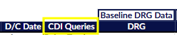

### Audit is Able to be Saved Without a Coder of Record

**CACTWO-7320** **(Important)**

In the case of a CDI being the last user in and the owner of an account before it is audited, the Coder of Record was blank. The audit should not be saveable if a coder is not selected. This has been corrected so that if an Auditor attempts to save or route an audit without a coder of record, a red error message will occur stating the coder of record needs to be set. 

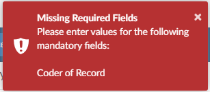

### Description change for the  Coder DRG Summary report

**CACTWO-7322** **(Enhancement)**

The description for the [Coder DRG Summary report](https://dolbeysystems.github.io/fusion-cac-web-docs/administrative-user-guide/reporting/user-reports/#coder-drg-summary) has been changed to read:

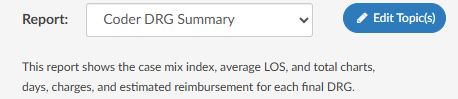

### Display codes only present in physician queries in the Unassigned codes tree

**CACTWO-7327** **(Enhancement)**

Codes that are added via the Pre and Post DRG computation within a [Physician Query](https://dolbeysystems.github.io/fusion-cac-web-docs/account-navigation/navigation-tree/physicians-and-queries/) will now show in the [Unassigned Codes Tree](https://dolbeysystems.github.io/fusion-cac-web-docs/general-user-guide/account-screen/#unassigned-codes) if the codes are not present elsewhere on the account.  The codes will be identified with a question mark in front of them, and cannot be edited unless assigned to the account or added to a document.

>[!note] 
> This fix only applies to sites using the Solventum encoder.s

### User is unable to unassign account without the Router role

**CACTWO-7330** **(Important)**

A user could not unassign an account if the user was not granted the privilege to route accounts from [Roles Management](https://dolbeysystems.github.io/fusion-cac-web-docs/administrative-user-guide/tools/role-management/). This has been corrected. 

### Dashboard experiencing slowness due to retrieval query

**CACTWO-7332** **(Important)**

When the [Admin Dashboard](https://dolbeysystems.github.io/fusion-cac-web-docs/administrative-user-guide/dashboard/#administrative-dashboard) loaded, its performance was being slowed down due to how the discharged pended accounts data was retrieved. This has been updated for faster performance. 

### Number of discharged accounts is incorrect on CDI Query Scorecard reports

**CACTWO-7334** **(Important)**

If multiple queries on an account fell in the same month, the number of the discharged accounts was being counted more than once.  This has been corrected. 

### Update the description of the Physician Coding Activity report

**CACTWO-7337** **(Important)**

The phrase “then the total number of Queries created” has been removed, since this report does not include the number of queries created by physician coders. 

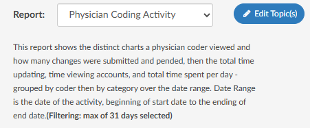

### Make the MRN# the Default in the Transfer Codes viewer

**CACTWO-7342** **(Enhancement)**

When opening the [Transfer Codes viewer](https://dolbeysystems.github.io/fusion-cac-web-docs/account-navigation/navigation-tree/transfer-account-codes/) from the Navigation Pane in an account, the field that will be defaulted will now be MRN#, rather than the Account #. To change back to Account #, please contact Support for a custom ticket.

### Update Account search to show mapped Shift reasons differently

**CACTWO-7343** **(Enhancement)**

When [Query Shift Reasons](https://dolbeysystems.github.io/fusion-cac-web-docs/account-navigation/navigation-tree/physicians-and-queries/#documenting-query-shift-reasons) were added, if a shift reason was based on a mapping, it was not showing the friendly name.  This has been changed to show the mappings description, rather than the key.   

### Audit Executive Summary Report is not Calculating Correctly

**CACTWO-7348** **(Important)**

The number of Total Eligible Cases in the [Audit Executive Summary report](https://dolbeysystems.github.io/fusion-cac-web-docs/administrative-user-guide/reporting/user-reports/#audit-executive-summary) was being under counted.  This has been corrected. 

### Physician Coder Manager Needs Access to the User Session Log report

**CACTWO-7358** **(Important)**

The User Session Log has been updated to allow access to the physician coder manager as long as the privilege is checked in [Role Management](https://dolbeysystems.github.io/fusion-cac-web-docs/administrative-user-guide/tools/role-management/). 

### Denial Management is not Correctly Assigning the Coder Field

**CACTWO-7365** **(Important)**

On a [Denial](https://dolbeysystems.github.io/fusion-cac-web-docs/general-user-guide/account-screen/navigation-tree/denial-management/), the coder field was not defaulting to the first submitting coder, or leaving as blank if not submitted.  This has been corrected. 

### CDI Today’s Productivity Time in Chart Calculation

**CACTWO-7371** **(Important)**

The time in the chart should be showing all the time spent, even if a working DRG is not calculated. It was not calculating time in chart that was worked and saved without a DRG. This has been corrected. 

### Change of Admit Source Should Clear DRGs

**CACTWO-7386** **(Important)**

If a DRG is calculated and afterwards the Admit Source is changed, the DRGs should clear. This was not happening and has been fixed. 

### Physician Query Recipient is Being Overwritten by Responding Physician

**CACTWO-7390** **(Important)**

When a different physician is set as the responder on a query, it was temporarily overwriting the recipient physician on the query. When saved, it was showing correctly in the physician query viewer, so the correct Physicians were being recorded. The appearance of the overwrite within the query has been corrected.

### Copy Row function for Flowsheet have ability to Copy to CDI/Clinical Alert

**CACTWO-6767** **(Enhancement)**

Fusion CAC now supports copying an entire row of a discrete value from flowsheet viewer into CDI/Clinical Alerts, as outlined in the comment above. Any hidden columns will be excluded from the [CDI/Clinical Alert](https://dolbeysystems.github.io/fusion-cac-web-docs/general-user-guide/account-screen/navigation-tree/cdi-clinical-alerts/) evidence, enabling more precise control over which data is transferred.  

### Strike through Evidence if Document Code is no Longer Present

**CACTWO-7132** **(Enhancement)**

Fusion CAC now enhances the [CDI/Clinical Alerts](https://dolbeysystems.github.io/fusion-cac-web-docs/general-user-guide/account-screen/navigation-tree/cdi-clinical-alerts/) experience by displaying evidence with a strike through in the viewer if the originally abstracted evidence is no longer present in the document. This typically occurs when a document has been amended and the evidence previously identified has been removed.

### Use Friendly Document Name in Copy to CDI/Clinical Alerts Function

**CACTWO-7241** **(Enhancement)**

When evidence is copied to a [CDI/Clinical Alert](https://dolbeysystems.github.io/fusion-cac-web-docs/general-user-guide/account-screen/navigation-tree/cdi-clinical-alerts/) from a document, the document type's friendly name will be displayed instead of its interface name. Previously it was using interface name.

