+++
title = 'V2.60 (Sep 2025)'
+++



### Add new Fields to Query Section of CDI Management Dashboard

**CACTWO-6105** **(Enhancement)**

Two new fields have been added to the [CDI Management Dashboard](https://dolbeysystems.github.io/fusion-cac-web-docs/administrative-user-guide/dashboard/#cdi-management-dashboard)’s query section.  There are now fields for Open Today and Open Yesterday. 

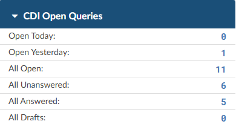

### New Operators of 'Last Month' and 'This Month' Added to Workflow

**CACTWO-6139** **(Enhancement)**

Two new [operators](https://dolbeysystems.github.io/fusion-cac-web-docs/administrative-user-guide/tools/workflow-management/#workflow-operators) have been added to [Workflow](https://dolbeysystems.github.io/fusion-cac-web-docs/administrative-user-guide/tools/workflow-management/); Last Month and This Month.  This would mostly be used in [Auditing workflow](https://dolbeysystems.github.io/fusion-cac-web-docs/administrative-user-guide/tools/workflow-management/#audit), but can be used in any worklist. These should be used with Date fields such as ‘Admit Date Time is This Month’, etc. 

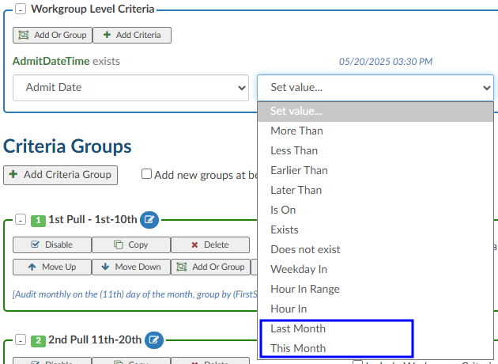

### Add a CDI Auditor Module to the Navigation Tree

**CACTWO-6412, CACTWO-7489, CACTWO-7534 (Enhancement)**

We are introducing a new [CDI Audit module](https://dolbeysystems.github.io/fusion-cac-web-docs/account-navigation/navigation-tree/add-on-modules-and-viewers/#cdi-audit-viewer), designed to bring formal auditing capabilities to CDI programs, which until now have largely relied on manual Excel tracking. This module will function as a dedicated viewer, similar in design to our coding [Audit module](https://dolbeysystems.github.io/fusion-cac-web-docs/account-navigation/navigation-tree/add-on-modules-and-viewers/#audit-module), while incorporating concepts specific to CDI work.

Key features include:
- Dedicated Viewer & Roles – A separate [CDI Audit Viewer](https://dolbeysystems.github.io/fusion-cac-web-docs/account-navigation/navigation-tree/cdi-audit/) with privacy controls for CDI of Record, CDI Auditors, and Management. A new CDI Audit role with role-based privileges will be added.
- Audit Criteria – Flexible audit framework supporting baseline DRG, working DRG, mismatch DRG rate, missed query opportunities, query compliance, correct claimed impact, and custom policies.
- Configurable Weighting – Mapping table options allow organizations to adjust terminology or emphasize certain criteria with higher weight, similar to coding incentive multipliers.
  
If opted in, a new [role](https://dolbeysystems.github.io/fusion-cac-web-docs/administrative-user-guide/tools/user-management/#roles) of ‘CDI Auditor’ will be available to be assigned to end users. This role will allow the assignee all the privileges of a CDI Specialist, plus the ability to audit inpatient accounts on a new CDI Audit Viewer. 

> [!info] Additional Action Required
Please contact your sales representative for pricing.

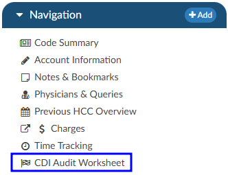

### Allow Unassigned Codes to be Hidden From the User's List

**CACTWO-6587** **(Enhancement)**

A new option now appears in the right click menu of the [Unassigned/All Codes](https://dolbeysystems.github.io/fusion-cac-web-docs/general-user-guide/account-screen/#unassigned-codes) lists called ‘hide unassigned code’.  When used, a new icon will appear in the header, and when clicked it will open a list of all codes hidden by that user on that account. This functionality will allow the user to indicate that they have reviewed a code and they have determined it is not needed. This is different from deleting codes as code suggestions will still appear in documents and the user can un-hide codes that need to be re-evaluated. No other user opening that account will have the code hidden. 

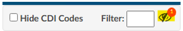

The user can un-hide by clicking on that icon to open the hidden codes list. 

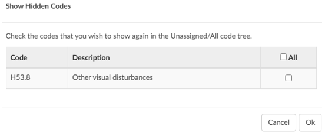

### Display Late Document Names in Grids With Hover Over Action

**CACTWO-6688** **(Enhancement)**

A new field has been added to [Grid Configuration](https://dolbeysystems.github.io/fusion-cac-web-docs/administrative-user-guide/tools/grid-column-configuration/) called Late Documents.  When in use, it will list each distinct document type.  If added to an Account List grid, if there are more than fit in the column, user can hover over to receive the entire list of document types.  

### Add new row to the CMI per Month Report

**CACTWO-7006 (Enhancement)**

The [Case Mixed Index per Month](https://dolbeysystems.github.io/fusion-cac-web-docs/administrative-user-guide/reporting/user-reports/#case-mix-index-per-month) report has been changed to show a Combined, Medical, and Surgical row. 

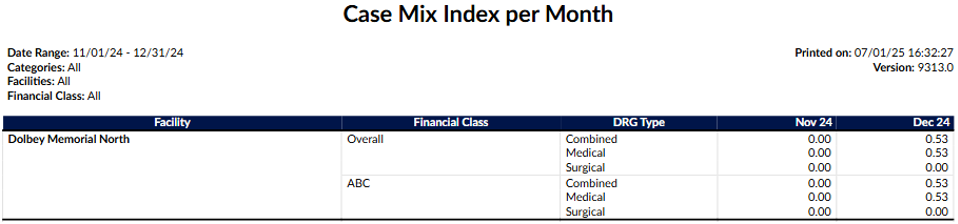

### Add More Role Types to the Worksheet Designer Shared Forms

**CACTWO-7059** **(Enhancement)**

In [Worksheet Designer](https://dolbeysystems.github.io/fusion-cac-web-docs/administrative-user-guide/tools/worksheet-designer/), shared forms have an [‘Editable](https://dolbeysystems.github.io/fusion-cac-web-docs/administrative-user-guide/tools/worksheet-designer/#editable)’ dropdown in the Add Field box.  Previously it only included All Users, Coder and CDI roles. This has been expanded to include Auditors Only, Auditors or Coders, Coding Managers Only, CDI Managers Only, and Administrators Only.

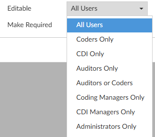

### Create Time Tracking for use With Custom Report

**CACTWO-7082, CACTWO-7474, CACTWO-7497 (Enhancement)**

A new viewer has been created that will show [time-tracking](https://dolbeysystems.github.io/fusion-cac-web-docs/account-navigation/navigation-tree/time-tracking-viewer/) on four types of document worksheets: 1) Denial worksheets;  2) Audit worksheets; 3) Documentation Reviews; and 4) worksheets added via the Add button on the Navigation tree.  These worksheets will all be read only until the new Start button is deployed.  The tracking will be stopped when one of three things occur:  1) clicking the Stop button; 2) opening another sheet and starting its time tracking; or 3) exiting the account.  Users will be able to adjust their time in the Time Tracking viewer if necessary.  Administrators will be able to see all time tracked on an account.  The user will only see their own. 

> [!info] Additional Configuration Required
Please contact Support to enable this feature.

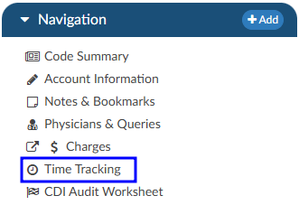

### Add new Operators to Workflow to Check Date Properties

**CACTWO-7116 (Enhancement)**

Three new [operators](https://dolbeysystems.github.io/fusion-cac-web-docs/administrative-user-guide/tools/workflow-management/#workflow-operators) have been added to the operator dropdown in [workflow](https://dolbeysystems.github.io/fusion-cac-web-docs/administrative-user-guide/tools/workflow-management/) criteria creation.  ‘Weekday In’ allows the user to select the specific day of the week; “Hour in Range” allows the user to select a range of hours for the admit/discharge date; and “Hour In” allows the user to select a specific hour of the day. 

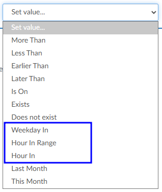

### Allow Addition of Manager Fields to Queries, Worksheets, and Grids

**CACTWO-7120 (Enhancement)**

Clients who use [managers](https://dolbeysystems.github.io/fusion-cac-web-docs/administrative-user-guide/tools/user-management/#manager) on their user profiles can opt in to have the First submitter’s manager and/or Last submitter’s manager fields to queries, worksheets and account grid columns. **This is not retroactive**.

> [!info] Additional Configuration Required
Please contact Support to enable this feature.

### Add E/M Charges to the Audit Worksheet

**CACTWO-7136** **(Enhancement)**

[E/M](https://dolbeysystems.github.io/fusion-cac-web-docs/account-navigation/navigation-tree/add-on-modules-and-viewers/#er-em-module) charges have been added to the [Audit Worksheet](https://dolbeysystems.github.io/fusion-cac-web-docs/account-navigation/navigation-tree/audit-worksheet/).  They will show in the Pre/Post Audit codes section, and then in their own E/M Charges section further down the worksheet.  

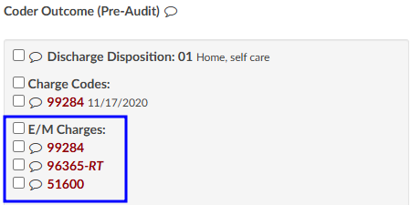

> [!info] Additional Configuration Required
Please contact Support if fields are needed for calculation.

### Allow Audit to be Hidden From the Coder of Record

**CACTWO-7169 (Enhancement)**

The ‘Route to Coder’ button on an [Audit Worksheet](https://dolbeysystems.github.io/fusion-cac-web-docs/account-navigation/navigation-tree/audit-worksheet/) can now have an arrow down button, to allow the Auditor to hide the Audit from the coder of record.  

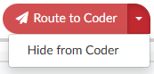

> [!info] Additional Configuration Required
Please contact Support to enable this feature.

### Allow Auditor to Audit Charge Quantity in the Worksheet

**CACTWO-7170 (Enhancement)**

The quantity field in the [Audited Charges](https://dolbeysystems.github.io/fusion-cac-web-docs/account-navigation/navigation-tree/audit-worksheet/#charges) section of an [Audit Worksheet](https://dolbeysystems.github.io/fusion-cac-web-docs/account-navigation/navigation-tree/audit-worksheet/) has now been opened for editing by the auditor.  Clicking in the field will present up and down buttons, or the auditor can just type in the new quantity. 

### Allow Clients to Trigger Specific Account Types for Charge Auditing 

**CACTWO-7171 (Enhancement)**

With a new script update, clients can set their [Audit worksheets](https://dolbeysystems.github.io/fusion-cac-web-docs/account-navigation/navigation-tree/audit-worksheet/#charges) to determine whether or not to do charges auditing based on Account type.

> [!info] Additional Configuration Required
Please contact Support to enable this feature.

### Add Field to E/M Coding Viewer for E/M Modifier

**CACTWO-7184 (Enhancement)**

A field for [E/M](https://dolbeysystems.github.io/fusion-cac-web-docs/general-user-guide/account-screen/navigation-tree/add-on-modules-and-viewers/#er-em-module) modifier from the E/M viewer on ER accounts has been added to the account grid.  This can also be used in Account Search and Validation Rules. 

### Add Symbols to Indicate Changes to Query Impact Codes box

**CACTWO-7189 (Enhancement)**

When going into a [physician query](https://dolbeysystems.github.io/fusion-cac-web-docs/account-navigation/navigation-tree/physicians-and-queries/#query-impact) that is in a [Query Impact](https://dolbeysystems.github.io/fusion-cac-web-docs/account-navigation/navigation-tree/physicians-and-queries/#query-impact) status, the computation window that pops will now show the plus, minus and arrows next to any code changes.

### Allow Accounts to be Reconciled a Second Time

**CACTWO-7197 (Enhancement)**

A new setting will allow an account’s [reconciliation](https://dolbeysystems.github.io/fusion-cac-web-docs/account-navigation/navigation-tree/drg-reconciliation/) record to be set back to false if a coder re-submits the account.  This will allow for a second reconciliation action.

> [!info] Additional Configuration Required
Please contact Support to enable this feature.

### Display Late Arriving Charges in Red and Bold Post Account Submit

**CACTWO-7215 (Enhancement)**

[Charges](https://dolbeysystems.github.io/fusion-cac-web-docs/account-navigation/navigation-tree/charges-or-transactions/) that are imported **AFTER** an account has been submitted will now show in bold red text. This is only for clients that are set for an ImportDateTime on their incoming charges.

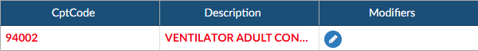

> [!info] Additional Configuration Required
Please contact Support to enable this feature.

### Add Rule Column to Validation Management Export

**CACTWO-7220 (Enhancement)**

When doing a ‘save and export’ in  [Validation Management](https://dolbeysystems.github.io/fusion-cac-web-docs/administrative-user-guide/tools/validation-management/), the spreadsheet will now show the headings of the columns capitalized and will show a Rule column with the number of the rule presented. 

### Allow Outpatient Queries to Track Impact and Shift Reasons

**CACTWO-7224. CACTWO-7521 (Enhancement)**

Currently, only inpatient account physician queries track the [query impact](https://dolbeysystems.github.io/fusion-cac-web-docs/account-navigation/navigation-tree/physicians-and-queries/#query-impact) and [shift reasons](https://dolbeysystems.github.io/fusion-cac-web-docs/account-navigation/navigation-tree/physicians-and-queries/#documenting-query-shift-reasons).  Outpatient accounts will now use the same processes to track query impact and shift reasons.  The Shift Reasons for Physician Query box that pops after a query is closed will have much fewer reasons to set, and the codes columns will be headed by the Primary and Secondary APC. 

> [!info] Additional Configuration Required
Please contact Support to disable this option if it is unwanted.

### Add Fields to the Physician Query Window and Allow Retention of Creator

**CACTWO-7232 (Enhancement)**

The Sender column will now say ‘Created  By’; and a new column ‘Sent By’ has been added to differentiate between the creator and sender of the [query](https://dolbeysystems.github.io/fusion-cac-web-docs/account-navigation/navigation-tree/physicians-and-queries/).  An optional setting has also been created to allow retention of the original creator in the even the query has a physician change.

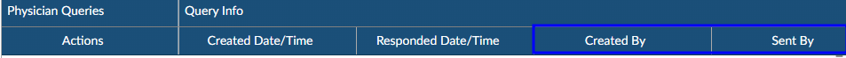

> [!info] Additional Configuration Required
Please contact Support to enable this optional setting.

### Remove Delete Button From a Saved Denial Worksheet

**CACTWO-7250 (Enhancement)**

When working on a [Denial](https://dolbeysystems.github.io/fusion-cac-web-docs/general-user-guide/account-screen/navigation-tree/denial-management/), once the account is saved, whether the Denial was completed or not, the Delete button will no longer be displayed.  Deleting can only be done on an unsaved Denial. 

### Add a Timer to the Account Details

**CACTWO-7254 (Enhancement)**

A new field showing the time in the account will now show in the [Account Detail page ](https://dolbeysystems.github.io/fusion-cac-web-docs/account-navigation/#account-action-bar)next to the Dates of Service.  This timer will restart any time the detail page is closed, with the exception of a refresh of the browser.  

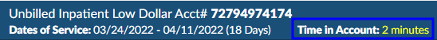

### Allow Forced Autoload Users to Manually Select an Account

**CACTWO-7256 (Enhancement)**

With a new setting, forced autoload coders will now have the Account selection field at the top of the page, which will allow them to go back to an account they have already looked at.  After selecting and working a [manually searched account](https://dolbeysystems.github.io/fusion-cac-web-docs/general-user-guide/accessing-accounts/#manually-loading-an-account), the user will be taken back to his place in his assigned workgroups.

> [!info] Additional Configuration Required
Please contact Support to enable this feature.

### Allow Buttons to Remain at the top of an Audit Worksheet

**CACTWO-7265 (Enhancement)**

In an [audit](https://dolbeysystems.github.io/fusion-cac-web-docs/account-navigation/navigation-tree/audit-worksheet/), as you work down the viewer, you lose the ‘Route to Coder, Cancel, Print’ buttons.  These buttons have now been set so that no matter where you are in an audit, they will always show at the top of the viewer. 

### Make Worksheet Created By Details Available in Grid Columns

**CACTWO-7292 (Enhancement)**

Created By fields for a custom worksheet can now be added to the [Grid Column Maintenance](https://dolbeysystems.github.io/fusion-cac-web-docs/administrative-user-guide/tools/grid-column-configuration/) for the purposes of reporting created by details on custom worksheets.
- UserId
- First Name
- Last Name
- Middle Name
- Current Role
- Added Date Time

> [!info] Additional Configuration Required
Please contact Support to enable this feature.

### Change Name of an XLSX Report to Reflect the Schedule Name

**CACTWO-7333 (Enhancement)**

Currently, when a [scheduled report](http://localhost:1313/fusion-cac-web-docs/administrative-user-guide/reporting/scheduled-reports/) comes into the user’s email, when it is opened it shows the attachment as ‘report csv.’  This has been changed to show the name of the schedule.  If the user prefers to go back to ‘report’ or some other hardcoded name, that can be done through Support.

> [!info] Additional Configuration Required
Please contact Support to enable this feature.

### Add new Fields for Outpatient Accounts in Denial Management

**CACTWO-7335 (Enhancement)**

One field in [Denial Management](https://dolbeysystems.github.io/fusion-cac-web-docs/general-user-guide/account-screen/navigation-tree/denial-management/) will change for outpatient accounts: “DRG Change Completed?” will change to “APC/ASC Change Completed?”, which will be a new field in [Account Search](https://dolbeysystems.github.io/fusion-cac-web-docs/administrative-user-guide/reporting/account-search/).  Two more fields have been added:  “Total Claim Amount” which will be a new field in Account Search and “Overpayment Amount”, which will be in the Financial  Outcome field in Account Search.

### Add a Drill-Down of Worksheet History to Account Search

**CACTWO-7340 (Enhancement)**

A new [drill-down](https://dolbeysystems.github.io/fusion-cac-web-docs/administrative-user-guide/reporting/account-search/#drill-down-level) called Worksheet History has been added to [Account Search](https://dolbeysystems.github.io/fusion-cac-web-docs/administrative-user-guide/reporting/account-search/).  This will automatically include fields based on the history of worksheets that are added/edited on an account’s detail screen. 

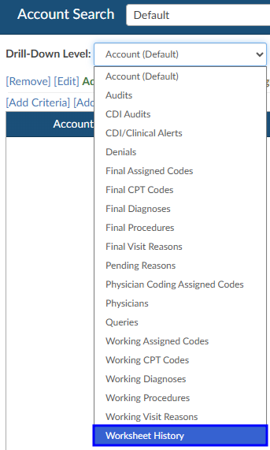

### Add a Total Time Logged in Field to the Coder's Personal Overview

**CACTWO-7346 (Enhancement)**

On the [Coder Personal Dashboard](http://localhost:1313/fusion-cac-web-docs/administrative-user-guide/dashboard/#coder-personal-dashboard), the Personal Overview section has an  added extra line ‘Total Time Logged In’.  Basically this is the total of the prior 3 lines.

### Add new Display for Rev Code in the Audit Worksheet

**CACTWO-7350 (Enhancement)**

Revenue codes can be enabled to show in the [Audit Worksheet](http://localhost:1313/fusion-cac-web-docs/account-navigation/navigation-tree/audit-worksheet/).  

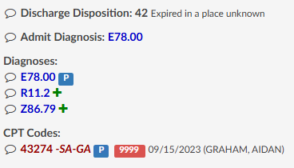

> [!info] Additional Configuration Required
Please contact Support to enable this feature.

### New Level and Navigation Options Added to Validation Rules

**CACTWO-7359 (Enhancement)**

A new level of ‘Informational’ has been added to the [Validation Management](https://dolbeysystems.github.io/fusion-cac-web-docs/administrative-user-guide/tools/validation-management/) page.  When set, the rule will show as light blue on the Code Summary page, and will not interfere with saving or submitting an account.  A new option for ‘Navigate to’ has also been added:  Web Page.  When using this option, a blank field will open up so the user can add the webpage URL.  Note that this has to start with http:// or https://.   When this validation shows in the Code Summary, clicking on it will that URL in a new tab. 

### Alert User to Unassigned Code Being Linked to a CPT Code

**CACTWO-7366 (Enhancement)**

An update has been created so that if there is a link(s) of a diagnosis code to a CPT code, and that code is then unassigned, a new window will pop advising the user that there are unassigned links.  The user will have drop down options of either deleting the link, or replacing that code with another in the list.

> [!info] Additional Configuration Required
Please contact Support to enable this feature.

### In the Edit All Codes Window, Display DX Codes Added to CPT Codes

**CACTWO-7367 (Enhancement)**

When a Diagnosis code is assigned to a CPT code by  a physician coder, those  codes will now show below the CPT code description in the  Edit All Codes window. 

> [!info] Additional Configuration Required
Please contact Support to enable this feature.

### In Edit All Codes, Allow DX Codes on CPT Codes to be Edited

**CACTWO-7368 (Enhancement)**

A new button has been created for the [Edit All Codes](https://dolbeysystems.github.io/fusion-cac-web-docs/general-user-guide/accessing-accounts/editing-codes/#mass-editing-codes) window.  It will appear below CPT codes to allow Diagnosis codes to be added or edited in the Edit All Codes Screen.  These codes will be shown in the order they are selected.  This button can also be opened up to other roles, not just physician coders.

> [!info] Additional Configuration Required
Please contact Support to enable this feature.

### Make CDI/Clinical Alert Strike Through Automatically Unchecked 

**CACTWO-7377 (Enhancement)**

Document Evidence that no longer exists in a [CDI Alert](https://dolbeysystems.github.io/fusion-cac-web-docs/general-user-guide/account-screen/navigation-tree/cdi-clinical-alerts/) shows as stricken through with a checked box.   This has been updated so that the box is automatically unchecked when a document no longer exists. 

### Add Columns to the Inpatient/Outpatient Scorecard Reports

**CACTWO-7400 (Enhancement)**

Two new columns have been add to the [Inpatient](https://dolbeysystems.github.io/fusion-cac-web-docs/administrative-user-guide/reporting/user-reports/#inpatient-audit-scorecard)/[Outpatient](https://dolbeysystems.github.io/fusion-cac-web-docs/administrative-user-guide/reporting/user-reports/#outpatient-audit-scorecard) Scorecard reports for auditing data.  The columns are ‘Audit Opened Date’ and ‘Training Recommendations’.

### Create an is Add-On Field for CPT Codes in Validation Management 

**CACTWO-7423 (Enhancement)**

A new field of ‘Is Add-On’ will now show when doing a ‘for each’ CPT code criteria in [Validation Management](https://dolbeysystems.github.io/fusion-cac-web-docs/administrative-user-guide/tools/validation-management/).  This will be triggered IF the CPT code is a designated Add-On code by CMS. 

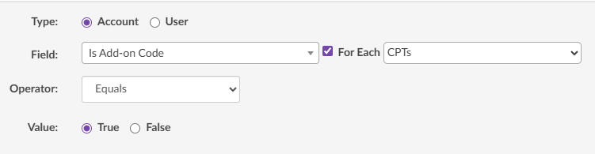

### Add Assistant Surgeon Column to Account Search

**CACTWO-7428 (Enhancement)**

For clients that have implemented, or would like to implement an Assistant Surgeon field on Procedure Codes - Fusion CAC will now add an Assistant Surgeon column to the Procedure Code drill down in Account Search. The criteria for that drill down will also include criteria for Asst Surgeon ID and Asst Surgeon Last Name.

### Add Columns for Query Reporting

**CACTWO-7431 (Enhancement)**

In [Grid Column Maintenance](https://dolbeysystems.github.io/fusion-cac-web-docs/administrative-user-guide/tools/grid-column-configuration/) two new column options have been added:  
- APR-DRG Weigth Difference *(Final APR-DRG Wgt - Baseline APR-DRG Weight)*
- DRG Impact *(Final DRG Est Reimb - Baseline DRG Est Reimb)*   

Columns have also been added to the Queries drilldown in [Account Search](https://dolbeysystems.github.io/fusion-cac-web-docs/administrative-user-guide/reporting/account-search/#drill-down-level):  Query-Impact Percent, Query-Impact Dollars, and Query-Impact Weight. 

### Blank Query response Date Showing in Query Reports

**CACTWO-7440 (Important)**

Blank query response dates were showing in query [reports](https://dolbeysystems.github.io/fusion-cac-web-docs/administrative-user-guide/reporting/user-reports/). If a query is manually responded to and there was no response date defaulted in, the data then shows as blank in query reports.  This has been changed so that if the date is blank, upon saving the response today’s date and time will be defaulted in for reporting purposes. 

### Add Extra Fields to the Appeal Sections in Denial Management

**CACTWO-7442 (Enhancement)**

Two new fields have been added to each Appeal section in [Denial Management](https://dolbeysystems.github.io/fusion-cac-web-docs/general-user-guide/account-screen/navigation-tree/denial-management/):  “HIMS Received Date” and “Response Due Date per Letter”.  Another field has been restored:  “Decision Letter Received Date”.  Both of the new additions will be available in [Account Search](https://dolbeysystems.github.io/fusion-cac-web-docs/administrative-user-guide/reporting/account-search/); the Response option is shortened by the removal of ‘per Letter’. 

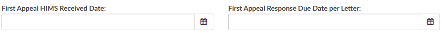

### Change how "hideCPTonInpatientAccounts" Works

**CACTWO-7443 (Enhancement)**

CAC will no longer remove CPT Code suggestions from inpatient accounts with a length of stay of 5 days or more if the appsetting "hideCPTonInpatientAccounts" is set to false. Now, the removal will only occur if "hideCPTonInpatientAccounts" is set to true.

### Change CDI Activity Reports Calculation of Queries

**CACTWO-7445 (Enhancement)**

The [CDI Activity Report](https://dolbeysystems.github.io/fusion-cac-web-docs/administrative-user-guide/reporting/user-reports/#cdi-activity-report) and the CDI Activity Detail Report will no longer count cancelled queries in the queries total. 

### Reports are Missing From the User Reports List

**CACTWO-7446 (Important)**

If a site did not have the Physician Coder or Auditor [role](https://dolbeysystems.github.io/fusion-cac-web-docs/administrative-user-guide/tools/user-management/#roles) authorized, then those reports that were open to those roles were missing in the [User Report](https://dolbeysystems.github.io/fusion-cac-web-docs/administrative-user-guide/reporting/user-reports/) list for all users.  This has been corrected. 

> [!info] Additional Configuration Required
Please contact Support to enable this feature.

### Add the Coder Scorecard to the Forced Autoload Dashboard

**CACTWO-7454 (Enhancement)**

Clients now have the ability to update their [Forced Autoload](https://dolbeysystems.github.io/fusion-cac-web-docs/administrative-user-guide/tools/user-management/#force-autoload) users to now see the Coder Scorecard at the bottom of their [Dashboard](https://dolbeysystems.github.io/fusion-cac-web-docs/administrative-user-guide/dashboard/). 

### TruCode™ Codebook is Leaving red bar in the Account After Being closed

**CACTWO-7455 (Important)**

If the [TruCode™](https://dolbeysystems.github.io/fusion-cac-web-docs/trucode-user-guide/) codebook is closed using the X at the top instead of being minimized, it was leaving the red bar that crosses the Save/Submit buttons on an account intact, leaving the user unable to leave the account.    This has been corrected. 

>[!Note] This is only relevant to the TruCode Encoder.

### Add Fields for Pre-Bill DRGs During DRG Reconciliation

**CACTWO-7461 (Enhancement)**

New fields have been add for specific groupers concerning Pre-bill DRGs determined at the time of the [DRG Reconciliation](https://dolbeysystems.github.io/fusion-cac-web-docs/account-navigation/navigation-tree/drg-reconciliation/).  This is only for sites that need this kind of detailed reporting.

> [!info] Additional Configuration Required
Please contact Support to enable this feature.

### TruCode™ Panel does not Update when Used for Edits Only

**CACTWO-7464 (Important)**

If Solventum™ is being used as the encoder and TruCode™ for edits only is being used as a partial encoder, when changes are made in Solventum™ they are not being carried through to the TruCode™ panel.  This has been corrected.  

### Account Search is not Handling Non-Numeric Units Properly

**CACTWO-7465 (Important)**

When using commas or decimals in the units field of a CPT code, they were not showing in [Account Search](https://dolbeysystems.github.io/fusion-cac-web-docs/administrative-user-guide/reporting/account-search/)’s CSV file properly.  This has been corrected so that quotes will appear around the field. When using Solventum™, if a comma is being used it will not be seen in the CRS, but decimals will be properly rounded to a whole number. 

### Account Information Fields not Holding the Mapping Order

**CACTWO-7470 (Important)**

If the [mappings](https://dolbeysystems.github.io/fusion-cac-web-docs/administrative-user-guide/tools/mapping-configuration/) order on one of the below [Account Information](https://dolbeysystems.github.io/fusion-cac-web-docs/account-navigation/navigation-tree/account-information/) dropdowns was changed, Account Information was still showing the dropdown in alphabetical order. This has been corrected to show the order set in Mappings Configuration.  The four corrected fields are: Payor, Facility, Gender, and Discharge Disposition.

### Add CDI Audits to the Time Tracking Module

**CACTWO-7474 (Enhancement)**

If the Time Tracking viewer has been added, an additional setting will add the CDI Audit viewer to the tracking.

> [!info] Additional Configuration Required
Please contact Support to enable this feature.

### Remove Disabled Work Groups With no Assignments From Account List

**CACTWO-7475 (Enhancement)**

If the user has the site_configuration “[DisplayEmptyWorkgroups](https://dolbeysystems.github.io/fusion-cac-web-docs/release-notes/v2.59/#allow-workgroups-with-a-0-count-to-show-in-account-list)” set to true, their account list will show work groups that have 0 assignments, even if the work group is disabled.  This has been changed so that if a work group is disabled and has 0 assignments, it will not show in the [Account List](https://dolbeysystems.github.io/fusion-cac-web-docs/general-user-guide/accessing-accounts/#account-list). 

### Capitalize all Columns in Scheduled Reports

**CACTWO-7477 (Enhancement)**

The name of all column headers in a [scheduled report](https://dolbeysystems.github.io/fusion-cac-web-docs/administrative-user-guide/reporting/scheduled-reports/) will now be capitalized. 

### Convert Birth Weight to a Whole Number

**CACTWO-7494 (Enhancement)**

Currently, birth weight is not converted when entered as a decimal on a GPCS account, which can cause a [validation](https://dolbeysystems.github.io/fusion-cac-web-docs/account-navigation/navigation-tree/code-summary/review-validation-rules/) error.  The conversion method has changed to round up a decimal number, and if the number cannot be converted, to return it as a zero (0).

### CDI/Clinical Alerts Showing as a Strike Through When Manually Added

**CACTWO-7499 (Important)**

When adding pasted data to a [CDI/Clinical Alert](https://dolbeysystems.github.io/fusion-cac-web-docs/general-user-guide/account-screen/navigation-tree/cdi-clinical-alerts/), it is pasting in with a strike through.  When saved, the strike through is gone.  This has been corrected so that the strike through never occurs. 

### Closing Code Book is Removing Code From Code Editor

**CACTWO-7501 (Important)**

If a code is opened in code editor, and the Edit button is clicked, if the code book is then closed without change, the code is being removed from the code editor.  This has been corrected.  Closing the code book will no longer remove the original code from the editor.  

### Inactivity Messages not Occurring if Browser is Minimized

**CACTWO-7505 (Enhancement)**

If CAC is minimized, and during that time is timed out due to inactivity, that inactivity is not being logged to the [User Audit](https://dolbeysystems.github.io/fusion-cac-web-docs/administrative-user-guide/reporting/user-reports/#user-audit-trail-report) Log.   Inactivity messaging has been updated to include this scenario. 

### Preserve DX Code Order Selected on a CPT Code

**CACTWO-7507 (Enhancement)**

The order that diagnosis codes are selected when adding them to CPT codes will now be respected in the Edit All Codes window.  Formerly the diagnosis codes showed in alphabetical order. 

### Add Weight Change and Difference to Audits and Account Search

**CACTWO-7509 (Enhancement)**

When an [auditor](https://dolbeysystems.github.io/fusion-cac-web-docs/administrative-user-guide/tools/user-management/#roles) makes a code change, calculates the DRG and the updates the codes in the [Audit Worksheet](https://dolbeysystems.github.io/fusion-cac-web-docs/account-navigation/navigation-tree/audit-worksheet/), weight change and weight difference fields will show in the DRG section of the worksheet.  

> [!info] Additional Configuration Required
Please contact Support to enable this feature.

### Right-click Menu is Being Lost During Document Search Activity

**CACTWO-7510 (Important)**

If Document [Search](https://dolbeysystems.github.io/fusion-cac-web-docs/general-user-guide/account-screen/#search-button) is opened and the user clicks on a document in that search, then does a right-click on the document to open the action menu, the user will be unable to re-access that right-click menu on any other areas of the document search results. This has been corrected. 

### Allow for Users Working in a Timezone Different than the Server

**CACTWO-7526 (Enhancement)**

Fusion CAC will now allow date/times in all grids to remain static to the timezone when the user's operating system is in a different timezone than the server. 

### CDI/Clinical Alert was not Updating When Applying an Edit

**CACTWO-7546 (Important)**

When editing a [CDI/Clinical Alert](https://dolbeysystems.github.io/fusion-cac-web-docs/general-user-guide/account-screen/navigation-tree/cdi-clinical-alerts/), doing the edit and clicking the Apply button was not updating the list.  It was only updating after Save had been clicked.  This has been corrected so that the list shows the edit upon clicking Apply.  

### Forced Autoload was Returning to a Limited Workgroup

**CACTWO-7554 (Important)**

If a Forced Autoload user worked through a group that had a limit on it, if an account was then added to a group that preceded it, the user would be taken to that and then back through the limited group. This has been changed so the the cycle of accounts always obeys the limit on any workgroup. 