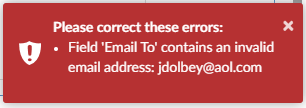
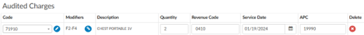
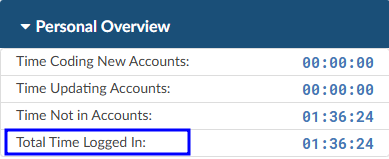
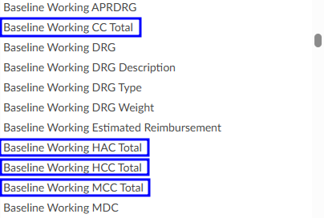
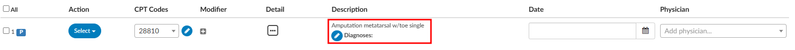
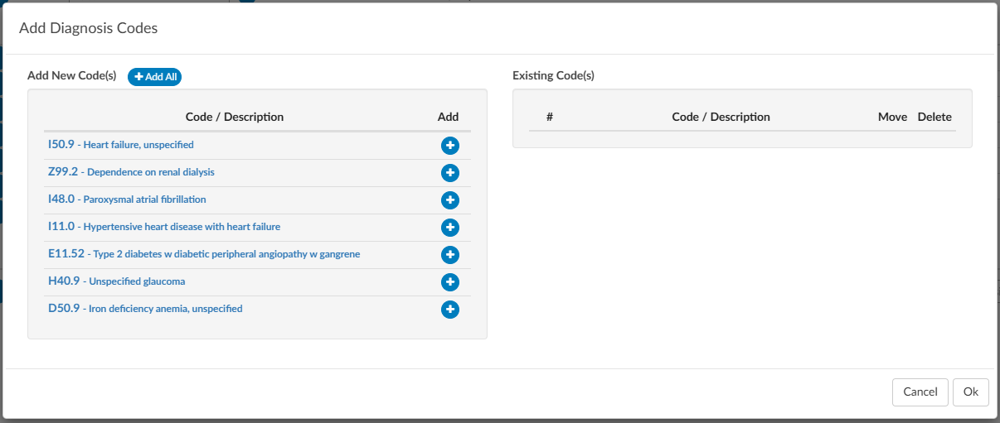
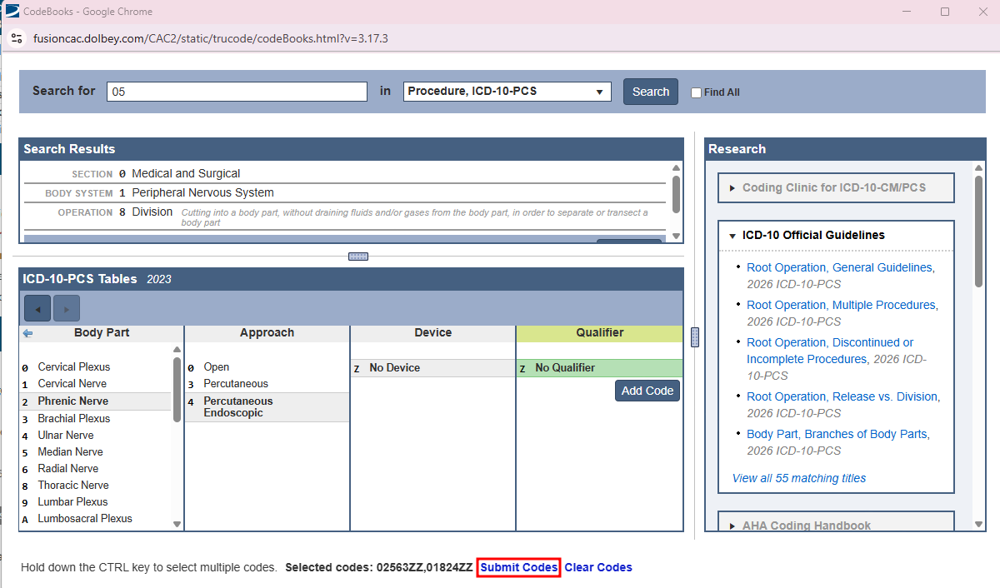
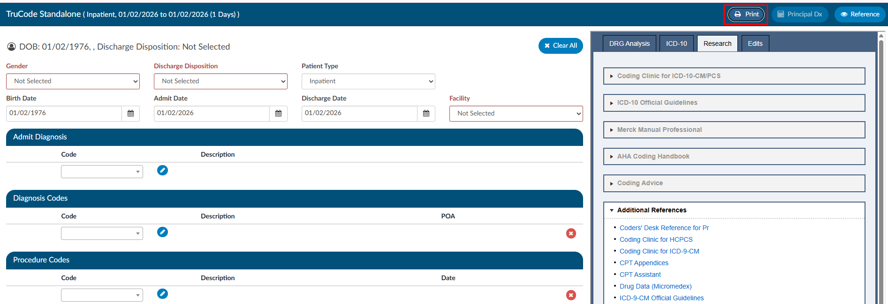

+++
title = 'V2.61 (Jan 2026)'
+++



### Add Ability to Schedule a Report per day of the Week

**CACTWO-5976 and CACTWO-7233** **(Enhancement)**

When creating a [scheduled report](https://dolbeysystems.github.io/fusion-cac-web-docs/administrative-user-guide/reporting/scheduled-reports/), the user will now have the ability to schedule a report for a certain day of the week such as ‘first Tuesday of the month’ or ‘last Friday of the month’.  This has also been added to the [scheduling window](https://dolbeysystems.github.io/fusion-cac-web-docs/administrative-user-guide/reporting/account-search/#scheduling-a-report) of the [Account Search](https://dolbeysystems.github.io/fusion-cac-web-docs/administrative-user-guide/reporting/account-search/), along with the ability to report hourly. 

### Replace PSI 04 with a new Failure to Rescue Measure

**CACTWO-6787** **(Enhancement)** 

A new failure to rescue code of ISCMR will now show concurrently with [PSI](https://dolbeysystems.github.io/fusion-cac-web-docs/account-navigation/navigation-tree/code-summary/quality-indicators/#psi-indicators) 04 when it applies, but it will be completely replacing PSI 04 in the future. 

### Allow Scheduled Reports to be Restricted to Particular Domains

**CACTWO-7138** **(Enhancement)**

A new setting will now stop [scheduled reports](https://dolbeysystems.github.io/fusion-cac-web-docs/administrative-user-guide/reporting/scheduled-reports/) from going out to emails that are not in the configured domain.  As an example, if the setting is marked for ‘dolbey.com’, and an aol.com address is entered in the email for a scheduled report, the user will be alerted that the address is not valid for the domain.

> [!info] Additional Configuration Required
Please contact Support to enable this feature.

### Make Mapping Titles more Noticeable

**CACTWO-7274** **(Enhancement)**

[Mapping table](https://dolbeysystems.github.io/fusion-cac-web-docs/administrative-user-guide/tools/mapping-configuration/) titles are now in blue to make them stand out better when a user is browsing a long list. Previously they were grey and did not stand out.

### Enable Columns in Account Search to be Filterable

**CACTWO-7319** **(Enhancement)**

The [columns](https://dolbeysystems.github.io/fusion-cac-web-docs/administrative-user-guide/reporting/account-search/#selecting-columns) button in [Account Search](https://dolbeysystems.github.io/fusion-cac-web-docs/administrative-user-guide/reporting/account-search/) now has a filter field at the top of the list.  Clicking on {}Columns{} brings up the column list as it is currently, and clicking the arrow lets you either select the list as 'Select All' or 'Unselect All'. No matter how columns are pulled up, a filter box is presented at the top and will filter down the list as characters are typed. 

### In Audit Worksheet, add APC Calculation Display

**CACTWO-7515** **(Enhancement)**

For accounts with charges, the [Audit Worksheet](https://dolbeysystems.github.io/fusion-cac-web-docs/account-navigation/navigation-tree/audit-worksheet/) will now show APC calculations to the left of each code in the [Audited Charges](https://dolbeysystems.github.io/fusion-cac-web-docs/account-navigation/navigation-tree/audit-worksheet/#charges) section, if configured. 

### Remove Trailing Blank Spaces in Pending Reason Note

**CACTWO-7525** **(Enhancement)**

Currently when adding a [note to a pending reason](https://dolbeysystems.github.io/fusion-cac-web-docs/account-navigation/navigation-tree/code-summary/pending-reasons/#pending-reason-notes), any trailing blank spaces are being saved to the record.  This has now been changed to discard trailing blank spaces upon saving the note.  

### Add 'Total' Column to the CDI Metric Score Card Report

**CACTWO-7551** **(Enhancement)**

A new 'Total' column has been added to the [CDI Metric Score Card](https://dolbeysystems.github.io/fusion-cac-web-docs/administrative-user-guide/reporting/user-reports/#cdi-metric-score-card) which calculates the combined statistics for all months within the report.  By comparison, the Average column calculates the average statistics per month within the report. 

### Dashboard will not Display Audit Sections if There is no Data

**CACTWO-7570** **(Enhancement)**

On the [Coder Personal Dashboard](https://dolbeysystems.github.io/fusion-cac-web-docs/administrative-user-guide/dashboard/#coder-personal-dashboard):
- If both Inpatient and Outpatient audit data are available, both section headers will appear on the user’s Dashboard, each displaying its corresponding audit details.
- If no audit data exists at all, both headers will still display, but instead of data, each section will show the message: “No audits performed since last month.
- If audit data exists for only one category (e.g., Inpatient audits are available but Outpatient audits are not), the Dashboard will display only the header(s) with available data, along with the corresponding audit information.

### Add User Name to CDI Metric Score Card When Sent as XLSX

**CACTWO-7575** **(Enhancement)**

If the [CDI Metric Score Card](https://dolbeysystems.github.io/fusion-cac-web-docs/administrative-user-guide/reporting/user-reports/#cdi-metric-score-card) report is run as XLSX and has multiple users on it, it will now split the names out on separate tabs in the XLSX report. 

### Added 'Audit - Modifiers' columns to the Audits drilldown in Account Search

**CACTWO-7581** **(Enhancement)**

Two new total columns have been added to the Audits [Drilldown](https://dolbeysystems.github.io/fusion-cac-web-docs/administrative-user-guide/reporting/account-search/#drill-down-level) in [Account Search](https://dolbeysystems.github.io/fusion-cac-web-docs/administrative-user-guide/reporting/account-search/#drill-down-level):

1. Audit- Modifiers Post Audit

2. Audit-Modifiers Pre Audit 

These will record the total based on the number of modifiers on the CPT codes or Charges.

### PC-06 Designation Updated for January 2026

**CACTWO-7584** **(Enhancement)**

The [PC-06 algorithm](https://dolbeysystems.github.io/fusion-cac-web-docs/account-navigation/navigation-tree/code-summary/quality-indicators/#pc-06-indicator) has been updated for January 2026 changes. This allows for a PC-06 designation for accounts that have a Discharge Disposition of ‘Transfer’ as well as ‘Expired’. 

### Remove the 'No' Option From the Final DRG Reconciliation box

**CACTWO-7588** **(Enhancement)**

An option has been added to hide the ‘No’ answer from the Final DRG Reconciliation prompt window within the [DRG Reconciliation viewer](https://dolbeysystems.github.io/fusion-cac-web-docs/account-navigation/navigation-tree/drg-reconciliation/). The user will then only have the options to agree or cancel during reconciliation.

> [!info] Additional Configuration Required
Please contact Support to enable this feature.

### Add Total Time Line to Forced Autoload Dashboard

**CACTWO-7597** **(Enhancement)**

For the sake of continuity, the line for 'Total Time Logged In' has been added to the [Forced Autoload](https://dolbeysystems.github.io/fusion-cac-web-docs/administrative-user-guide/tools/user-management/#force-autoload) dashboard to match the other user dashboards. 

### When Moving Between Viewers they were marked as read-only

**CACTWO-7604** **(Important)**

Under specific circumstances, when moving back and forth between viewers, [audits](https://dolbeysystems.github.io/fusion-cac-web-docs/account-navigation/navigation-tree/audit-worksheet/#starting-an-audit) were being marked as read-only and user was unable to reopen and edit.  This has been corrected. 

### TruCode link to crosswalks was not opening

**CACTWO-7604** **(Important)**

While the link for accessing crosswalks in [TruCode](https://dolbeysystems.github.io/fusion-cac-web-docs/trucode-user-guide/) was present, it had yet to be implemented. That has now been added so that users can use the crosswalks. 

### Updates Made to Description of Several Reports

**CACTWO-7616** **(Enhancement)**

The descriptions of the [CDI Query Score Card](https://dolbeysystems.github.io/fusion-cac-web-docs/administrative-user-guide/reporting/user-reports/#cdi-query-score-card-report) and the [CDI Query Score Card by Admission Month](https://dolbeysystems.github.io/fusion-cac-web-docs/administrative-user-guide/reporting/user-reports/#cdi-query-score-card-by-admission-month) have been updated. 

### Sync Between Workgroup Criteria Changes was not Working

**CACTWO-7619** **(Important)**

When multiple users were in the same [workgroup criteria](https://dolbeysystems.github.io/fusion-cac-web-docs/administrative-user-guide/tools/workflow-management/#workgroup-level-criteria), the ‘sync change’ ability was not working.  This has been corrected. 

### Mass Edit is not working for 'All' when adding Dx codes to CPT codes

**CACTWO-7630** **(Important)**

If a user checked the 'ALL' button at the top of the CPT column in [Mass Editing](https://dolbeysystems.github.io/fusion-cac-web-docs/general-user-guide/accessing-accounts/editing-codes/#mass-editing-codes) and added a DX code to the first CPT code, it was not being carried down to all of the CPT codes like it should.  This has been corrected. 

### Add new Working DRG Fields in Account Search

**CACTWO-7631** **(Enhancement)**

4 new fields have been added to [Account Search](https://dolbeysystems.github.io/fusion-cac-web-docs/administrative-user-guide/reporting/account-search/) to be used as search criteria:
- Baseline Working CC Total
- Baseline Working HAC Total
- Baseline Working HCC Total
- Baseline Working MCC Total

### Mappings not Showing all Columns When Using CSV Option

**CACTWO-7632** **(Important)**

When exporting a CSV in [Mappings](https://dolbeysystems.github.io/fusion-cac-web-docs/administrative-user-guide/tools/mapping-configuration/), some of the newly added columns were missing from the report.  This has been corrected. 

### Add checkmark next to codes in inpatient accounts

**CACTWO-7634** **(Enhancement)**

A checkmark will now appear on the right of the diagnosis and procedure codes that affect the DRG according to Solventum™ or TruCode™ in these places in Fusion CAC:
* the Code Summary viewer; 
* the Final Code Summary viewer; 
* the Working CDI History viewer; 
* the Suggested DRG History viewer; AND
* the TruCode Standalone page. 

> [!info] Additional Configuration Required
Please contact Support to enable this feature.

### Session Expiration is locking user in account

**CACTWO-7635** **(Important)**

If a user is in an account and goes away from their session for long enough for the session to expire, the user is receiving a red error message and is not being taken out to the Login Screen.  This has been corrected. 

### Receiving an error when using invalid characters in Document Search

**CACTWO-7644** **(Important)**

If an invalid character is used in Document Search, ie .^$*+-?{}\/|, then an invalid pattern error was showing in the Fuscion CAC log.  This has been updated so that no error occurs, and the Document Search works normally. 

### Accounts assigned to Audit workgroups were not leaving the workgroup

**CACTWO-7648** **(Important)**

If an auditor finished an audit and then did a Save/and route on the account to route to a custom workgroup, the account was not leaving the Audit workgroup.  This has been corrected

### Update the way diagnosis codes can be added to CPT code charges

**CACTWO-7653** **(Important)**

The ‘add’ table has been changed to allow better usablilty and readablity of diagnosis codes that are added to a CPT charge on an outpatient account. 

### E/M charges should not show in some circumstances and remarks should

**CACTWO-7658** **(Important)**

ADD TEXT

### TruCode™ encoder is deleting PCS codes after clicking the 'Submit Codes' link

**CACTWO-7659** **(Important)**

If a user has the TruCode™ encoder open and adds multiple codes via the code book, a code was being dropped when the 'Submit Codes' link was pressed to bring those codes to the Assigned codes tree.  This has been corrected. 

### Scroll Bars in TruCode™ encoder are not working properly

**CACTWO-7660** **(Important)**

If a user changes the zoom on the encoder from 100%, the scroll bar sometimes does not go all the way to the bottom of the viewer.  This has been corrected. 

### TruCode™ encoder has drag and drop issues

**CACTWO-7661** **(Important)**

In the codes section of TruCode™ encoder, when using drag and drop, the codes were getting stuck.  This has been corrected. 

### TruCode™ encoder links are not working

**CACTWO-7662** **(Important)**

When working in the TruCode™ encoder, if an edits icon appeared on a code indicating that additional codes should be added, clicking the “other codes” link did not open the Code Book in the Edits panel.  This has been corrected. 

### TruCode™ encoders needs a units field for CPT codes

**CACTWO-7663** **(Enhancement)**

A new field has been added to the TruCode™ encoder. A units field will now show at the end of each CPT code line in Outpatient runs. It will default to a count of 1.

### Update Modifier button in TruCode™ encoder

**CACTWO-7664** **(Enhancement)**

In TruCode™ encoder, the current modifier button was a circle with a link icon located at the end of the CPT code line.   This has been changed to a gray square with a plus sign, and relocated next to the code’s edit button for consistency.

### Create a Print Button for TruCode™ Standalone

**CACTWO-7665** **(Enhancement)**

Since a right-click print command does not work, a new Print button has been added to the top right of the TruCode™ Standalone page.

### Informational warning popping during submission of account

**CACTWO-7667** **(Important)**

When there is an informational warning on the Code Summary page, if the account was subsequently submitted, a warning box is popping asking the user if they want to go ahead with the submission, which should not be happening.  This has been corrected. 

### Allow DRG to autocompute when selected from Dx Analysis button

**CACTWO-7669** **(Enhancement)**

When using the Principal DX Analysis button when computing a TruCode™ DRG, the diagnosis changes, but the DRG has to be recomputed.  This has been changed so that if a different diagnosis is selectd from the Principal DX  Analysis dropdown, the DRG will automatically compute in the banner bar. 

### Add more date options to Audit Workflow

**CACTWO-7679** **(Enhancement)**

When setting time for Audit workflow to run, the days of the 29th, 30th and 31st have been added. If a month occurs that does NOT have the date set (such as setting for the 31st) the month will not run an Audit worklow (such as during the month of November which does not have a 31st day). 

### Auditor cannot close audit if account type is changed

**CACTWO-7683** **(Important)**

If an Audit was started and left open on an account that then had its type changed from inpatient to outpatient, when the Auditor went back in to the audit, it was unable to be closed. This has been corrected. 

### CDI Alert links to document not working

**CACTWO-7684** **(Important)**

If a document was archived which occurs when a Coder saves or submits a chart, CDI Alert links from the viewer to that document could break because the document was archived. This has been corrected, and the links will now continue to work even after the document is archived.

### Drafted queries are not being counted correctly

**CACTWO-7686** **(Important)**

This release corrects an issue where physician query drafts were not accurately reflected in Account Search results and grid columns. In certain situations, the system was counting sent physician queries instead of physician query drafts, which could cause accounts to appear as having drafts when none existed.

With this update, physician query draft counts and filters now correctly reflect only true draft queries, ensuring accurate Account Search results and reporting.

Please note that this correction is not retroactive. Existing accounts will reflect the updated behavior after the account is re-saved or re-submitted.

### Add hierarchical user-to-manager assignments for dashboard  and user reports

**CACTWO-7689** **(Enhancement)**

This enhancement is for Dashboards and User Reports to support multi-level management hierarchies. Managers will now see data for:
* Their **direct reports**
* **Indirect reports** (staff managed by their direct reports)
* **Themselves**, when applicable

This ensures Dashboards and User Reports display only data relevant to a manager’s full reporting structure, rather than all users in the system.

**Important Behavior Change for Administrators**
Previously, Administrators always saw data for all users in dashboards and reports. With this update:
* If an Administrator also has the Manager role and assigned staff, Dashboards and User Reports will reflect only that Administrator’s management hierarchy.
* Administrators who need visibility into all users should not be assigned the Manager role.

### Create new Locked in Use messaging in accounts

**CACTWO-7690** **(Enhancement)**

If an account is 'Locked in Use', beside the message that pops when a second user tries to open that account, there will now be a line in the Summary of User Actions.  This line will show an Action of Locked in User, along with the User who has the account locked and their role.

> [!info] Additional Configuration Required
Please contact Support to enable this feature if you have a Custom Code Summary.

### Account Search not finding CDI Alerts in certain cases

**CACTWO-7695** **(Important)**

If a non-CDI Alert Matched Criteria was assigned to an account ahead of CDI Alerts, the Account Search did not display those CDI Alerts in the CDI/Clinical Alerts Drill-Down.  This has been corrected. 

### Changing patient type in TruCode™ Standalone left partial computations

**CACTWO-7698** **(Important)**

When changing a patient type from Outpatient to Inpatient (or vice versa), the banner bar was not completely clearing during the computation process.  This has been corrected. 

### Audit Workflow is not recognizing role-based criteria

**CACTWO-7699** **(Important)**

When using a role based criteria in a workflow, such as ‘First Coder Roles’, the criteria was not looking at user roles.  This has been corrected. 

### Dates in specific XLSX reports are off by one day

**CACTWO-7706** **(Important)**

The latest version of JS Reports handles XLSX in a different way than previous, which caused some report dates to be off by one (1) day when run as an XLSX report.  This has been corrected. 

The correction ensures that dates shown in XLSX reports now match the dates displayed in the corresponding HTML and PDF versions of the same reports, providing consistent and accurate date values across all formats.

*Affected Reports:*

* CDI Query Detail Report
* Discharged Not Final Coded
* Engine Outcome Detail per CDI
* Engine Outcome Detail per Coder
* AdventHealth custom Secondary Diagnosis Report

### Corrects length-of-stay (LOS) calculations across multiple reports

**CACTWO-7709** **(Important)**

This update corrects length-of-stay (LOS) calculations in several reports to ensure LOS is calculated consistently and accurately based on the standard formula.

Specifically, this release addresses the following issues:
* **Same-day discharges** are now correctly calculated with an LOS of 1 day instead of 0.
* **Timezone-related discrepancies** have been resolved so admit and discharge dates reflect the correct local date, preventing LOS from being undercounted when dates fall late in the evening.
* **Overcounted LOS values** have been corrected where reports were previously adding an extra day.

These fixes ensure LOS values are accurate and consistent across affected reports.

*Affected Reports:*
* Financial Class Outcome by Discharge
* Discharged Not Final Coded
* DRG Comparison Report
* Final Code Count per Account
* HAC Report
* Pending Reason Historical Report
* Prevent on Admission Tracking
* User Detail

### Error occurring when using Queries drilldown for Account Search reports

**CACTWO-7721** **(Important)**

If an account has physician queries and impact query data is recorded for any query on the account with the "Impact Queries" viewer, any scheduled account search with the "Queries" drilldown that would include that query will produce an error.

With this change, the scheduled account search will no longer error, and the three "Query - Impact" fields (Query - Impact Percent, Query - Impact Dollars or Query - Impact Weight) should be populated.

### Audit Subtype is cleared when closed audit is popped out

**CACTWO-7722** **(Important)**

In a particular instance where a User popped out the Audit Worksheet, then closed the original account page and reopened it, popping the Audit Worksheet back out was resulting in a blank Audit Subtype.  

This was occuring with these conditions, which has been corrected:

1.	In a single browser, log in as an Auditor.
2.	Load an account with a closed audit (preferably just one audit).
3.	Click on Audit Management in the main window to examine the audit's subtypes.
4.	Click the pop-out button on Audit Management to examine the audit in a separate browser tab. The audit subtype should still be correct. Do NOT drag the tab to a separate window (problem can't be replicated if you do). Do NOT close the tab (problem can't be replicated if you do).
5.	Click back on the main tab and cancel out of the account. Return to the Account List page.
6.	Reload the same account from Recent Views.
7.	Click the pop-out button on Audit Management, then click on the second browser tab (which should already be present) to view it. Note that the audit subtype is erroneously blank. You are also able to go back to the main tab and save the account with a blank audit subtype on a closed audit.

### Pre-Bill DRG data is not being written on certain accounts

**CACTWO-7729** **(Important)**

Discharged inpatient accounts that are submitted for the first time from the v2.60 release with a Working DRG and a Final DRG are not recording a PreReconciledDRG property on the account, when the Working DRG and Final DRG matched, affecting some reports.  This has been corrected. 

> [!info] Additional Configuration Required
Please contact Support to check if you need a manual change.

### E/M coding is retaining E/M levels when  No Charge is changed

**CACTWO-7734** **(Important)**

If a User initially sets up an E/M Coding worksheet to have a No Charge set as None, they get E/M levels.  These show in the Summary at the bottom.  If later that No Charge option is changed to any other dropdown, the E/M Level section is being hidden, but is still showing in the Summary.  This has been corrected. 

### 'Select an item' is being saved in fields that should be ‘null’

**CACTWO-7737** **(Important)**

If a User selects a dropdown item in a worksheet, then ‘deselects’ it by going back to the top of the dropdown and selecting ‘Select an item’, those words are being saved in the field when it should be saved as ‘null’.  This has been corrected.

### Add a refresh button to the Scheduled Reports page

**CACTWO-7752** **(Enhancement)**

A refresh button has been added to the Scheduled Report page, and will appear next to the name of the report. Pressing this will update that report page for any changes, and will also update the Run History.

### The Audit Abstract report is erroring when using a filter

**CACTWO-7787** **(Important)**

The Audit Abstract Report errors when filtered by Category and/or Facility.  This has been corrected.

### CDI Alerts report showing no data under certain situations

**CACTWO-7788** **(Important)**

When running the CDI Alerts report, if it was filtered by Catetory/Facility, it resulted in no data being returned.  This has been corrected.

### Denial Worksheets are showing blank

**CACTWO-7792** **(Important)**

An issue was occuring where if a User went back to add data to an old  Denial Worksheet, such as an appeal, the sheet was showing with no data unless the User tabbed to another denial and back.  This also caused issues with the calendar in the appeal section.  Everything has been corrected.

