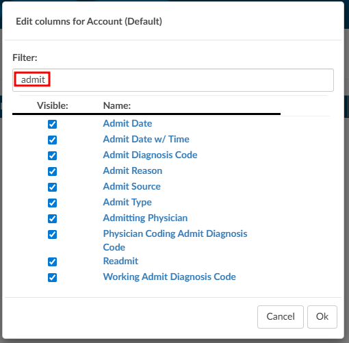

+++
title = 'V2.61 (Jan 2026)'
+++



### Add ability to schedule a report per day of the week.

**CACTWO-5976 and CACTWO-7233** **(Enhancement)**

When creating a scheduled report, the user will now have the ability to schedule a report for a certain day of the week such as ‘first Tuesday of the month’ or ‘last Friday of the month’.  This has also been added to the scheduling window of the Account Search, along with the ability to report hourly. 

### Replace PSI 04 with a new failure to rescue measure.

**CACTWO-6787** **(Enhancement)** 

A new failure to rescue code of ISCMR will now show concurrently with PSI 04 when it applies, but it will be completely replacing PSI 04 in the future. 

### Allow scheduled reports to be restricted to particular domains

**CACTWO-7138** **(Enhancement)**

A new setting will now stop scheduled reports from going out to emails that are not in the configured domain.  As an example, if my setting is marked for ‘dolbey.com’, then if I put an aol.com address in the email for a scheduled report, I will be alerted that the address is not valid for the domain.

> [!info] Additional Configuration Required
Please contact Support to enable this feature.

### Make Mapping titles more noticeable

**CACTWO-7274** **(Enhancement)**

Mapping titles are now in blue to make them stand out better when a user is browsing a long list. Previously they were grey and did not stand out.

### Enable Columns in Account Search to be filterable

**CACTWO-7319** **(Enhancement)**

The Columns button in Account Search now has a filter field at the top of the list.  Clicking on Columns brings up the column list as it is currently, and clicking the arrow lets you either select the list as "Select All" or "Unselect All". No matter how columns are pulled up, a filter box is presented at the top and will filter down the list as characters are typed. 

### In Audit Worksheet, add APC calculation display

**CACTWO-7515** **(Enhancement)**

For accounts with charges, the Audit Worksheet will now show APC calculations to the left of each code in the Audited Charges section if these two site_configuration settings are set to true:

1. ShowAuditAPC : true

2. ShowAuditCharges : true

### Remove trailing blank spaces in pending reson note

**CACTWO-7525** **(Enhancement)**

Currently when adding a note to a pending reason, any trailing blank spaces are being saved to the record.  This has now been changed to discard trailing blank spaces upon saving the note.  

### Add Total Column to the CDI Metric Score Card report

**CACTWO-7551** **(Enhancement)**

A new Total column has been added to the CDI Metric Score Card which calculates the combined statistics for all months within the report.  By comparison, the Average column calculates the average statistics per month within the report. 

### Add user name to CDI Metric Score Card when sent as XLSX

**CACTWO-7575** **(Enhancement)**

If a CDI Metric Score Card report is run as XLSX and has multiple users on it, it will now split the names out on separate tabs in the XLSX report. 

### Added "Audit - Modifiers" columns to the Audits drilldown in Account Search

**CACTWO-7581** **(Enhancement)**

Two new total columns have been added to the Audits Drilldown:

1. Audit- Modifiers Post Audit; AND

2. Audit-Modifiers Pre Audit.  

These will record the total based on the number of modifiers on the CPT codes or Charges.

### PC-06 designation needs to be updated for January 2026

**CACTWO-7584** **(Enhancement)**

The PC-06 algorithm has been updated for January 2026 changes. This allows for a PC-06 designation for accounts that have a Discharge Disposition of ‘Transfer’ as well as ‘Expired’. 

### Remove the "No" option fromthe Final DRG Reconciliation box

**CACTWO-7588** **(Enhancement)**

An option has been added to hide the ‘No’ answer from the Final DRG Reconciliation box. The user will then only have the options to agree or cancel during reconciliation.

> [!info] Additional Configuration Required
Please contact Support to enable this feature.

### Add Total Time line to Forced Autoload Dashboard

**CACTWO-7597** **(Enhancement)**

For the sake of continuity, the line for Total Time Logged in has been added to the Forced Autoload dashboard to match the other user dashboards. 