+++
title = 'V2.62 (Apr 2026)'
+++



### New "User Login" Report has Been Created

**CACTWO-5478** **(Enhancement)**

A new report titled "[User Login](https://dolbeysystems.github.io/fusion-cac-web-docs/administrative-user-guide/reporting/user-reports/#user-login-report)" has been created. This will show the login/logout activity of the user. If an inactivity reason was recorded by the user, then the prior logout will be listed as ‘inactivity’ instead of logout and the inactivity reason will be recorded in its own column.  Date range available is 31 days, the report will never show the current day’s activity.

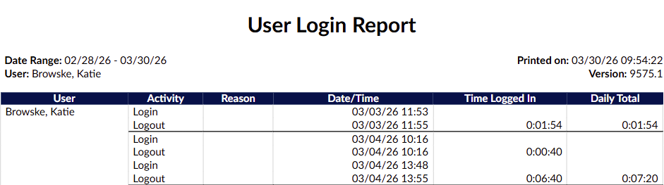

### Allow a Secondary Sort in Workflow Management

**CACTWO-5569** **(Important)**

A new enhancement has been added to [Workflow Management](https://dolbeysystems.github.io/fusion-cac-web-docs/administrative-user-guide/tools/workflow-management/) that allows for a secondary sort order within workflows. When configuring a workflow’s list on the user’s [Account List](https://dolbeysystems.github.io/fusion-cac-web-docs/general-user-guide/accessing-accounts/#account-list) page, items will first be organized by the primary sort, and then further refined using the secondary sort within those results.

### Allow Deleted Pending Reasons and Notes to be Viewable

**CACTWO-6727** **(Enhancement)**

A new checkbox has been added to the [Code Summary viewer](https://dolbeysystems.github.io/fusion-cac-web-docs/general-user-guide/account-screen/navigation-tree/code-summary/) to allow the user to view [pending reasons](https://dolbeysystems.github.io/fusion-cac-web-docs/general-user-guide/account-screen/navigation-tree/code-summary/#pending-reasons) (and any applicable notes) to be seen.  A marker  number next to the checkbox will show the number of currently deleted pending reasons.   When checked, the deleted pending reasons will show beneath the list of active pending reasons, and the red delete button will be grayed out to indicate this is an already deleted pending reason.

> [!note] The number and checkbox will only display if there were previously deleted pending reasons.

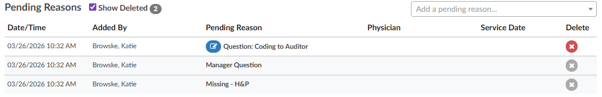

### Add the Ability to Collapse Criteria in Workflow Management

**CACTWO-6896** **(Enhancement)**

In a [workflow management](https://dolbeysystems.github.io/fusion-cac-web-docs/administrative-user-guide/tools/workflow-management/), a new checkbox has been added under the Criteria Groups heading; Collapse all criteria groups.

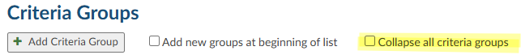

When the box is checked, all criteria under that workflow will close, only showing the name of the criteria:

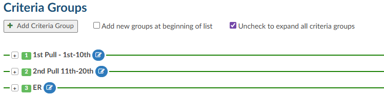

Unchecking the box will reopen all the criteria. 

### Allow Managers to set Grid Columns to Only be Seen by Manager/Admin

**CACTWO-7164** **(Enhancement)**

Managers can now restrict certain grid columns so they are visible only to users with Manager or Administrator roles.

A new “Managers Only” option has been added in [Grid Column Maintenance](https://dolbeysystems.github.io/fusion-cac-web-docs/administrative-user-guide/tools/grid-column-configuration/). When this option is selected for a column, it will be hidden from all users except those assigned a Manager or Administrator role in their User Profile.

For example, if enabled, only users with one of these roles will be able to view the Workgroup column in their grids.

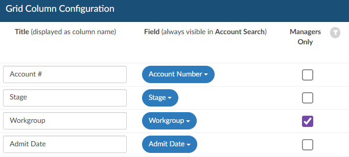

### Identify Transferred Codes in the Show History

**CACTWO-7240** **(Enhancement)**

Codes that have been added to an account via the [Transfer Account Codes](https://dolbeysystems.github.io/fusion-cac-web-docs/general-user-guide/account-screen/navigation-tree/transfer-account-codes/) viewer will now have a ‘download’ icon next to them in the [Show History](https://dolbeysystems.github.io/fusion-cac-web-docs/general-user-guide/account-screen/navigation-tree/code-summary/#show-history) viewer.   When hovering over the icon, the use will see a statement that indicates which account the codes were transferred from.

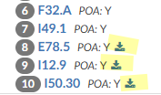

### Display HAC Designation in Banner Bar 

**CACTWO-7344** **(Enhancement)**

To make an assigned diagnosis code with an HAC designation more noticeable, an HAC text will now appear in the [banner bar](https://dolbeysystems.github.io/fusion-cac-web-docs/account-navigation/#banner-bar), similar to a PSI or QI designation.  The HAC designation will still appear next to the assigned code in the [Assigned tree](https://dolbeysystems.github.io/fusion-cac-web-docs/account-navigation/#assigned-codes). 

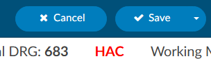

### Add Queries Sent Column to CDI Personal Dashboard

**CACTWO-7345** **(Enhancement)**

A new column has been added to the [CDI Personal Dashboard](https://dolbeysystems.github.io/fusion-cac-web-docs/administrative-user-guide/dashboard/#cdi-personal-dashboard)’s Personal Stats pane.  The column is Queries Sent and will count any physician query created by a CDI Specialist or a CDI Auditor that is not cancelled.  All numbers except zero will show drill-down when the number is clicked.  This change is retroactive. 

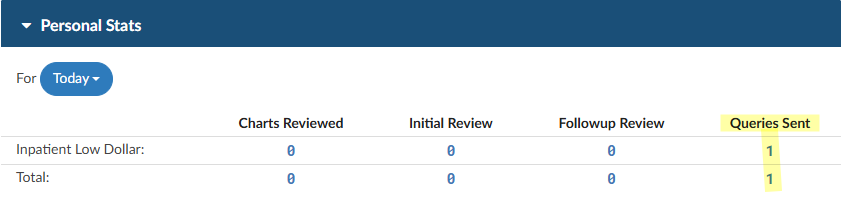

### Force Autoload is Receiving Incorrect "No Accounts" Message

**CACTWO-7579** **(Important)**

An issue was identified where using browser navigation controls (such as the Back or Refresh buttons) during F[orced Autoload](https://dolbeysystems.github.io/fusion-cac-web-docs/administrative-user-guide/tools/user-management/#force-autoload) could cause the session to fall out of sync. This sometimes resulted in an incorrect “There are no accounts…” message, even when accounts were still available.

This has been resolved. The system now detects when the Forced Autoload session becomes out of sync due to unexpected actions or network interruptions and will automatically reset and reload accounts in the background. If accounts still cannot be retrieved after retrying, the message will display as expected. This enhancement helps ensure a more consistent workflow and reduces interruptions during Forced Autoload processing.

### Add Sorting to "Work Available Queue" Admin Dashboard Panels

**CACTWO-7582** **(Enhancement)**

The three administrative dashboards ([Administrative](https://dolbeysystems.github.io/fusion-cac-web-docs/administrative-user-guide/dashboard/#administrative-dashboard), [CDI Management](https://dolbeysystems.github.io/fusion-cac-web-docs/administrative-user-guide/dashboard/#cdi-management-dashboard), [Audit Management](https://dolbeysystems.github.io/fusion-cac-web-docs/administrative-user-guide/dashboard/#audit-management-dashboard)) will now have a sort button at the top of each column under the [Work Available Queue](https://dolbeysystems.github.io/fusion-cac-web-docs/administrative-user-guide/dashboard/#work-available-queue) heading. 

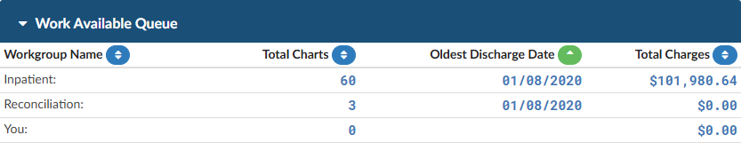

The unsorted buttons will show in blue, and when a sort is put on one of the columns, it will turn green and show which sort it is, ascending or descending.  In this case, the Workgroup Name column is sorted in Ascending order. The sort will flow through to all three administrative dashboards, and will remain in place during the session. Once logout occurs, the sort will clear. 

### Add Default Create Time (descending) Sorting Within Notes and Bookmarks

**CACTWO-7585** **(Enhancement)**

If a user changes the sort to a different column or order withing [Notes and Bookmarks](https://dolbeysystems.github.io/fusion-cac-web-docs/account-navigation/navigation-tree/notes-and-bookmarks/), that preference will persist while navigating between accounts. Upon logging out or restarting Fusion CAC, the sort will reset to the default Create Time (descending) setting.

### A new "Change Auditor" Option has Been Added to Editable Audits

**CACTWO-7625** **(Enhancement)**

When accessed, a selection dialog will display available auditors based on the audit type. This change was made for both [Coding Audits](https://dolbeysystems.github.io/fusion-cac-web-docs/account-navigation/navigation-tree/audit-worksheet/) and [CDI Audits](https://dolbeysystems.github.io/fusion-cac-web-docs/account-navigation/navigation-tree/cdi-audit/). The ability of an auditor (or cdi auditor) to change the auditor of record has been added to the Audit (and CDI Audit) worksheet.  When the button is clicked the dropdown list of users that have the audit role will be displayed. In either audit type a new button will appear, similar to the one for changing the coder (or CDI) of record:

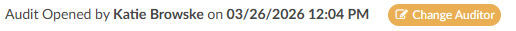
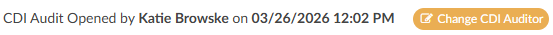

### AG-Grid has Been Updated to the Latest Version

**CACTWO-7636** **(Enhancement)**

### AG-Grid had Been Updated to the Latest Version

**CACTWO-7636** **(Enhancement)**

[AG-Grid](https://dolbeysystems.github.io/fusion-cac-web-docs/administrative-user-guide/reporting/account-search/) has been updated and have several new abilities to be aware of:

- The ‘hamburger’ symbol is replaced by a right click menu and the filter icon now handles filtering only. 
- Improved filter search allows users to locate values by searching any part of the text, not just the first word.
- The Reset button in the right click menu will reset the entire grid back to match how Grid Column Maintenance is set, so use with caution.
  
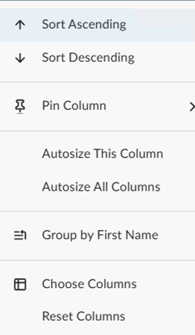

On the right hand side of the viewer, there is now a Columns and a Filters grid. 

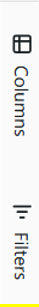

Clicking on Columns allows you to select and deselect columns, plus group rows at the bottom of the list which can be dragged and dropped: 

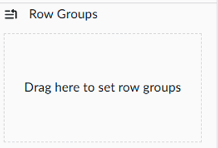

With the Filters option, as you filter, those will be added here, so that you can see all your filters at once. You can also add a filter here:

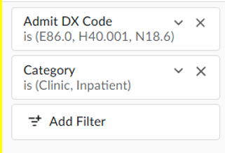

### Enable Time Zone Entry for Specific Reports

**CACTWO-7637** **(Enhancement)**

A new mapping called ‘Timezone’, will allow for timezone entry on 4 [reports](https://dolbeysystems.github.io/fusion-cac-web-docs/administrative-user-guide/reporting/user-reports/): [User Audit Trail](https://dolbeysystems.github.io/fusion-cac-web-docs/administrative-user-guide/reporting/user-reports/#user-audit-trail-report), [User Detail](https://dolbeysystems.github.io/fusion-cac-web-docs/administrative-user-guide/reporting/user-reports/#user-detail-report), [User Login Report](https://dolbeysystems.github.io/fusion-cac-web-docs/administrative-user-guide/reporting/user-reports/#user-login-report) and [User Session Log](https://dolbeysystems.github.io/fusion-cac-web-docs/administrative-user-guide/reporting/user-reports/#user-session-log-report).  This will be helpful for clients who have coders that work across time zones.

> [!info] Additional Configuration Required
Please contact Support to enable this feature.

### Add Modifier Column to Outpatient Coder Scorecard Report

**CACTWO-7641** **(Enhancement)**

A new column has been added to the [Outpatient Coder Scorecard report](https://dolbeysystems.github.io/fusion-cac-web-docs/administrative-user-guide/reporting/user-reports/#outpatient-coder-scorecard); CPT Modifier Count.  This is the total number of modifiers involved in the audit of an outpatient account. This is a retroactive change. 

### Add HCC to Outpatient Shift Reasons

**CACTWO-7647** **(Enhancement)**

‘HCC’ has been added to the [shift reason](https://dolbeysystems.github.io/fusion-cac-web-docs/general-user-guide/account-screen/navigation-tree/physicians-and-queries/#documenting-query-shift-reasons) dialog for outpatient physician queries.  

### Retain Minimized Encoder when Editing an Assigned Code

**CACTWO-7651** **(Enhancement)**

If the [Code Editor](https://dolbeysystems.github.io/fusion-cac-web-docs/general-user-guide/accessing-accounts/editing-codes/) is minimized when editing an assigned code, it will not close if the user moves to other areas of an account’s detail.  But if the code is edited from the document or document code list, the editor will be closed if the user moves to another document. 

### Allow Custom Roles to Populate the Change Dropdown in Audits

**CACTWO-7708** **(Enhancement)**

Custom Roles can be [created](https://dolbeysystems.github.io/fusion-cac-web-docs/administrative-user-guide/tools/role-management/#create-a-new-role) that will be seen in the ‘Change Coder of Record’ dropdown in an [Audit](https://dolbeysystems.github.io/fusion-cac-web-docs/account-navigation/navigation-tree/audit-worksheet/), and the ‘Change CDI of Record’ dropdown in a [CDI Audit](https://dolbeysystems.github.io/fusion-cac-web-docs/account-navigation/navigation-tree/cdi-audit/).  

For "Coder of Record" in [Audit Management](https://dolbeysystems.github.io/fusion-cac-web-docs/account-navigation/navigation-tree/audit-worksheet/), in addition to users with the role of "Coder" or "Auditors", users with roles enabled with the following privileges are now included:

- Audit accounts as an Auditor
- Edit accounts as a Coder
- Edit accounts as a Single Path Coder

For "CDI Specialist of Record" in [CDI Audit Management](https://dolbeysystems.github.io/fusion-cac-web-docs/account-navigation/navigation-tree/cdi-audit/), in addition to users with the role of "CDI Specialist" or "CDI Auditor," users with roles enabled with the following privileges are now included:

- Audit accounts as a CDI Auditor
- Edit accounts as a CDI Specialist

### Add Pending Reasons to the User Audit Trail Report

**CACTWO-7710** **(Enhancement)**

The [User Audit Trail](https://dolbeysystems.github.io/fusion-cac-web-docs/administrative-user-guide/reporting/user-reports/#user-audit-trail-report) will now show two additional message lines; a line for if a pending reason was added, and a line for is a pending reason has been deleted.  

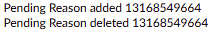

### Add CDI Query Count to CDI Management Dashboard

**CACTWO-7716** **(Enhancement)**

Two new lines of data have been added to the [CDI Management dashboard](https://dolbeysystems.github.io/fusion-cac-web-docs/administrative-user-guide/dashboard/#cdi-management-dashboard) under the CDI Summary pane; CDI Queries Sent Today, and CDI Queries Sent in Last 7 Days.  These will also have a drill-down leading to detailed pages for those statistics. 

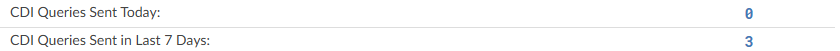

### Add Plus Buttons in DRG Reconciliation Viewer to add Codes

**CACTWO-7756** **(Enhancement)**

A plus sign has been added to the left of the codes in the [DRG Reconciliation Viewer](https://dolbeysystems.github.io/fusion-cac-web-docs/account-navigation/navigation-tree/drg-reconciliation/) to allow for easy additions to the Working DRG and Final DRG.

### Add new Field of "Pending Reason Date Added (First)"

**CACTWO-7758** **(Enhancement)**

A new field has been added to [Grid Maintenance](https://dolbeysystems.github.io/fusion-cac-web-docs/administrative-user-guide/tools/grid-column-configuration/), ‘Pending Reason Date Added (First)'.  This will also show as a choice in the [Account Search](https://dolbeysystems.github.io/fusion-cac-web-docs/administrative-user-guide/reporting/account-search/) and [Workflow](https://dolbeysystems.github.io/fusion-cac-web-docs/administrative-user-guide/tools/workflow-management/) Criteria dropdowns. 

### Increase Amount of Accounts Account Search can List

**CACTWO-7763** **(Enhancement)**

In [Account Search](https://dolbeysystems.github.io/fusion-cac-web-docs/administrative-user-guide/reporting/account-search/), there will no longer be a page restriction for the amount of accounts that can show on one page.  All accounts will now be seen on the first page, and they will be streamed into Account Search, allowing for thousands of accounts before memory is compromised.  

### Make User Management Work the Same as Account Search Detail

**CACTWO-7769** **(Enhancement)**

[User Management](https://dolbeysystems.github.io/fusion-cac-web-docs/administrative-user-guide/tools/user-management/) has been updated to work similarly to how [Account Search](https://dolbeysystems.github.io/fusion-cac-web-docs/administrative-user-guide/reporting/account-search/) detail returns work.

- If a user is being edited, once it is saved or cancelled, the return to the Management screen will highlight and focus on that user.
- If using the ‘Add’ button to add a user, when the user is saved, the return back to the Management screen will highlight and be focused on that new user.
- If the copy button is used on an already existing user, once the copy (or copies) are saved, the return to the Management screen will highlight and be focused on the last new user created from the copy.
- If the copy button is used and the copy is cancelled, not saved, the return to the Management screen will highlight and be focused on the user that was being copied. 

### Change Dashboard to not Show '5,000+' as Total

**CACTWO-7771** **(Enhancement)**

The [Work Available Queue](https://dolbeysystems.github.io/fusion-cac-web-docs/administrative-user-guide/dashboard/#work-available-queue) on the Dashboard shows any total over 5000 as 5000+.  This has been changed to show the exact number of accounts.

### The Validation Management Display and CSV Export have been Updated

**CACTWO-7800 and 7801** **(Enhancement)**

For consistency within Fusion, the [Validation Management](https://dolbeysystems.github.io/fusion-cac-web-docs/administrative-user-guide/tools/validation-management/) page has been updated to look and act like the [Workflow Management](https://dolbeysystems.github.io/fusion-cac-web-docs/administrative-user-guide/tools/workflow-management/) and [Scheduled Reports](https://dolbeysystems.github.io/fusion-cac-web-docs/administrative-user-guide/reporting/scheduled-reports/) pages.  The functionality of adding, deleting, editing and copying all remain the same.  The csv report has also been updated for better usability.

### Allow Submitted Accounts to Remain in Submitted Status to Audit

**CACTWO-7813** **(Enhancement)**

When using Save and Route to send a submitted account directly to an Auditor or an [Audit workgroup](https://dolbeysystems.github.io/fusion-cac-web-docs/administrative-user-guide/tools/workflow-management/#audit), the account will now remain in Submitted (Stage A).

Previously, routing a submitted account to a user or workgroup would automatically change its stage to QA Review (Stage Q), as the system assumed the account was being sent for updates and resubmission. With this update, routing through Save and Route to an audit destination is recognized as an audit-only action, so the account status will no longer change unnecessarily.

### Add Fields to Validation Management for Denials

**CACTWO-7819** **(Enhancement)**

In [Validation Management](https://dolbeysystems.github.io/fusion-cac-web-docs/administrative-user-guide/tools/validation-management/), when using the ‘[for each](https://dolbeysystems.github.io/fusion-cac-web-docs/administrative-user-guide/tools/validation-management/#for-each-check-box)’ option and selecting Denials from the list, a list of Denial options will be opened to complete the validation rule. 

### Add Column to the CDI Alerts Impact Report

**CACTWO-7820** **(Enhancement)**

A new column, ‘Query Template’ has been added to the [CDI Alert Impact Report](https://dolbeysystems.github.io/fusion-cac-web-docs/administrative-user-guide/reporting/user-reports/#cdi-alerts-impact-report), and it appears to the left of the Account Number column.  The Date range of the report has also been updated to pull from the Admit Date, not the Query Created Date.

### Add Column to the Query Impact Report

**CACTWO-7822** **(Enhancement)**

When the [Query Impact Report](https://dolbeysystems.github.io/fusion-cac-web-docs/administrative-user-guide/reporting/user-reports/#query-impact-report) or Q[uery Impact Report by Discharge Date](https://dolbeysystems.github.io/fusion-cac-web-docs/administrative-user-guide/reporting/user-reports/#query-impact-by-discharge-date-report) is exported as an XLSX file, a ‘Query For’  column will show next to the Query Template. This new column will NOT show if a Query For has not been recorded.  

### Add Drill Down for E/M Charges in Account Search 

**CACTWO-7823** **(Enhancement)**

A new [drill down](https://dolbeysystems.github.io/fusion-cac-web-docs/administrative-user-guide/reporting/account-search/#drill-down-level) for [E/M](https://dolbeysystems.github.io/fusion-cac-web-docs/general-user-guide/account-screen/navigation-tree/add-on-modules-and-viewers/#er-em-module) Charges has been added to the [Account Search](https://dolbeysystems.github.io/fusion-cac-web-docs/administrative-user-guide/reporting/account-search/) page, which will include columns associated with the charges field in an [E/M worksheet](https://dolbeysystems.github.io/fusion-cac-web-docs/general-user-guide/account-screen/navigation-tree/add-on-modules-and-viewers/#completing-the-er-em-worksheet). 

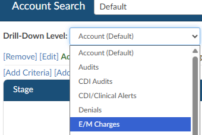

### Add new Columns to Inpatient and Outpatient Coder Scorecards

**CACTWO-7833** **(Enhancement)**

Two new columns have been added to the [Inpatient](http://localhost:1313/fusion-cac-web-docs/administrative-user-guide/reporting/user-reports/#inpatient-coder-scorecard) and [Outpatient](http://localhost:1313/fusion-cac-web-docs/administrative-user-guide/reporting/user-reports/#outpatient-coder-scorecard) Coder Scorecard reports.  These come directly after the account column and are called D/C Disp Change and D/C Disp Accuracy rate.  This change is retroactive. 

### Error Occurring when Running the Outpatient Coder Scorecard

**CACTWO-7835** **(Important)**

An error occurred when running the [Inpatient](http://localhost:1313/fusion-cac-web-docs/administrative-user-guide/reporting/user-reports/#inpatient-coder-scorecard) or [Outpatient](http://localhost:1313/fusion-cac-web-docs/administrative-user-guide/reporting/user-reports/#outpatient-coder-scorecard) Coder Scorecard reports if an auditor performed several audits with the same audit type and recorded large amounts of text in Training Recommendations.  This has been corrected. 

### Create Hover Over to Active Alerts Name Column

**CACTWO-7836** **(Enhancement)**

The Active Alerts Name column will now have a hover over so that the user can see the full list of alerts when the field in that column ends in ellipsis.

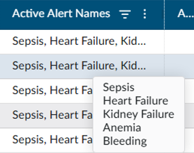

### Make the Archived Documents Symbols Easier to see

**CACTWO-7840** **(Enhancement)**

The eye symbol that appears on the [Documents panel header](https://dolbeysystems.github.io/fusion-cac-web-docs/account-navigation/#documents-tree) to alert the user to an archived document will now have a black background to make it more noticeable. 

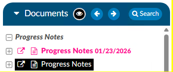

### Add new Column to the Query Drill Down in Account Search

**CACTWO-7842** **(Enhancement)**

A new column of Queries Created by Role column will now appear when Queries is selected as the [Drill-Down Level](https://dolbeysystems.github.io/fusion-cac-web-docs/administrative-user-guide/reporting/account-search/#drill-down-level) in [Account Search](https://dolbeysystems.github.io/fusion-cac-web-docs/administrative-user-guide/reporting/account-search/).

### Add 'Loading' Bubbles to Calendar View

**CACTWO-7843** **(Enhancement)**

In the case of a very large return on a [Calender View day](https://dolbeysystems.github.io/fusion-cac-web-docs/administrative-user-guide/reporting/calendar-view/), users were unable to tell if the request was working or not, since it took a long time for the page to load.  To remedy that, three pulsing dots, or bubbles, have been added to the screen to show that the screen is in the process of loading.

### Change Orientation on the CDI Query Score Card Reports

**CACTWO-7854** **(Enhancement)**

The [CDI Query Score Card](https://dolbeysystems.github.io/fusion-cac-web-docs/administrative-user-guide/reporting/user-reports/#cdi-query-score-card-report) and [CDI Query Score Card by Admission Month](https://dolbeysystems.github.io/fusion-cac-web-docs/administrative-user-guide/reporting/user-reports/#cdi-query-score-card-by-admission-month) reports will now show in Letter (Portrait) mode for PDF, rather than Landscape (Legal) mode. 

### Correct Calculation of Oldest D/C Date in Work Available Queue Panel

**CACTWO-7855** **(Important)**

Today’s date was showing as the Oldest Discharge Date in the [Dashboard Work Available](https://dolbeysystems.github.io/fusion-cac-web-docs/administrative-user-guide/dashboard/#work-available-queue) panel if an account did not have a discharge date. The Oldest Populated discharge date will now appear for each  Work Available Queue even if there are blank discharge dates within that queue. 

### Quantity Resetting to Zero in E/M Viewer

**CACTWO-7870** **(Important)**

In the instance of a soft CT code being assigned to a document on an [E/M](https://dolbeysystems.github.io/fusion-cac-web-docs/general-user-guide/account-screen/navigation-tree/add-on-modules-and-viewers/#er-em-module) account, if the user then went into the [E/M viewer](https://dolbeysystems.github.io/fusion-cac-web-docs/general-user-guide/account-screen/navigation-tree/add-on-modules-and-viewers/#completing-the-er-em-worksheet) and added a quantity of 1 to the  “Charges for Assigned CPT Codes”, the 1 was not being retained upon saving the account.  This has been corrected.

### Inpatient Coder Scorecard is not Displaying Audit DRGs

**CACTWO-7886** **(Important)**

The Pre-Audit and Post-Audit DRG columns in the [report](https://dolbeysystems.github.io/fusion-cac-web-docs/administrative-user-guide/reporting/user-reports/#inpatient-coder-scorecard) are showing as blank.  This has been corrected so that the columns are now populated with the correct DRGs.  This fix is retroactive. 

### Change how Clicking "ok" is Handled in a Code Comment

**CACTWO-7888** **(Enhancement)**

When a user adds a [code comment](https://dolbeysystems.github.io/fusion-cac-web-docs/general-user-guide/account-screen/#code-comments), their name should appear in the Commented By column of the [Notes and Bookmarks viewer](https://dolbeysystems.github.io/fusion-cac-web-docs/general-user-guide/account-screen/navigation-tree/notes-and-bookmarks/) if a secondary user opens and either clicks cancels or OK without adding text.  It was being replaced by the secondary user.  This has been updated so that the Commented By ID is only changed if a secondary user actually adds more data to the comment. 

### Create new Report Coding TAT per Patient Type

**CACTWO-7892** **(Enhancement)**

[This new report](https://dolbeysystems.github.io/fusion-cac-web-docs/administrative-user-guide/reporting/user-reports/#coding-tat-per-patient-type) was created for a coding management view to show work entering and completing for the selected Discharge Date range.  It includes incoming and completed volume, remaining backlog, and average turnaround times.  This report needs at least a minimum of one category selected and can only use a maximum of a 31-day range. 

### Workgroups are Skipped During the Second Round for Forced Autoload

**CACTWO-7900** **(Important)**

[Forced Autoload](https://dolbeysystems.github.io/fusion-cac-web-docs/administrative-user-guide/tools/user-management/#force-autoload) now properly follows a round-robin order when assigning work across multiple workgroups.

Previously, if all assigned workgroups had limits, the system could stop assigning work as expected after the first pass.
With this update, once all workgroup limits are reached, the system will reset the limits and continue assigning work in order, ensuring a consistent and balanced distribution across workgroups.

### The Plus Sign in the Final DRG Viewer is not Working Properly 

**CACTWO-7901** **(Important)**

If the plus sign on an already assigned code is clicked in a Final [DRG viewer](https://dolbeysystems.github.io/fusion-cac-web-docs/account-navigation/navigation-tree/drg-reconciliation/), the code was being removed which is not correct functionality.  Clicking a plus sign should not remove a code; this has been corrected. 

### Create a Privilege for Creating and Editing E/M Configuration

**CACTWO-7902** **(Enhancement)**

A new privilege has been added to [Role Management](https://dolbeysystems.github.io/fusion-cac-web-docs/administrative-user-guide/tools/role-management/) called ‘Create/Edit E/M Configuration.  If given to a role, it will add the [ER E/M Configuration](https://dolbeysystems.github.io/fusion-cac-web-docs/administrative-user-guide/tools/er-em-configuration-page/) page to the Tools menu.

### Allow Assigned Codes Tree to Show SOI and ROM Numbers

**CACTWO-7909** **(Enhancement)**

As long as there is an APR-DRG on an account, the [Assigned codes tree](https://dolbeysystems.github.io/fusion-cac-web-docs/account-navigation/#assigned-codes) will now show code-level SOI and ROM numbers divided by a slash in a blue box next to the code.  Hovering over that will give the descriptors; in the first example of this list the hover over would say SOI 2 / ROM 1.

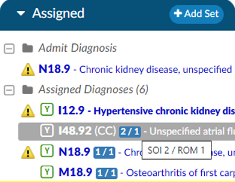

### Change how the E/M Page Determines Critical Care Date

**CACTWO-7913** **(Enhancement)**

Currently the [Critical Care](https://dolbeysystems.github.io/fusion-cac-web-docs/general-user-guide/account-screen/navigation-tree/add-on-modules-and-viewers/#critical-care) date on the [E/M viewer](https://dolbeysystems.github.io/fusion-cac-web-docs/general-user-guide/account-screen/navigation-tree/add-on-modules-and-viewers/#completing-the-er-em-worksheet) is defaulting to today’s date.  This has been changed to default to the date of the E/M page, which is the Admit date. 

### Stop Users from Being able to add a Duplicate Worksheet to an Account

**CACTWO-7914** **(Enhancement)**

In order to stop a worksheet from being added multiple times to an account, a new checkbox has been added in [Worksheet Designer](https://dolbeysystems.github.io/fusion-cac-web-docs/administrative-user-guide/tools/worksheet-designer/).  When checked, once that worksheet has been added to an account, it will then appear in italics in the worksheet dropdown and will be unable to be selected.   Worksheets that have the checkbox left blank will be able to be added multiple times. 

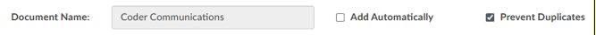
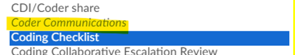

### Allow Images to be Pasted into the Rebuttal Areas of Audits

**CACTWO-7915** **(Enhancement)**

Currently, the rebuttal comment section of the [Audit Worksheet](https://dolbeysystems.github.io/fusion-cac-web-docs/account-navigation/navigation-tree/audit-worksheet/) and [CDI Audit Worksheet](https://dolbeysystems.github.io/fusion-cac-web-docs/account-navigation/navigation-tree/cdi-audit/) only support text.   This has been updated so that images can be pasted into the field.  

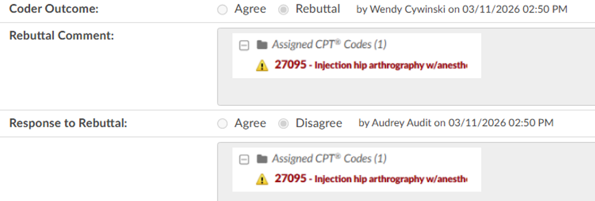

### Secondary Cardiac Dysrhythmia with POA Y was not Excluding PSI 10

**CACTWO-7920** **(Important)**

When a secondary cardiac dysrhythmia code with POA N is on an account with other criteria that will create a PSI 10 designation, and the POA on that code is later changed to a Y, the PSI 10 designation should be removed, but is not.  This has been corrected. 

### Allow Browser tab to Display Personalized Setting

**CACTWO-7921** **(Enhancement)**

A setting that allows the browser tab to display personal text in the browser tab has been modified to show that text first, before the Fusion CAC wording, like this: 

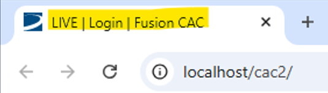

Users already having this setting will see the change, users that do not currently have this setting can contact Support to have it enabled. 

### Physician Queries were Allowed to be Changed on Locked in use Accounts

**CACTWO-7924** **(Important)**

If an account was locked in use, the second user that opened it was still able to make changes to queries, assigned physicians, etc, just as if the account was not locked.   This has been corrected.  No changes can be made on a locked account. 

### Coder Should be Unable to add Codes in CDI History when Locked

**CACTWO-7926** **(Important)**

If an account is locked and a coder clicks on a plus sign in the [CDI History](https://dolbeysystems.github.io/fusion-cac-web-docs/general-user-guide/account-screen/navigation-tree/working-cdi-history/) worksheet, the code can be added.  Account cannot be saved, but the coder should still not be able to do this. The plus sign has now been removed from locked accounts. 

### Split a Current Privilege in Role Management into two Privileges

**CACTWO-7930** **(Enhancement)**

Currently, in [Role Management](https://dolbeysystems.github.io/fusion-cac-web-docs/administrative-user-guide/tools/role-management/) there is a single privilege ‘Exclude Saves From First Coder, Next Review, Ownership, and Workflow updates’.  This has been split out into 2 privileges for better exclusion work:
- Exclude Saves from First Coder, Next Review, and Ownership
- Exclude Saves from Triggering Workflow

### Do not Allow all Codes Editor and Code Editor to be Open Together

**CACTWO-7931** **(Important)**

When the [Code editor](https://dolbeysystems.github.io/fusion-cac-web-docs/general-user-guide/accessing-accounts/editing-codes/#mass-editing-codes) was opened and minimized, the [All Codes editor](https://dolbeysystems.github.io/fusion-cac-web-docs/general-user-guide/accessing-accounts/editing-codes/#mass-editing-codes) could still be opened, which is not correct.  Now, the user will see a blue toast message over the red ‘restore’ bar that a code editor is already open.

### Stop Multiple Instances of Validation Rule from Showing

**CACTWO-7933** **(Enhancement)**

If a [Validation Rule](https://dolbeysystems.github.io/fusion-cac-web-docs/administrative-user-guide/tools/validation-management/) was a ‘for each’ CPT code, and an account had several instances that matched that, the Validation Rule would be listed for each time in the [Code Summary](https://dolbeysystems.github.io/fusion-cac-web-docs/account-navigation/navigation-tree/code-summary/).  A new checkbox for ‘Display Distinct Rules Only’ has been added for the ‘for each’ type fo rule, which will then only allow 1 instance of the rule to show for each distinct result.  In the below example, if an account had 3 instances of CPT 44100, the rule would previously show 3 times in the Code Summary.  With the new checkbox it will now only show once. 

### Change DRG Display on Pre/Post Queries

**CACTWO-7935** **(Enhancement)**

Physician Queries will now display the billing grouper within inpatient physician queries if "BillingGrouper" is configured.  The continued default is for  inpatient physician queries to display the primary grouper.

### Forced Autoload Users are Being Given out of Order Accounts

**CACTWO-7941** **(Important)**

In the event of very large loads in the assigned workgroups, because it is taken extra time to load the next account, if a user clicks on a Pending account and it opens, the assigned workgroups can lose their work order.  The three blinking dots symbol has been added to Dashboard to indicate the system is working, and this will prevent any user from clicking on a pending account or Load Next Account during that action.  

### Autoload Dashboard is not Dropping Down Lists from Pending Accounts

**CACTWO-7945** **(Important)**

If a [Forced Autoload](https://dolbeysystems.github.io/fusion-cac-web-docs/administrative-user-guide/tools/user-management/#force-autoload) user has the Coder Scorecard on their dashboard, then if they did a drop down from the ag-grid on their Pending Accounts (hamburger icon in the right of each column) , the dropdown was appearing under the Coder Scorecard banner bar, causing part of the list to be unviewable.  This has been corrected. 

### Default the ER E/m Date to the Account's Admit Date

**CACTWO-7947** **(Enhancement)**

When opening the [E/M Management](https://dolbeysystems.github.io/fusion-cac-web-docs/administrative-user-guide/tools/er-em-configuration-page/) viewer for the first time on an account, the ER E/M date will now default to the account‘s Admit Date.

### Audit Workflow is mot Triggering for Charts

**CACTWO-7968** **(Important)**

If an [Audit Workflow](https://dolbeysystems.github.io/fusion-cac-web-docs/administrative-user-guide/tools/workflow-management/#audit) uses criteria involving a type of user’s role and uses a grouping that includes the same type of user, the workflow was not triggering.  As an example if a criteria included "First Submitter Roles" and the grouping included "First Submitter User Id" an exception in the MongoDB would occur. This has been corrected. 

### Auditor Worksheets are not Automatically Being Applied

**CACTWO-7974** **(Important)**

If an Auditor Worksheet was marked for Auto-Add from within worksheet designer, it was not being added when an account was opened.  This has been corrected. 

### The User Detail Report is not Allowing a Full Month of Data to be Pulled

**CACTWO-7980** **(Important)**

The maximum days set on the [User Detail Report](https://dolbeysystems.github.io/fusion-cac-web-docs/administrative-user-guide/reporting/user-reports/#user-detail-report) is 30…this causes an issue when running a report that runs between a 31 day month and a 30.  The maximum has been changed to 31 days and the description has been updated. 

### In Workflow Management, the Audit Workflow is not Running

**CACTWO-7980** **(Important)**

In [Workflow Management](https://dolbeysystems.github.io/fusion-cac-web-docs/administrative-user-guide/tools/workflow-management/), when working with an Audit workflow’s [scheduling](https://dolbeysystems.github.io/fusion-cac-web-docs/administrative-user-guide/tools/workflow-management/#schedule), the ‘restrict’ field was allowing alpha entry when it should only have accepted numeric entry.  This caused the workflow to not run.  The ‘restrict’ field has been changed to a drop down field for selection to prevent this issue. 

### Scorecard Reports not Showing Properly in XLSX

**CACTWO-8000** **(Important)**

The [Inpatient](https://dolbeysystems.github.io/fusion-cac-web-docs/administrative-user-guide/reporting/user-reports/#inpatient-coder-scorecard) and [Outpatient Coder Scorecard](https://dolbeysystems.github.io/fusion-cac-web-docs/administrative-user-guide/reporting/user-reports/#outpatient-audit-scorecard) reports were showing extended characters, like ellipsis or bullet points, as symbols when the reports were run in XLSX.  This has been corrected. 

### Unable to Delete Physicians Using "Edit Procedure Codes"

**CACTWO-8002** **(Important)**

On the [Assigned code tree](https://dolbeysystems.github.io/fusion-cac-web-docs/account-navigation/#assigned-codes), right clicking on PCS or CPT codes and selecting ‘Edit Procedure Code’ from the list was allowing the user to delete the physician assigned, but when clicking save the physician was re-applied.  This has been corrected so that if the ‘x’ is used to remove the physician, saving was saving the deletion.  

### Account Search is Losing the Lower Scroll Bar

**CACTWO-8008** **(Important)**

It was confirmed that if a filter summary exceeded one line in length, the lower scroll bar would be unviewable.  This has been corrected. 