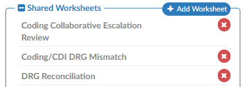
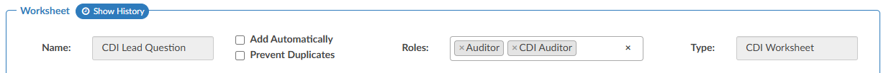
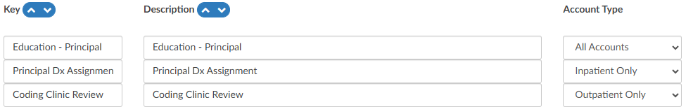
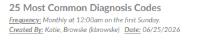
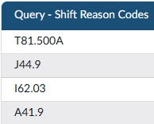
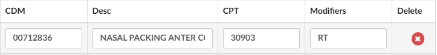

+++
title = 'V2.63 (Jul 2026)'
+++



### Add Comment Bubbles to Audit Input Fields

**CACTWO-6029** **(Enhancement)**

### Clear Button Added to Filter Input Boxes in Workflow

**CACTWO-6049** **(Enhancement)**

An "X" clear button has been added to the end of each filter input box in [Workflow Management](https://dolbeysystems.github.io/fusion-cac-web-docs/administrative-user-guide/tools/workflow-management/). Clicking the X will immediately clear the contents of that field, allowing users to quickly reset a filter without having to manually select and delete the text. This restores functionality that was previously available in the classic workflow view.

### Redesign the Worksheet and Query Template pages

**CACTWO-6142** **(Important)**

The [Worksheet Designer](https://dolbeysystems.github.io/fusion-cac-web-docs/administrative-user-guide/tools/worksheet-designer/) and [Query Designer](https://dolbeysystems.github.io/fusion-cac-web-docs/administrative-user-guide/tools/query-designer/) pages have been redesigned to match the look and feel of other administrative pages in the application. Previously, these pages had inconsistent styling, an unnecessary filters section, and a hide left column toggle that would obscure the navigation panel. With this update, the pages now present worksheet and query groups in a fixed, logical order with the left panel always visible. 

### Restrict Worksheet Creation by Role

**CACTWO-6151** **(Enhancement)**

A new Roles field has been added to CDI, Coding, and Shared worksheets in [Worksheet Designer](https://dolbeysystems.github.io/fusion-cac-web-docs/administrative-user-guide/tools/worksheet-designer/). When one or more roles are assigned to a worksheet, only users who have at least one of those roles assigned to their profile will be able to add that worksheet to an account. Users without a matching role will not see the option to add the worksheet, though they will still be able to view worksheets that have already been added. This role restriction is based on the full list of roles assigned to a user's profile, not just the role they are currently signed in under. The Roles field does not apply to Documentation Review or Physician Query templates and will not appear for those template types.

### Assign Audit Training Topics by Account Type

**CACTWO-6582** **(Enhancement)**

A new Account Type column has been added to the AuditTrainingTopics mapping in [Mappings Configuration](https://dolbeysystems.github.io/fusion-cac-web-docs/administrative-user-guide/tools/mapping-configuration/). This allows administrators to specify whether each audit training topic is available for all accounts, inpatient accounts only, or outpatient accounts only. When an auditor is working on an inpatient account, only training topics designated for all accounts or inpatient accounts will appear as selectable options, and likewise for outpatient accounts. This feature applies to Audit Management only and is not implemented in CDI Audit Management, as CDI audits are exclusively applied to inpatient accounts.

### CDI Alerts Link Now Displays Active Alert Count in Bold Red

**CACTWO-6943** **(Enhancement)**

### Display Creator Name and Date on Scheduled Reports

**CACTWO-6999** **(Enhancement)**

The [Scheduled User Reports](https://dolbeysystems.github.io/fusion-cac-web-docs/administrative-user-guide/reporting/scheduled-reports/) page and [Account Search](https://dolbeysystems.github.io/fusion-cac-web-docs/administrative-user-guide/reporting/account-search/) schedules will now record and display the name of the user who originally created a scheduled report, along with the date it was created. This information appears below the report in the list beneath the Frequency field. If the report is subsequently edited and saved, a "Last Updated By" user and date will also be displayed. The creator information will not change when a report is modified by another user, preserving the original author's identity. Please note this change is not retroactive; only reports created after this update will display the "Created By" stamp; previously existing scheduled reports will not show this information.

### Add Query Shift Reason Codes Column to Query Drilldown

**CACTWO-7531** **(Enhancement)**

A new column called "Query - Shift Reason Codes" has been added to the Query drill-down in [Account Search](https://dolbeysystems.github.io/fusion-cac-web-docs/administrative-user-guide/reporting/account-search/). 
This column displays a comma-separated, alphabetically sorted list of all codes selected in either the Before Query or After Query section of the Shift Reason dialog when a query is closed. 
The column is also supported in scheduled account search reports, allowing users to include it when scheduling and distributing Account Search results.

### Add Modifier Support to ER E&M CDM Table Import

**CACTWO-7764** **(Enhancement)**

The Edit CDM Table within [E/M Configuration](https://dolbeysystems.github.io/fusion-cac-web-docs/administrative-user-guide/tools/er-em-configuration-page/) now supports modifiers as part of the CDM import process. When importing the CDM table, modifiers should immediately follow the CPT code with no space (for example, "30903RT"). 

A new Modifier column has been added to the CDM table, which is populated automatically when performing a Reset to import the spreadsheet, or can be entered manually. 
When a coder assigns a CPT code in the E/M Viewer that matches a CDM entry with a modifier, the modifier will automatically be applied to the charge. This allows sites that use hard-coded modifiers such as RT or LT on specific charges to have those modifiers carried forward without requiring coders to add them manually.

### Add CDI/Clinical Alert Fields as Searchable Criteria

**CACTWO-7824** **(Enhancement)**

Six new [CDI/Clinical Alert](https://dolbeysystems.github.io/fusion-cac-web-docs/general-user-guide/account-screen/navigation-tree/cdi-clinical-alerts/) fields have been added as searchable criteria in [Account Search](https://dolbeysystems.github.io/fusion-cac-web-docs/administrative-user-guide/reporting/account-search/), allowing users to filter accounts based on alert-level data. The new fields available are: Alert Name, Alert Subtitle, Alert Category, Alert Outcome, Alert Other Outcome, and Alert Query Template. Because multiple alerts can exist on a single account, these fields are string-based and search across all alerts associated with the account.

### CPT Codes Now Optional for Additional Charges

**CACTWO-7837** **(Enhancement)**

The CPT Code field for "Additional Charges" in [E/M Management](https://dolbeysystems.github.io/fusion-cac-web-docs/administrative-user-guide/tools/er-em-configuration-page/) has been made optional. Previously, a CPT Code was required to save an Additional Charge entry, which presented a challenge for sites that use charges without an associated CPT Code. 

The CDM field remains mandatory for all Additional Charges, and CPT Codes continue to be required for all other E/M charge types. When an Additional Charge without a CPT Code is added to an account from the E/M Viewer, it will be added to the E/M Summary normally without generating an error.

### Modifier from Assigned CPT Code Now Applies When Matching CDM Entry

**CACTWO-7858** **(Enhancement)**

When a coder assigns a CPT code to the code tree that is attributed to the ER and matches a charge in the [E/M Viewer](https://dolbeysystems.github.io/fusion-cac-web-docs/administrative-user-guide/tools/er-em-configuration-page/) CDM table, any modifier on the assigned CPT code will now be used to locate the appropriate CDM entry and automatically applied to the charge. 

Previously, only the CPT code was used for matching and modifiers were ignored, resulting in the modifier not carrying over into the E/M page. If the CPT code matches a CDM entry but the modifiers do not align, a warning will be displayed. Note that modifiers present on the assigned CPT code take precedence over modifiers defined in E/M Configuration via the Edit CDM Table feature.

### Add Configurable "Other" Section to CDI Audits

**CACTWO-7865** **(Enhancement)**

[CDI Audits](https://dolbeysystems.github.io/fusion-cac-web-docs/account-navigation/navigation-tree/cdi-audit/#starting-a-cdi-audit) can now be extended with a configurable Other section, allowing organizations to include additional audit questions for evolving review areas such as CDI alerts, reconciliation, workflow compliance, or other site-specific processes. This provides the flexibility to expand audit criteria without requiring product changes.

The feature is enabled by creating a CdiAuditOtherQuestions mapping in [Mappings Configuration](https://dolbeysystems.github.io/fusion-cac-web-docs/administrative-user-guide/tools/mapping-configuration/). Each mapping entry becomes a question in the Other section when a CDI Audit is started, with response options of Criteria Met, Education Opportunity, and Not Applicable. Responses automatically contribute to Other Opportunities and Other Errors where applicable, and the results are available in the CDI Audit drill-down within Account Search for reporting and analysis.

> [!info] Additional Configuration Required
Please contact Support to enable this feature.

### Add Modifier Support to Options Charges

**CACTWO-7893** **(Enhancement)**

A new Modifiers column has been added to the Options section of [E/M Management](https://dolbeysystems.github.io/fusion-cac-web-docs/administrative-user-guide/tools/er-em-configuration-page/), allowing administrators to configure modifiers for each charge listed there. 

Modifiers are optional, but when populated on a charge in E/M Configuration, they will automatically carry over to the E/M Viewer when that charge is used on an account. Configured modifiers are displayed as comma-separated text on each charge row, with an "Edit Modifiers" button that opens the standard modifier editing dialog. For Additional Charges, the Modifiers field will only be available when a CPT Code is also present on the charge.

### Preserve E/M Viewer Scroll Position Within Session

**CACTWO-7946** **(Enhancement)**

The [E/M Viewer](https://dolbeysystems.github.io/fusion-cac-web-docs/general-user-guide/account-screen/navigation-tree/add-on-modules-and-viewers/#er-em-module) will now remember the scroll position for each account during a session. Previously, navigating away from the E/M Viewer and returning to it would reset the view to the top of the page, requiring the user to scroll back down to their previous location. 

The scroll position is now retained per account for the duration of the session. If a different account is loaded, the E/M Viewer will reset to the top for that account. Once the user exits the application entirely, scroll positions are cleared for all accounts.

### Add Mass Unassign and Assign Visit Support for Diagnosis Codes

**CACTWO-7951** **(Enhancement)** 

The [Mass Edit](https://dolbeysystems.github.io/fusion-cac-web-docs/general-user-guide/accessing-accounts/editing-codes/#mass-editing-codes) dialog has been updated to support the "Unassign Diagnosis Code" and "Assign as Visit" actions when multiple codes are selected using the checkboxes or the "All" checkbox. 

Previously, these actions only applied to the individual code on which the action was taken, rather than all selected codes. Users can now unassign diagnosis codes in bulk, or assign multiple codes as Visit reason (up to the maximum of 3). If more than 3 codes are selected for the Assign as Visit action, no codes will be assigned and a warning message will be displayed, preventing a partial or unintended assignment.

### Coder Scorecard Blank for Users with Facility Restrictions

**CACTWO-7976** **(Important)**

For coders whose user profiles included facility constraints, the [Coder](https://dolbeysystems.github.io/fusion-cac-web-docs/administrative-user-guide/reporting/user-reports/#inpatient-coder-scorecard) [Scorecard](https://dolbeysystems.github.io/fusion-cac-web-docs/administrative-user-guide/reporting/user-reports/#outpatient-coder-scorecard) on the [Coder Personal Dashboard](https://dolbeysystems.github.io/fusion-cac-web-docs/administrative-user-guide/dashboard/#coder-personal-dashboard) was always displaying blank, even when qualifying audits had been closed within the current or prior calendar month. 

The query has been corrected so that the Coder Scorecard now displays audit data filtered to only the facilities the coder is authorized to access. This fix is retroactive and applies to existing audits. 

### Create a CDI Query SOI Impact per Month Report

**CACTWO-7978** **(Enhancement)**

A new "CDI Query SOI Impact per Month" [report](https://dolbeysystems.github.io/fusion-cac-web-docs/administrative-user-guide/reporting/user-reports/) was requested to help CDI leadership evaluate monthly query performance and its effect on patient Severity of Illness (SOI) metrics. 

This new report provides CDI teams with a monthly view of query activity and the resulting impact on patient SOI for submitted inpatient accounts. It tracks accounts where a CDI Specialist established a Baseline APR-DRG and a Coder's Final APR-DRG reflected a higher SOI, allowing teams to monitor documentation improvement trends and measure the effectiveness of their query practices. 

Users can filter results by either Admit Date or Discharge Date, with a maximum range of 12 months. When exported to Excel, the report includes four tabs; a cover sheet, a details tab, a summary, and a bar chart visualization;  while PDF and HTML exports display the summary only.

### Role Management now supports View Only permissions for Audit and CDI Audit Management

**CACTWO-7981** **(Enhancement)**

### Highlight Row Yellow When a Value is Changed

**CACTWO-7991** **(Enhancement)**

### Increase Bookmark Icon Size

**CACTWO-7994** **(Enhancement)**

### Encoder now Blocks DRG/APC Computation for Facilities not Explicitly Licensed in the Medicare Provider Number Mapping

**CACTWO-7997** **(Enhancement)**

### Mapping Configuration now tracks and displays a history of changes

**CACTWO-8015** **(Enhancement)**

### Create a Configurable Document Background Display

**CACTWO-8035** **(Enhancement)**

### Account Search now includes Remaining Impact Dollars, Percent, and Weight fields from the Impact Viewer

**CACTWO-8038** **(Enhancement)**

### Audit Management no longer displays redundant values 

**CACTWO-8054** **(Enhancement)**

### Sort Order Resets After Page Refresh

**CACTWO-8084** **(Important)**

### Server Error When Auto-Saved Account No Longer Exists

**CACTWO-8085** **(Important)**

### Validation Rules Causing Infinite Loop

**CACTWO-8097** **(Important)**

### System Search Date Criteria Scrolls Uncontrollably

**CACTWO-8104** **(Important)**

### Print Button Overlaps Controls in Popped-Out Documents 

**CACTWO-8107** **(Enhancement)**

### Add Optional Time Entry for Date Fields to ER E/M Viewer

**CACTWO-8109** **(Enhancement)**

> [!info] Additional Configuration Required
Please contact Support to enable this feature.

### Document Type Numbers Displaying Incorrectly

**CACTWO-8121** **(Important)**

### Update the Code Set Management Page

**CACTWO-8128** **(Enhancement)**

### Account Search does not Retain Applied Filters or Sorts

**CACTWO-8132** **(Important)**

### The Impact Viewer loops indefinitely and never loads

**CACTWO-8133** **(Important)**

### Collaboration chat Added to Grid Column Configuration, Role Management, and Mapping Configuration pages

**CACTWO-8160** **(Enhancement)**

### Physicians Could not be Edited or Deleted in the Transactions Viewer

**CACTWO-8161** **(Important)**

### Deleting a Note in Notes & Bookmarks did not Refresh the Display

**CACTWO-8175** **(Important)**

### Account Searches Using Query Date/Time Filters Caused Extreme Slowness

**CACTWO-8197** **(Important)**

### TruBridge MUE Edits not Displaying in the Standalone Encoder

**CACTWO-8202** **(Important)**

### Account Search Group rows Missing Total Charges Subtotals

**CACTWO-81203** **(Important)**

### Denial Management Root Causes Field was Clearing due to a Validation rule

**CACTWO-8204** **(Important)**

### Document Types Management Displayed Engine Handling Incorrectly

**CACTWO-8207** **(Important)**

### Black Border Appearing Around Focused Links in Chrome and Edge Browsers

**CACTWO-8210** **(Enhancement)**

### Workgroup Selector Breaks when Workgroup is Removed from User Profile

**CACTWO-8216** **(Important)**

### Destination Account Banner Displays Incorrect Patient Type

**CACTWO-822** **(Important)**

