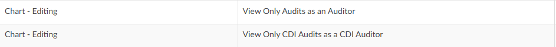
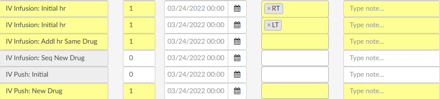
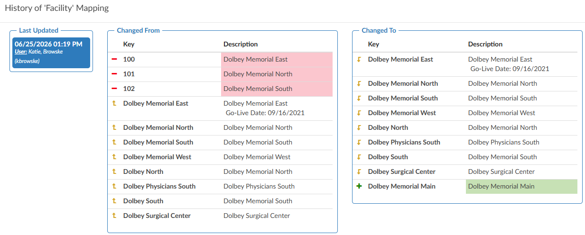

+++
title = 'V2.63 (Jul 2026)'
+++



### Add Comment Bubbles to Audit Input Fields

**CACTWO-6029** **(Enhancement)**

### Clear Button Added to Filter Input Boxes in Workflow

**CACTWO-6049** **(Enhancement)**

An "X" clear button has been added to the end of each filter input box in [Workflow Management](https://dolbeysystems.github.io/fusion-cac-web-docs/administrative-user-guide/tools/workflow-management/). Clicking the X will immediately clear the contents of that field, allowing users to quickly reset a filter without having to manually select and delete the text. This restores functionality that was previously available in the classic workflow view.

### Redesign the Worksheet and Query Template pages

**CACTWO-6142** **(Important)**

The [Worksheet Designer](https://dolbeysystems.github.io/fusion-cac-web-docs/administrative-user-guide/tools/worksheet-designer/) and [Query Designer](https://dolbeysystems.github.io/fusion-cac-web-docs/administrative-user-guide/tools/query-designer/) pages have been redesigned to match the look and feel of other administrative pages in the application. Previously, these pages had inconsistent styling, an unnecessary filters section, and a hide left column toggle that would obscure the navigation panel. With this update, the pages now present worksheet and query groups in a fixed, logical order with the left panel always visible. 

### Restrict Worksheet Creation by Role

**CACTWO-6151** **(Enhancement)**

A new Roles field has been added to CDI, Coding, and Shared worksheets in [Worksheet Designer](https://dolbeysystems.github.io/fusion-cac-web-docs/administrative-user-guide/tools/worksheet-designer/). When one or more roles are assigned to a worksheet, only users who have at least one of those roles assigned to their profile will be able to add that worksheet to an account. Users without a matching role will not see the option to add the worksheet, though they will still be able to view worksheets that have already been added. This role restriction is based on the full list of roles assigned to a user's profile, not just the role they are currently signed in under. The Roles field does not apply to Documentation Review or Physician Query templates and will not appear for those template types.

### Assign Audit Training Topics by Account Type

**CACTWO-6582** **(Enhancement)**

A new Account Type column has been added to the AuditTrainingTopics mapping in [Mappings Configuration](https://dolbeysystems.github.io/fusion-cac-web-docs/administrative-user-guide/tools/mapping-configuration/). This allows administrators to specify whether each audit training topic is available for all accounts, inpatient accounts only, or outpatient accounts only. When an auditor is working on an inpatient account, only training topics designated for all accounts or inpatient accounts will appear as selectable options, and likewise for outpatient accounts. This feature applies to Audit Management only and is not implemented in CDI Audit Management, as CDI audits are exclusively applied to inpatient accounts.

### CDI Alerts Link Now Displays Active Alert Count in Bold Red

**CACTWO-6943** **(Enhancement)**

### Display Creator Name and Date on Scheduled Reports

**CACTWO-6999** **(Enhancement)**

The [Scheduled User Reports](https://dolbeysystems.github.io/fusion-cac-web-docs/administrative-user-guide/reporting/scheduled-reports/) page and [Account Search](https://dolbeysystems.github.io/fusion-cac-web-docs/administrative-user-guide/reporting/account-search/) schedules will now record and display the name of the user who originally created a scheduled report, along with the date it was created. This information appears below the report in the list beneath the Frequency field. If the report is subsequently edited and saved, a "Last Updated By" user and date will also be displayed. The creator information will not change when a report is modified by another user, preserving the original author's identity. Please note this change is not retroactive; only reports created after this update will display the "Created By" stamp; previously existing scheduled reports will not show this information.

### Add Query Shift Reason Codes Column to Query Drilldown

**CACTWO-7531** **(Enhancement)**

A new column called "Query - Shift Reason Codes" has been added to the Query drill-down in [Account Search](https://dolbeysystems.github.io/fusion-cac-web-docs/administrative-user-guide/reporting/account-search/). 
This column displays a comma-separated, alphabetically sorted list of all codes selected in either the Before Query or After Query section of the Shift Reason dialog when a query is closed. 
The column is also supported in scheduled account search reports, allowing users to include it when scheduling and distributing Account Search results.

### Add Modifier Support to ER E&M CDM Table Import

**CACTWO-7764** **(Enhancement)**

The Edit CDM Table within [E/M Configuration](https://dolbeysystems.github.io/fusion-cac-web-docs/administrative-user-guide/tools/er-em-configuration-page/) now supports modifiers as part of the CDM import process. When importing the CDM table, modifiers should immediately follow the CPT code with no space (for example, "30903RT"). 

A new Modifier column has been added to the CDM table, which is populated automatically when performing a Reset to import the spreadsheet, or can be entered manually. 
When a coder assigns a CPT code in the E/M Viewer that matches a CDM entry with a modifier, the modifier will automatically be applied to the charge. This allows sites that use hard-coded modifiers such as RT or LT on specific charges to have those modifiers carried forward without requiring coders to add them manually.

### Add CDI/Clinical Alert Fields as Searchable Criteria

**CACTWO-7824** **(Enhancement)**

Six new [CDI/Clinical Alert](https://dolbeysystems.github.io/fusion-cac-web-docs/general-user-guide/account-screen/navigation-tree/cdi-clinical-alerts/) fields have been added as searchable criteria in [Account Search](https://dolbeysystems.github.io/fusion-cac-web-docs/administrative-user-guide/reporting/account-search/), allowing users to filter accounts based on alert-level data. The new fields available are: Alert Name, Alert Subtitle, Alert Category, Alert Outcome, Alert Other Outcome, and Alert Query Template. Because multiple alerts can exist on a single account, these fields are string-based and search across all alerts associated with the account.

### CPT Codes Now Optional for Additional Charges

**CACTWO-7837** **(Enhancement)**

The CPT Code field for "Additional Charges" in [E/M Management](https://dolbeysystems.github.io/fusion-cac-web-docs/administrative-user-guide/tools/er-em-configuration-page/) has been made optional. Previously, a CPT Code was required to save an Additional Charge entry, which presented a challenge for sites that use charges without an associated CPT Code. 

The CDM field remains mandatory for all Additional Charges, and CPT Codes continue to be required for all other E/M charge types. When an Additional Charge without a CPT Code is added to an account from the E/M Viewer, it will be added to the E/M Summary normally without generating an error.

### Modifier from Assigned CPT Code Now Applies When Matching CDM Entry

**CACTWO-7858** **(Enhancement)**

When a coder assigns a CPT code to the code tree that is attributed to the ER and matches a charge in the [E/M Viewer](https://dolbeysystems.github.io/fusion-cac-web-docs/administrative-user-guide/tools/er-em-configuration-page/) CDM table, any modifier on the assigned CPT code will now be used to locate the appropriate CDM entry and automatically applied to the charge. 

Previously, only the CPT code was used for matching and modifiers were ignored, resulting in the modifier not carrying over into the E/M page. If the CPT code matches a CDM entry but the modifiers do not align, a warning will be displayed. Note that modifiers present on the assigned CPT code take precedence over modifiers defined in E/M Configuration via the Edit CDM Table feature.

### Add Configurable "Other" Section to CDI Audits

**CACTWO-7865** **(Enhancement)**

[CDI Audits](https://dolbeysystems.github.io/fusion-cac-web-docs/account-navigation/navigation-tree/cdi-audit/#starting-a-cdi-audit) can now be extended with a configurable Other section, allowing organizations to include additional audit questions for evolving review areas such as CDI alerts, reconciliation, workflow compliance, or other site-specific processes. This provides the flexibility to expand audit criteria without requiring product changes.

The feature is enabled by creating a CdiAuditOtherQuestions mapping in [Mappings Configuration](https://dolbeysystems.github.io/fusion-cac-web-docs/administrative-user-guide/tools/mapping-configuration/). Each mapping entry becomes a question in the Other section when a CDI Audit is started, with response options of Criteria Met, Education Opportunity, and Not Applicable. Responses automatically contribute to Other Opportunities and Other Errors where applicable, and the results are available in the CDI Audit drill-down within Account Search for reporting and analysis.

> [!info] Additional Configuration Required
Please contact Support to enable this feature.

### Add Modifier Support to Options Charges

**CACTWO-7893** **(Enhancement)**

A new Modifiers column has been added to the Options section of [E/M Management](https://dolbeysystems.github.io/fusion-cac-web-docs/administrative-user-guide/tools/er-em-configuration-page/), allowing administrators to configure modifiers for each charge listed there. 

Modifiers are optional, but when populated on a charge in E/M Configuration, they will automatically carry over to the E/M Viewer when that charge is used on an account. Configured modifiers are displayed as comma-separated text on each charge row, with an "Edit Modifiers" button that opens the standard modifier editing dialog. For Additional Charges, the Modifiers field will only be available when a CPT Code is also present on the charge.

### Preserve E/M Viewer Scroll Position Within Session

**CACTWO-7946** **(Enhancement)**

The [E/M Viewer](https://dolbeysystems.github.io/fusion-cac-web-docs/general-user-guide/account-screen/navigation-tree/add-on-modules-and-viewers/#er-em-module) will now remember the scroll position for each account during a session. Previously, navigating away from the E/M Viewer and returning to it would reset the view to the top of the page, requiring the user to scroll back down to their previous location. 

The scroll position is now retained per account for the duration of the session. If a different account is loaded, the E/M Viewer will reset to the top for that account. Once the user exits the application entirely, scroll positions are cleared for all accounts.

### Add Mass Unassign and Assign Visit Support for Diagnosis Codes

**CACTWO-7951** **(Enhancement)** 

The [Mass Edit](https://dolbeysystems.github.io/fusion-cac-web-docs/general-user-guide/accessing-accounts/editing-codes/#mass-editing-codes) dialog has been updated to support the "Unassign Diagnosis Code" and "Assign as Visit" actions when multiple codes are selected using the checkboxes or the "All" checkbox. 

Previously, these actions only applied to the individual code on which the action was taken, rather than all selected codes. Users can now unassign diagnosis codes in bulk, or assign multiple codes as Visit reason (up to the maximum of 3). If more than 3 codes are selected for the Assign as Visit action, no codes will be assigned and a warning message will be displayed, preventing a partial or unintended assignment.

### Coder Scorecard Blank for Users with Facility Restrictions

**CACTWO-7976** **(Important)**

For coders whose user profiles included facility constraints, the [Coder](https://dolbeysystems.github.io/fusion-cac-web-docs/administrative-user-guide/reporting/user-reports/#inpatient-coder-scorecard) [Scorecard](https://dolbeysystems.github.io/fusion-cac-web-docs/administrative-user-guide/reporting/user-reports/#outpatient-coder-scorecard) on the [Coder Personal Dashboard](https://dolbeysystems.github.io/fusion-cac-web-docs/administrative-user-guide/dashboard/#coder-personal-dashboard) was always displaying blank, even when qualifying audits had been closed within the current or prior calendar month. 

The query has been corrected so that the Coder Scorecard now displays audit data filtered to only the facilities the coder is authorized to access. This fix is retroactive and applies to existing audits. 

### Create a CDI Query SOI Impact per Month Report

**CACTWO-7978** **(Enhancement)**

A new "[CDI Query SOI Impact per Month](https://dolbeysystems.github.io/fusion-cac-web-docs/administrative-user-guide/reporting/user-reports/#cdi-query-soi-impact-per-month)" [report](https://dolbeysystems.github.io/fusion-cac-web-docs/administrative-user-guide/reporting/user-reports/) was requested to help CDI leadership evaluate monthly query performance and its effect on patient Severity of Illness (SOI) metrics. 

This new report provides CDI teams with a monthly view of query activity and the resulting impact on patient SOI for submitted inpatient accounts. It tracks accounts where a CDI Specialist established a Baseline APR-DRG and a Coder's Final APR-DRG reflected a higher SOI, allowing teams to monitor documentation improvement trends and measure the effectiveness of their query practices. 

Users can filter results by either Admit Date or Discharge Date, with a maximum range of 12 months. When exported to Excel, the report includes four tabs; a cover sheet, a details tab, a summary, and a bar chart visualization;  while PDF and HTML exports display the summary only.

### Role Management now supports View Only permissions for Audit and CDI Audit Management

**CACTWO-7981** **(Enhancement)**

There was no way to grant users read-only access to [audits](https://dolbeysystems.github.io/fusion-cac-web-docs/account-navigation/navigation-tree/audit-worksheet/) - anyone with auditor access could edit or modify audit data, making it difficult for managers and supervisors to review audits without risk of inadvertent changes. 

Two new privileges have been added to the Chart - Editing group in [Role Management](https://dolbeysystems.github.io/fusion-cac-web-docs/administrative-user-guide/tools/role-management/): "Only View Audits as an Auditor" and "Only View CDI Audits as a CDI Auditor." 

When enabled, these permissions make the respective audit viewer strictly read-only for all fields, including stopwatches. If a user's role has both create and view-only privileges assigned, the view-only permission takes precedence.

### Highlight Row Yellow When a Value is Changed

**CACTWO-7991** **(Enhancement)**

Rows in the E/M Viewer will now be highlighted in yellow when any value on that row is modified. 

This makes it easier for coders to quickly identify which lines have been updated within the viewer. The highlight is triggered by a change to any control on the row, including quantity, duration, date, or notes. 

Modifiers are excluded from triggering the highlight, as they may be automatically applied via E/M Configuration. The highlight applies to all charge types displayed in the E/M Viewer, including Medications and Additional Charges.

### Increase Bookmark Icon Size

**CACTWO-7994** **(Enhancement)**

The bookmark indicator icon in the Account Detail [document viewer](https://dolbeysystems.github.io/fusion-cac-web-docs/account-navigation/#document-viewer) has been increased to 20px in size to improve visibility. 

Users were having difficulty spotting bookmarks while skimming through documents. The color and icon style remain unchanged; only the size has been enlarged. Note that this change may slightly increase the spacing between lines of text where a bookmark is present.

### Encoder now Blocks DRG/APC Computation for Facilities not Explicitly Licensed in the Medicare Provider Number Mapping

**CACTWO-7997** **(Enhancement)**

### Mapping Configuration now tracks and displays a history of changes

**CACTWO-8015** **(Enhancement)**

The [Mapping Configuration](https://dolbeysystems.github.io/fusion-cac-web-docs/administrative-user-guide/tools/mapping-configuration/) page previously provided no way to see what had changed within a mapping category, making it difficult to diagnose issues caused by inadvertent configuration changes. 

When a mapping was altered incorrectly, administrators had no record of what was changed, by whom, or when - requiring manual investigation to identify and resolve the problem. 

With this update, a "Show History" button now appears in the upper right corner of any mapping that has been modified. Clicking it opens a dialog displaying a before-and-after comparison of all changes made to that mapping, listed in reverse date order. Additions are highlighted in green, deletions in red, and changes in yellow, making it easy to quickly identify exactly what was modified and when.

### Create a Configurable Document Background Display

**CACTWO-8035** **(Enhancement)**

### Account Search now includes Remaining Impact Dollars, Percent, and Weight fields from the Impact Viewer

**CACTWO-8038** **(Enhancement)**

[Account Search]([https://](https://dolbeysystems.github.io/fusion-cac-web-docs/administrative-user-guide/reporting/account-search/)) previously had no way to report on unassigned CDI query impact, when the impact viewer was used to assign impact per query, making it difficult for teams to identify charts where impact had not yet been fully allocated. 

Three new fields, Remaining Impact Dollars, Remaining Impact Percent, and Remaining Impact Weight, have been added to Account Search and Workflow. These fields are updated whenever a CDI Specialist or CDI Auditor closes a physician query, and reflect the outstanding impact as shown in the Impact Queries viewer. 

A Remaining Impact Percent greater than zero indicates there is still impact to be assigned on an account. Note that these fields are not retroactive and will only populate for accounts updated after this change.

### Audit Management no Longer Displays Redundant Values 

**CACTWO-8054** **(Enhancement)** 

In [Audit](https://dolbeysystems.github.io/fusion-cac-web-docs/account-navigation/navigation-tree/audit-worksheet/) Management, when custom abstractions were enabled for a field that had a mapping configured, both the friendly value and the interface value were displayed even when they were identical, resulting in unnecessary and confusing duplication. 

With this update, the interface value is now suppressed when it matches the friendly value, so only one value is shown. When the two values differ, both continue to display as before. This change applies retroactively to all existing audits without requiring them to be resaved.

### Sort Order Resets After Page Refresh

**CACTWO-8084** **(Important)**

Sorting a column in [Account Search](https://dolbeysystems.github.io/fusion-cac-web-docs/administrative-user-guide/reporting/account-search/) was lost whenever the page was refreshed, causing users to lose their place. The fix ensures that column sort and filter settings are preserved when clicking Refresh. Note that changing the filter or drill-down will still intentionally clear the sort.

### Server Error When Auto-Saved Account No Longer Exists

**CACTWO-8085** **(Important)**

If an account was auto-saved due to inactivity, and while the user was logged out, the account was deleted by an interface message, the user should be able to log back in without issue. This has been fixed.

### Validation Rules Causing Infinite Loop

**CACTWO-8097** **(Important)**

In the [Validation Editor](https://dolbeysystems.github.io/fusion-cac-web-docs/administrative-user-guide/tools/validation-management/), a validation rule configured with both a criterion that checks for pending reasons (such as "Pending Reason Does Not Exist") and a pending reason set to be automatically added by that same rule could cause an infinite loop, locking up the browser when an account was loaded. 

This occurred because the rule would trigger itself repeatedly; adding the pending reason, then re-evaluating it, then adding it again. The fix prevents this loop by excluding a rule's own auto-added pending reason from its own criterion evaluation.

### System Search Date Criteria Scrolls Uncontrollably

**CACTWO-8104** **(Important)**

In [System Search](https://dolbeysystems.github.io/fusion-cac-web-docs/administrative-user-guide/tuning/system-search/), clicking the up or down arrow on a numeric date criteria field caused the number to spin rapidly and continuously in the selected direction, with no way to stop it other than clicking outside the field. 

This made it impossible to use the arrows to set a precise value. The issue was isolated to System Search, as Account Search and Workflow were not affected. The arrows now increment and decrement the value as expected, advancing one step per click and stopping when the mouse button is released.

### Print Button Overlaps Controls in Popped-Out Documents 

**CACTWO-8107** **(Enhancement)**

When a document was [popped out](https://dolbeysystems.github.io/fusion-cac-web-docs/account-navigation/#document-viewer) and the window was reduced in size, the Print button could shift down and overlap the document action bar, rendering the Add Codes, Encoder, and Start/Stop buttons un-clickable. 

The issue was intermittent and depended on the length of the document title, which affected how much the window could be resized before the Print button was displaced. The navbar control for the popped-out document page has been updated to prevent wrapping, so the Print button now remains anchored in its position in the document header regardless of window size, keeping all action bar controls accessible.

### Add Optional Time Entry for Date Fields to ER E/M Viewer

**CACTWO-8109** **(Enhancement)**

A new site configuration option has been added to enable time entry in the [ER E/M Viewer](https://dolbeysystems.github.io/fusion-cac-web-docs/administrative-user-guide/tools/er-em-configuration-page/). When enabled, a time attribute will appear alongside the date fields in the Emergency Room E/M section, the Options section, and the Summary section. 

This feature is off by default so that existing sites will experience no change to their current workflow. Sites that require time entry for billing purposes can have a new setting activated by Support. When the setting is disabled, the standard date picker with the single-day increment buttons remains in place as before.

> [!info] Additional Configuration Required
Please contact Support to enable this feature.

### Document Type Numbers Displaying Incorrectly

**CACTWO-8121** **(Important)**

In [Document Types Management](https://dolbeysystems.github.io/fusion-cac-web-docs/administrative-user-guide/tuning/document-types-management/), document type group numbers were incorrectly displaying as "Invalid Number", even when valid values existed in the database. 

This was a display-only issue, and the fix corrected the code to ensure group numbers render correctly.

### Update the Code Set Management Page

**CACTWO-8128** **(Enhancement)**

The [Code Set Management](https://dolbeysystems.github.io/fusion-cac-web-docs/administrative-user-guide/tools/code-set-management/) page was the last admin page in the application still using the original layout, creating an inconsistent user experience. 

The page was redesigned to match the modern style used by other admin pages throughout the application, bringing it into visual and functional consistency with the rest of the admin interface.

### Account Search does not Retain Applied Filters or Sorts

**CACTWO-8132** **(Important)**

When filters or sorting were applied in [Account Searc](https://dolbeysystems.github.io/fusion-cac-web-docs/administrative-user-guide/reporting/account-search/)h and a user opened a record via "View Account Detail," returning to the search results would reset the view to the full unfiltered list, forcing the user to reapply their search criteria. 

The fix changed how Account Detail records load; rather than navigating away from Account Search, the record now loads within the Account Search page itself, hiding the grid while the record is open and restoring it upon exit. This eliminates the need for a page refresh and preserves all previously applied sorts and filters.

### The Impact Viewer loops indefinitely and never loads

**CACTWO-8133** **(Important)**

When a CDI Specialist attempted to open the [Impact Viewer](https://dolbeysystems.github.io/fusion-cac-web-docs/account-navigation/navigation-tree/impact-queries-viewer/) for the first time on an account with completed, non-cancelled queries, the viewer would continuously load without ever rendering results. 

The fix resolved the issue, restoring the Impact Viewer to load correctly under these conditions.

### Collaboration chat Added to Grid Column Configuration, Role Management, and Mapping Configuration pages

**CACTWO-8160** **(Enhancement)**

Several admin pages were missing the collaboration chat functionality that was already available on other pages in the application. 

Chat rooms have been added to the [Grid Column Configuration](https://dolbeysystems.github.io/fusion-cac-web-docs/administrative-user-guide/tools/grid-column-configuration/), [Role Management](https://dolbeysystems.github.io/fusion-cac-web-docs/administrative-user-guide/tools/role-management/), and [Mapping Configuration](https://dolbeysystems.github.io/fusion-cac-web-docs/administrative-user-guide/tools/mapping-configuration/) pages. Each of these pages has its own dedicated chat room, separate from those shared by other admin pages, allowing teams to collaborate directly within the context of those specific configuration areas.

### Physicians Could not be Edited or Deleted in the Transactions Viewer

**CACTWO-8161** **(Important)**

In the [Transactions Viewer](https://dolbeysystems.github.io/fusion-cac-web-docs/account-navigation/navigation-tree/charges-or-transactions/), users were unable to edit or delete a physician on an existing transaction; changes appeared to save but the original physician remained, with no update occurring in the database. 

This issue affected only the Transactions Viewer (not the Charges Viewer) and only when editing or deleting an existing physician, not when adding one for the first time. The fix restored the ability to edit and delete physicians in the Transactions Viewer, and an additional display issue where a deleted physician was not visually removed from the viewer was also corrected.

### Deleting a Note in Notes & Bookmarks did not Refresh the Display

**CACTWO-8175** **(Important)**

When a user deleted a note, the [Notes & Bookmarks](https://dolbeysystems.github.io/fusion-cac-web-docs/account-navigation/navigation-tree/notes-and-bookmarks/) viewer did not update right away; the note appeared to remain until the user navigated away from the screen, making it seem as though the deletion had not worked. 

The fix corrected the viewer to refresh immediately upon deletion, so the note is removed from the display as soon as it is deleted.

### Account Searches Using Query Date/Time Filters Caused Extreme Slowness

**CACTWO-8197** **(Important)**

When an [Account Search](https://dolbeysystems.github.io/fusion-cac-web-docs/administrative-user-guide/reporting/account-search/) included a filter on Query Created Date/Time or Query Closed Date/Time, the date filter was not being applied to the database query, causing the search to scan every account in the database rather than limiting results to the specified date range. 

This resulted in extremely slow search performance, with some queries taking nearly 47 minutes to complete. The fix corrected how these date filters are applied during account search execution, ensuring they properly narrow the result set and significantly improve performance.

### TruBridge MUE Edits not Displaying in the Standalone Encoder

**CACTWO-8202** **(Important)**

The Standalone Encoder was not displaying MUE edits, while the same codes entered in Account Detail would show them correctly. 

The cause was that the Units field for CPT procedures was not being passed to [TruBridge](https://dolbeysystems.github.io/fusion-cac-web-docs/trucode-user-guide/) when running the Standalone Encoder. The fix corrected this so that CPT code units are now properly sent to TruBridge, and MUE edits display as expected.

### Account Search Group rows Missing Total Charges Subtotals

**CACTWO-81203** **(Important)**

When accounts in [Account Search](https://dolbeysystems.github.io/fusion-cac-web-docs/administrative-user-guide/reporting/account-search/) were grouped by a column, the grouping rows previously displayed a subtotal of Total Charges for the accounts within each group. 

This functionality was lost due to changes made to the Account Search page. The fix restored the Total Charges subtotal on grouping rows, which displays whenever the Total Charges column is visible in the grid and is hidden when the column is unchecked.

### Denial Management Root Causes Field was Clearing due to a Validation rule

**CACTWO-8204** **(Important)**

When a [validation rule](https://dolbeysystems.github.io/fusion-cac-web-docs/administrative-user-guide/tools/validation-management/) using "For Each" was enabled on the Root Causes field of a denial worksheet, the field would not populate previously saved root causes when navigating to the worksheet, and any changes made would be cleared when navigating away and back. 

Additionally, the multi-select input intermittently allowed only one value at a time, and on save the Root Causes array in the database was being cleared entirely. The fix corrected the interaction between the For Each validation rule and the Root Causes multi-select field, restoring proper display, editing, and saving behavior.

### Document Types Management Displayed Engine Handling Incorrectly

**CACTWO-8207** **(Important)**

In [Document Types Management](https://dolbeysystems.github.io/fusion-cac-web-docs/administrative-user-guide/tuning/document-types-management/), the Engine Handling configuration was being displayed at the document group row level, even though this setting is only configurable and applicable at the individual document level. 

This was a display-only issue; Engine Handling is not used by the application at the group level. The fix corrected the display so that group rows now show only the Group Name and Group Order, removing the misleading Engine Handling values from the grouped row view.

### Black Border Appearing Around Focused Links in Chrome and Edge Browsers

**CACTWO-8210** **(Enhancement)**

A black border began appearing around links when clicked or focused in Chrome and Edge browsers, most noticeably around workflow groups in Workflow Management and suggested codes in the document viewer, reducing readability by overlapping the text. 

The fix updated the application's CSS to suppress the unwanted focus border, restoring the previous clean appearance across all pages of the application.

### Workgroup Selector Breaks when Workgroup is Removed from User Profile

**CACTWO-8216** **(Important)**

An error was corrected where the [Account List](https://dolbeysystems.github.io/fusion-cac-web-docs/general-user-guide/accessing-accounts/#account-list) workgroup selector would stop functioning properly if the currently selected workgroup was removed from the user's profile while still active. 

This caused the selector to appear truncated, the removed workgroup to remain displayed with no accounts loading, and in some cases the loading indicator would spin endlessly. The Account List will now automatically fall back to the "You" queue when a workgroup is removed from the user's profile, and the removed workgroup will no longer appear in the selector.

### Destination Account Banner Displays Incorrect Patient Type

**CACTWO-822** **(Important)**

A bug was corrected in the [Transfer Account Codes viewer](https://dolbeysystems.github.io/fusion-cac-web-docs/account-navigation/navigation-tree/transfer-account-codes/) where the banner bar was displaying the Patient Type of the source account rather than the destination account. 

This caused confusion when combining accounts of different types, such as merging an ER account into an Inpatient account. Additionally, minor formatting issues in the viewer have been resolved, including the "Room" field not appearing in bold and the "Bed" field displaying as a dash instead of the correct value.

