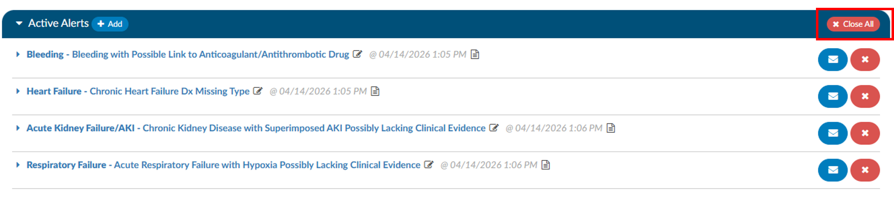
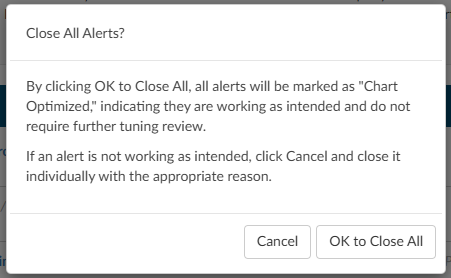
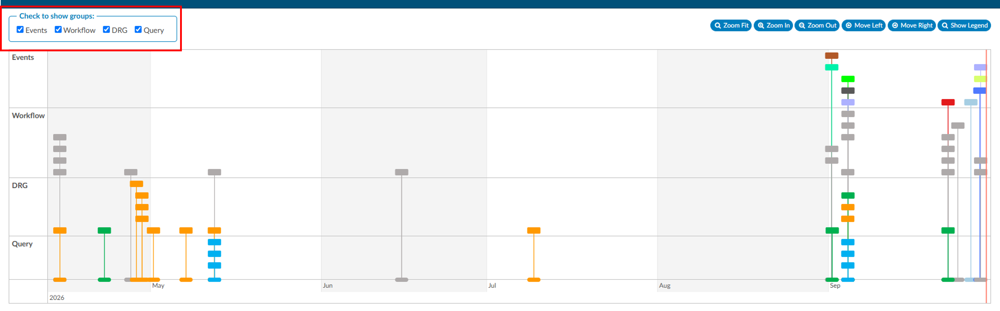
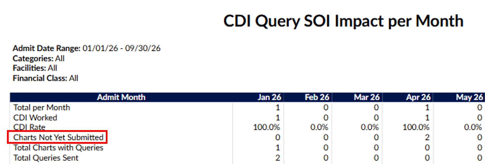
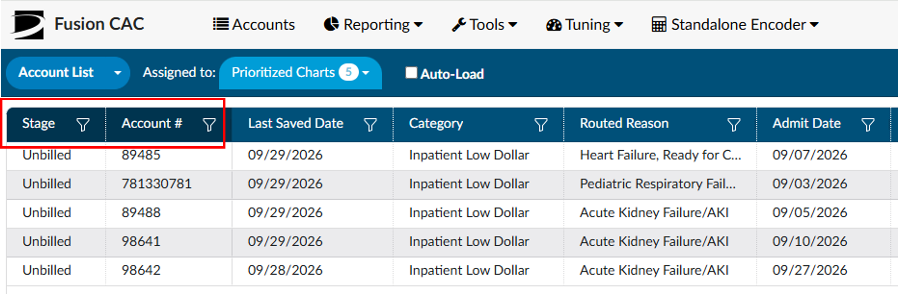
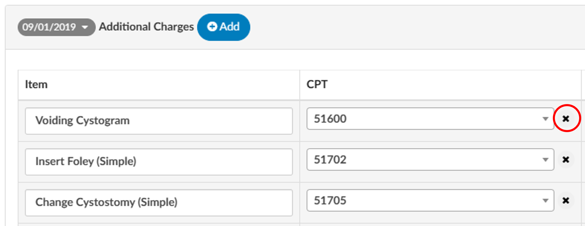
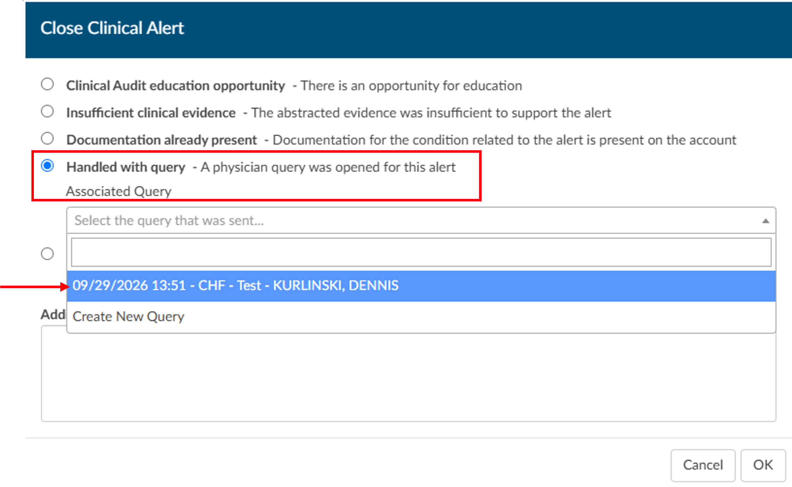
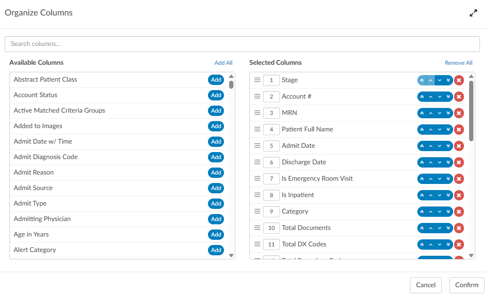
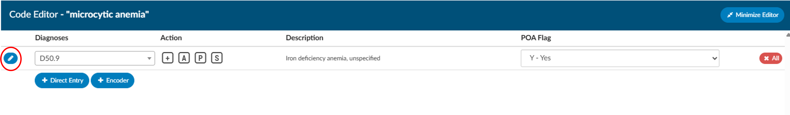
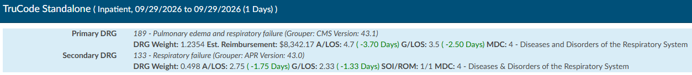

+++
title = 'V2.64 (Oct 2026)'
+++



### Ability for the end User to add Custom Subheadings in the CDI Alerts Editor

**CACTWO-6448** **(Enhancement)**

Previously, subheadings such as Clinical Evidence, Laboratory Studies, and Vital Signs only appeared in the [CDI Alerts](https://dolbeysystems.github.io/fusion-cac-web-docs/general-user-guide/account-screen/navigation-tree/cdi-clinical-alerts/) [Evidence Editor](https://dolbeysystems.github.io/fusion-cac-web-docs/general-user-guide/account-screen/navigation-tree/cdi-clinical-alerts/#cdiclinical-alerts-editor-function) when evidence already existed under them, so users had no way to add a subheading that was missing. A new Add button has been added to the Evidence Editor that lets users select and add a subheading from a configured mapping list. Once added, the subheading can be dragged and dropped to resequence it, and evidence can be moved into it or added to it from an abstraction, discrete value, or medication. A new mapping with the ID "CdiAlertTopicSubHeaders" must be created in Mappings Configuration to populate the list of available subheadings.

> [!info] Additional Configuration Required
Please contact Support to enable this feature.

### Allow an end User to Manually add a CDI/Clinical Alert

**CACTWO-7161** **(Enhancement)**

Users can now add a [CDI/Clinical Alert](https://dolbeysystems.github.io/fusion-cac-web-docs/general-user-guide/account-screen/navigation-tree/cdi-clinical-alerts/#cdiclinical-alerts-editor-function) from a predefined list of topics, even when the system has not automatically identified that topic on the account. This lets CDI specialists gather evidence in an Alert and use the Query button to carry those details into a query, reducing the need to copy and paste information manually.

A manually added Alert displays **“Manually added”** beside its name, along with a person-and-plus icon. Alert topic names can no longer be edited in the [Evidence Editor](https://dolbeysystems.github.io/fusion-cac-web-docs/general-user-guide/account-screen/navigation-tree/cdi-clinical-alerts/#cdiclinical-alerts-editor-function).

If the system later identifies the same topic, it will create a separate automated Alert. The automated Alert may include additional evidence and subcategory information.

When closing a manually added Alert, users can select **“Created by accident”** to remove one opened in error. The **“Insufficient clinical evidence,”** **“Documentation already present,”** and **“Other”** outcomes are unavailable for manually added Alerts.

Previously, a CDI/Clinical Alert topic could only appear on an account if the system automatically triggered it, so users had no way to open an alert for a topic that hadn't yet been flagged. Users can now manually add a new CDI/Clinical Alert from a preselected list of topics, using a mapping called "CdiAlertTopicHeaders." 

Manually added alerts will show ‘Manually added’ next to the name, along with a person and plus sign icon. All Alert Topics can non longer have their name edited in the Evidence Editor, the edit icon has been removed. If the system later automatically detects the same topic, it will still create its own active alert, since the automated version pulls in additional data and subcategory information. 

> [!info] Additional Configuration Required
Please contact Support to enable this feature.

### Add a Days from Discharge column to Account Search

**CACTWO-7533** **(Enhancement)**

A new "Days from Discharge" column has been added for use in [Account Search](https://dolbeysystems.github.io/fusion-cac-web-docs/administrative-user-guide/reporting/account-search/). When added to a grid through [Grid Column](https://dolbeysystems.github.io/fusion-cac-web-docs/administrative-user-guide/tools/grid-column-configuration/) Maintenance, it displays the number of days between today and the account's discharge date. If an account has a blank discharge date, the value is treated as zero. This field is intended for display only.  This column is also supported in [scheduled](https://dolbeysystems.github.io/fusion-cac-web-docs/administrative-user-guide/reporting/scheduled-reports/) Account Search reports run through JSReport. 

### Add Charge and Abstraction Audit Columns to the Outpatient Coder Scorecard

**CACTWO-7898** **(Enhancement)**

The [Outpatient Coder Scorecard](https://dolbeysystems.github.io/fusion-cac-web-docs/administrative-user-guide/reporting/user-reports/#outpatient-coder-scorecard) report has been updated to add up to six new columns. When the site configuration setting "ShowAuditCharges" is enabled, Charge Audit, Charge Errors, and Charge Accuracy Rate columns appear after the CPT related columns. Abstraction Audit, Abstraction Errors, and Abstraction Accuracy Rate columns always appear before the Training Topics column. These fields match the values shown in Audit Management for an outpatient account, and no Accuracy Rate value displays when the Audit count is zero.

### Add a Close All Active Alerts Button to the CDI Alerts Viewer

**CACTWO-7939** **(Enhancement)**

Users can now close all active CDI Alerts on a chart at once when the chart is fully optimized and no further CDI action is needed. The new **Close All** button appears at the top of the CDI Alerts Viewer, eliminating the need to close each Alert individually.

Selecting **Close All** opens a confirmation dialog. If the user confirms, all active Alerts on the chart are closed with the reason Chart Optimized. If an Alert requires a different close reason, the user can cancel and close that Alert individually. 

Closing Alerts that no longer need action helps keep worklists and opportunity counts accurate.

### Add Drilldown and Additional Metrics to the Coder Scorecard

**CACTWO-7975** **(Enhancement)**

The Coder Scorecard on the **Coder Personal** and **Forced Autoload** dashboards now gives coders more visibility into how their accuracy scores are calculated. **Principal PCS Code** has been added as a tracked metric, and each accuracy percentage now shows **Total Opportunities** and **Total Errors** beneath it.

The **Closed Audit** metric opens a detailed view showing each account number, its errors and accuracy results, and its overall accuracy. Account numbers display as text in this view.

A new **Routed to Coder** section shows which charts have been routed to the coder, helping users identify work waiting for them, particularly at sites that do not use workflow. **View All Audits** opens the Accuracy Rate table and the charts included in its results in a new tab.

### Add a Sequence Property for Validation Messages Using For Each

**CACTWO-8234** **(Enhancement)**

[Validation messages](https://dolbeysystems.github.io/fusion-cac-web-docs/administrative-user-guide/tools/validation-management/) can now identify the specific item that needs attention when a rule uses **[For Each](https://dolbeysystems.github.io/fusion-cac-web-docs/administrative-user-guide/tools/validation-management/#for-each-check-box)** to evaluate an array. This helps users find and correct an issue without searching through every audit, denial, or diagnosis on the chart.

In the Validation Editor, add {Sequence} to the message text to display the matching item’s number. For example, if the second denial is missing a Billed DRG, the message Denial #{Sequence} is missing a Billed DRG appears in the Code Summary as **“Denial #2 is missing a Billed DRG.”**

{Sequence} can be used with any **For Each** array.

### Allow Physician Query Drafts to be Viewed as Read Only

**CACTWO-8238** **(Enhancement)**

Previously, when an account was opened as read-only, a [physician](https://dolbeysystems.github.io/fusion-cac-web-docs/general-user-guide/account-screen/navigation-tree/physicians-and-queries/) query draft created by another user could not be viewed, even though the Physicians & Queries section of the Navigation Tree indicated a draft existed. 
This has been changed so that a user with the privilege to create or edit queries can now view another user's draft as read-only when the account is locked. No changes can be made to the draft while viewing it this way. 

### Improve Readability of Show History Timeline

**CACTWO-8239** **(Enhancement)**

Checkboxes have been added to the [Show History](https://dolbeysystems.github.io/fusion-cac-web-docs/general-user-guide/account-screen/navigation-tree/code-summary/#show-history) timeline, allowing each group, such as Workflow, to be individually shown or hidden. All groups are checked, and therefore visible, by default. 
This makes it easier to focus on the entries that matter by temporarily hiding categories that generate a large number of system-generated events, such as workflow activity. Hiding a group only affects the timeline display and has no effect on the Changes or Visual Difference columns.

### Replace Form Editor in Worksheet Designer and Query Designer

**CACTWO-8240** **(Enhancement)**
https://dolbeysystems.github.io/fusion-cac-web-docs/administrative-user-guide/tools/query-designer/ has been replaced in its entirety. 
All existing features have been retained, though some, such as adding sections and editing tables, may be implemented differently. Existing worksheets and queries will continue to work as before, and all editing and toolbar options, such as sizes, styles, and colors, remain available in the new editor.

### Add a New Field to the CDI Query SOI Impact per Month Report

**CACTWO-8243** **(Enhancement)**

A new field called ‘Charts Not Yet Submitted’ has been added to the [CDI Query SOI Impact per Month](https://dolbeysystems.github.io/fusion-cac-web-docs/administrative-user-guide/reporting/user-reports/#cdi-query-soi-impact-per-month) report.  The new field shows the number of inpatient accounts that have a stage of ‘P’, indicating they are not yet submitted. 

### Visually Identify Pinned Columns in Grids

**CACTWO-8244** **(Enhancement)**

Pinned column headers now display with a darker blue background throughout the application, making it easier to visually identify which columns are pinned. 

This applies to any column pinned by the user, as well as columns that are pinned by default, such as in [Physicians & Queries](https://dolbeysystems.github.io/fusion-cac-web-docs/account-navigation/navigation-tree/physicians-and-queries/) and Flowsheet grids, so that pinned columns are displayed consistently across all grids.  In this example, the left two columns are pinned. 

### Add Question Level Weighting for Query Compliance and Other Sections in CDI Audit

**CACTWO-8250** **(Enhancement)**

Administrators can now apply a custom weight to individual questions within the Query Compliance and Other sections of the [CDI Audit Worksheet](https://dolbeysystems.github.io/fusion-cac-web-docs/account-navigation/navigation-tree/cdi-audit/). 

A new Weight column has been added to mappings with the ids "QueryCompliance" or "CdiAuditOtherQuestions" in [Mappings Configuration](https://dolbeysystems.github.io/fusion-cac-web-docs/administrative-user-guide/tools/mapping-configuration/), allowing a positive whole number or decimal value, up to two decimal points, to be set for each question. Existing mappings default to a weight of 1, and any question without a specified weight also defaults to 1. 

When a weighted question is answered "Criteria Met" or "Education Opportunity" on a CDI Audit, the error rate and accuracy rate adjust according to that question's weight. This change may not apply retroactively to existing CDI audits.

### Allow CPT Code to be Removed in Additional Charges Section of ER E/M Configuration

**CACTWO-8259** **(Enhancement)**

Since CPT Codes were made optional in the [Additional Charges](https://dolbeysystems.github.io/fusion-cac-web-docs/administrative-user-guide/tools/er-em-configuration-page/#options-additional-charges) section, an easy way to remove one once entered was still needed, previously requiring a user to delete and re-add the entire row. 

A clear "x" button has been added next to the CPT Code dropdown in the Additional Charges configuration section of [ER E/M Configuration](https://dolbeysystems.github.io/fusion-cac-web-docs/administrative-user-guide/tools/er-em-configuration-page/), allowing the code to be removed without deleting the row. This option is only available in the Additional Charges section, since CPT Codes are optional there only.

### Hide Delete Symbol for Pending Reasons Added by Validation Rules

**CACTWO-8276** **(Enhancement)**

In the Code Summary, a Pending Reason that was added automatically by a Validation Rule still displayed a Delete symbol, making it appear that it could be manually deleted. 

The Delete symbol has been disabled for Pending Reasons added by a Validation Rule, since these should only be removed once the Validation Rule is no longer in effect.

### Associate a "Query Sent" Outcome to a Query When Closing a CDI Alert

**CACTWO-8279** **(Enhancement)**

Previously, when a user closed a CDI/Clinical Alert with the "Query Sent" outcome without creating the query directly from the alert, no association was made between the alert and the query. 

This created a data gap that made it difficult to determine which query resulted from an alert or what financial impact should be attributed to it, affecting ROI reporting. Now, when a user selects "Query Sent" while closing an alert, a dropdown appears listing the existing queries on the account so the user can select the appropriate one before the alert can be closed. 

If no matching query exists, the user can create a new one from this dialog, which is then associated with the alert. The dropdown displays each query's date and time, query template, physician name, and, when applicable, the Query For value.

### Remove Association Between CDI Alert and Query if Query is Cancelled

**CACTWO-8280** **(Enhancement)**

When a CDI query created from a CDI/Clinical alert was cancelled, the alert remained linked to that cancelled query. This prevented users from creating a new query from the same alert and properly associating it, so the appropriate dollar impact could not be assigned. This has been resolved so that cancelling a query removes the association between the alert and that query. Users can now click the envelope icon on a completed alert and open a new, blank query ready to send, allowing the CDI impact to be assigned correctly.

### Add Organize Columns Dialog to Account Search

**CACTWO-8302** **(Enhancement)**

A new "Organize Columns" button has been added to the upper right corner of the Account Search page. 

This button opens a dialog that makes it easier to organize columns, including dragging and dropping fields to reorder them, entering a specific position for a field, using arrows to move fields up, down, or to the top or bottom, and searching to quickly locate fields. Users can also add or remove individual fields or all fields at once, and the dialog can be expanded or minimized to fit the screen.

### Add Pre and Post Query DRG Fields to Account Search Drilldown

**CACTWO-8304** **(Enhancement)**

The **Queries** drilldown in Account Search now includes eight fields for comparing DRG information before and after a query: **Pre-DRG, Pre-DRG Description, Pre-DRG Weight, Pre-DRG Reimbursement, Post-DRG, Post-DRG Description, Post-DRG Weight, and Post-DRG Reimbursement.**

These fields are also available in scheduled Account Searches.

### Filters Lost and Busy Indicator Missing on Account List After Routing from Context Menu

**CACTWO-8314** **(Important)**

On the Account List page, assigning or unassigning an account using the context menu would clear any column filters that had been applied after the grid refreshed, and the busy indicator would not display during the refresh. 

This has been resolved so that column filters are now retained, and the busy indicator appears as expected when assigning or unassigning accounts from the Account List.

### Allow Inactive Users to be Selected on User Reports

**CACTWO-8315** **(Enhancement)**

Inactive users can now be selected in the Users filter on the User Reports page, for reports that allow filtering by user, such as the User Detail report. Previously, only active users could be selected in this filter, even though reports have always included the activity of users who are no longer active. This makes it easier to run or rerun historical reports, such as activity or productivity reports for prior periods, without needing to reactivate a user first.

### Add Ability to Exclude Accounts with Unselected Pending Reasons from the Grid

**CACTWO-8316** **(Enhancement)**

With the update to the ag-grid  when a user unchecks a pending reason from the Pending Reasons column filter on the Autoload, Account List, or Account Search pages, accounts that ONLY have that pending reason are removed. 
Accounts that have the unchecked pending reason along with other pending reasons still display. A new **opt-in site configuration setting** has been added which, when set to true, will now remove any account that contains that specific reason whether or not other pending reasons are assigned. When left at its default of false, filtering behaves as before, removing only accounts that have solely that pending reason.

> [!info] Additional Configuration Required
Please contact Support to enable this feature.

### E/M Charges Credited When Levels Or Options Are Renamed

**CACTWO-8318** **(Important)**

E/M charges were being incorrectly credited on an account when a level or option name was changed in ER E/M Configuration after the charge had already been applied to that account. This issue has been resolved so that renaming a level or option in ER E/M Configuration will no longer affect existing E/M Charge Summaries on accounts.

### Custom Workgroup Assigned Date Displaying with Time in Account List

**CACTWO-8324** **(Important)**

In the Account List page, the "Custom Workgroup Assigned Date" column was displaying the date and time in UTC format instead of the standard MM/DD/YYYY format when a custom workgroup was selected. 

The column now correctly displays only the date the account was assigned to the custom workgroup. This was a display issue only, and the fix is retroactive for existing accounts since the underlying data was already correct.

### Display Total Column as Currency in the Transactions Viewer

**CACTWO-8326** **(Important)**

The Total column in the Transactions Viewer was not displaying as a currency value for sites with custom columns configured. This issue has been resolved.  The Total column will now correctly display as a currency value, and the fix is retroactive for existing accounts with custom columns in the Transactions Viewer.

### Change Warning for Worksheets Prevents Saving

**CACTWO-8345** **(Important)**

An account could end up with a duplicate worksheet document, which caused the Account Changed warning to repeatedly appear when a user chose Apply & Save, preventing the account from being saved. 

An additional check has been added so that when the Conflict dialog alerts on a new worksheet, choosing Apply or Apply & Save will now verify the worksheet does not already exist before adding it, preventing the duplicate from being created.

### Display the Edit with Encoder Button Consistently in the Code Editor

**CACTWO-8349** **(Enhancement)**

The "Edit with Encoder" button in the Code Editor dialog was displayed inconsistently across different code fields. The button has been moved to the left of the code entry, so it now appears in the same location for all codes. This is a layout change only, with no change in functionality.

### Audit Sub-type Dropdown Not Populating on Audit Worksheet

**CACTWO-8353** **(Important)**

In Audit Management, the Audit Sub-Type dropdown on the Audit Worksheet would sometimes not display any choices when an account was first opened, even though the data for the Audit Sub-Type existed. This was a display issue only and has been resolved so the Audit Sub-Type now displays correctly when the account is opened.

### Duplicate Lines in Worksheet History Drilldown on Account Search

**CACTWO-8356** **(Important)**

Duplicate worksheet history records could be written for an account, causing entries to appear more than once in the Worksheet History drilldown of Account Search. This has been resolved so duplicate worksheet history records are no longer created going forward. This change is **not retroactive**, so existing duplicate records already in the system will still display as duplicates.

> [!info] For Additional Assistance
Please contact Support for additional assistance to fix older records.

### Add a New Alerts Performance Dashboard

**CACTWO-8376** **(Enhancement)**

The new **Alerts Performance** dashboard brings CDI/Clinical Alert activity, outcomes, and impact into one view. Teams can see how Alerts contribute to CDI queries, which Alerts lead to different outcomes, and how financial impact changes over time.

The dashboard includes **Alert Impact** metrics, a **Net Financial Impact Trend** graph that shows positive and negative values, a donut chart comparing queries from Alerts with other CDI queries, **Top 5 Alerts by Outcome, Alert Key Performance Indicators, and Top 10 Average Auto Resolve Time**.

The dashboard opens in full screen and uses the same timeframe buttons and shared Facility filter as other management dashboards. Users can select the i icon on a panel header for more information about its data.

Because not all sites use CDI/Clinical Alerts, access is controlled by the new **View Alerts Performance Dashboard** privilege in Role Management.

### Save Layout Not Saving Column Order in Medications and Transactions Viewers

**CACTWO-8387** **(Important)**

Clicking "Save Layout" in the Medications viewer would not save changes to column order, so any rearranged columns reverted the next time the viewer was opened. This has been resolved so that "Save Layout" now correctly saves and restores column order in the Medications viewer. Note that layouts are saved per user. The same issue was also identified and resolved for the Transactions viewer.

### Diagnosis Codes That Are Both MCC and HAC Not Designated as HAC

**CACTWO-8394** **(Important)**

When a diagnosis code qualified as both a MCC (or CC) and a HAC, and had a U or N POA designation, Fusion CAC was giving the MCC or CC flag precedence over the HAC flag, contrary to CMS guidance that HAC should take precedence. This has been resolved so that when a diagnosis code has both an MCC/CC and an HAC, the code will now correctly be designated as HAC rather than MCC or CC.

### CDI Management Dashboard Redesign

**CACTWO-8401** **(Enhancement)**

The **CDI Management Dashboard** has been redesigned to make performance trends and available work easier to review. Key Performance Indicators now use defined periods, such as **This Month** and **Last Month**, instead of a rolling 30 day window. A new dropdown lets users calculate these metrics by **Admit Date** or **Discharge Date**.

**CDI Team Performance** now appears beneath **Activity Summary**. The **Top 10 LOS Variance** list has been renamed **Top 10 Concurrent LOS Variance** and includes only in house patients. A new **Work Available Queue** section at the bottom of the dashboard includes the oldest admit date for each queue.

**Query Performance Trends, Top 10 Query Template Performance, and Top 10 Provider Query Performance** now show the last 60 days. The Provider Query Performance columns have also been reordered and relabeled to match the Query Template Performance card. **CMI Trend** and **CC/MCC Capture Rate Trend** now show a rolling 13 month calendar range, and the capture rate chart includes separate **Medical DRG, Surgical DRG, and Combined Capture** trend lines.

The date range filters in the upper corner apply to **Activity Summary** and **CDI Team Performance** only. Users can select the i icon on a panel header for more information about its data. Updated colors, consistent card alignment, and alternating row shading make the dashboard easier to scan.

### CDI Personal Dashboard Redesign

**CACTWO-8402** **(Enhancement)**

The **CDI Personal Dashboard** has been updated to make individual performance and current work easier to review. It now includes an **Audit Scorecard**, and the **Aging Queries** donut chart has been enlarged for better visibility.

**Top 10 LOS Variance** is now called **Top 10 Concurrent Length of Stay Variance** and shows only currently admitted patients. **Top 10 Query Template Performance** and **Query Performance Trends** now display data from the last 60 days.

In the **CC/MCC Capture** section, **In Progress, No CC/MCC** has been renamed **Working, No CC/MCC**. The Financial Impact panel is now called **Query Impact** and has an updated tooltip. Users can select the "i" icon on a panel header for more information about its data.

Updated colors and consistent card alignment make the dashboard easier to scan. The CDI Personal Dashboard continues to display without a Facility filter.

### Prevent Race Condition When Loading a Document of an Unloaded Account

**CACTWO-8403** **(Important)**

An error occured when the system attempted to load a document for an account at the same time the account was being removed from memory, such as when a user exited a chart shortly after opening a document. 

This displayed an error message, although no account data was affected and the error had no impact on submits or other account actions. This has been corrected so that the system prevents this race condition from occurring when a document is loading for an account that is in the process of being unloaded.

### Workgroup History Logs Every Incremental Change Instead of Only the Final Saved State

**CACTWO-8406** **(Important)**

Previously, when a user created or edited a criteria filter, every incremental change to the filter's property, operator, and value was logged to the workgroupHistory collection on save, rather than just the change that was actually saved. 

For example, typing a value would log each keystroke as a separate change, and reverted changes were logged even though they were never included in the final save. This also extended to other workgroup and criteria group level actions such as enabling or disabling a criteria group, renaming a group, reordering items, and adding or removing criteria. 

This has been corrected so that history changes are logged on save based on the net difference between the starting and ending state, at both the workgroup and criteria group levels. Repetitive actions that ultimately result in no change, such as toggling disable and enable multiple times, are no longer logged, and only the final valid change is recorded.

### Validation Rule Prevents the Prompt to Update the Baseline DRG from Triggering

**CACTWO-8408** **(Important)**

Previously, when the site configuration setting "promptToUpdateBaseline" was enabled and a CDI Specialist calculated a new Working DRG that differed from the Baseline Working DRG, saving the account would not prompt the user to update the Baseline DRG if a CONFIRM, CRITICAL, or TOAST validation rule was also triggered on save. 

The validation rule dialog was suppressing the baseline prompt entirely. This has been corrected so that the prompt to update the Baseline Working DRG still appears after the user responds to the validation rule dialog. If the account is autosaved due to inactivity in this situation, it will still close without leaving a dialog unanswered.

### Workgroup History Shows a Blank Changes Dialog for Criteria Group Filters

**CACTWO-8421** **(Important)**

Clicking the date and time stamp next to a criteria group filter to view its saved changes displayed a blank dialog instead of the change history, even though the dialog worked correctly for unsaved changes and for workgroup level filters. 

This has been corrected so that clicking the date and time stamp next to a criteria group filter now correctly displays the saved change history in the dialog.

### Change Workflow Button Label for Consistency

**CACTWO-8423** **(Enhancement)**

To stay consistent with the Validation Management, System Search and Account Search pages, the button label in Workflow Management for criteria has been changed from Save Criteria to Add Criteria. 

### Support More Than Two Inpatient Groupers on the TruCode Standalone Page

**CACTWO-8424** **(Enhancement)**

The TruCode Standalone page previously supported only two inpatient grouper calculations. Support has been added for displaying additional groupers, such as a third or fourth DRG calculation, on this page. 

> [!info] Additional Configuration Required
Please contact Support to enable this feature.

### Work Available Queue on the Dashboard Fails to Load

**CACTWO-8429** **(Important)**

When a user's primary workgroup name contained an apostrophe, the Work Available Queue on the dashboard would show the "Retrieving..." indicator indefinitely and never load, as the dashboard/getWorkgroupMetrics endpoint returned an error for that user. 

This has been corrected so that workgroup names containing an apostrophe no longer cause this issue, and the dashboard, Account List, and related reports and worksheets open and display without error. 

### Document Type Management Displays Times in UTC Instead of the Local Time Zone

**CACTWO-8431** **(Important)**

The Last Document Import column in Document Type Management was displaying times in the UTC timezone rather than the user's local timezone, showing a time four to five hours ahead of the correct one, even though the time displayed correctly when opening the same document in a chart. 

This has been corrected so that the Last Document Import column now displays the time in the local timezone, matching the time shown when opening the document in Account Detail.

### Exclude Inactive Users from the Users Offline Count on Dashboards

**CACTWO-8476** **(Enhancement)**

The administrative and management dashboards included inactive user profiles in the Users Offline count. This has been changed so that inactive users are excluded from the offline user counts, both in the total and in the drilldown, across all dashboards that display online and offline user counts.

### Bulleted Lists in Account Notes Display as Numbered Lists

**CACTWO-8482** **(Important)**

A bulleted list added in the Account Notes screen was displayed as a numbered list after clicking OK, even though editing the note showed it correctly as a bulleted list. This has been corrected so that a note saved as a bulleted list now displays correctly as a bulleted list, both in the note itself and in the Notes and Bookmarks viewer.

### Flowsheet Columns Do Not Display in Chronological Order

**CACTWO-8496** **(Important)**

In the Flowsheet viewer, when a user selected a discrete value with both earlier date and time columns and columns already shown for another value, the shared columns could appear out of order. The Flowsheet viewer now displays all columns in chronological order.

