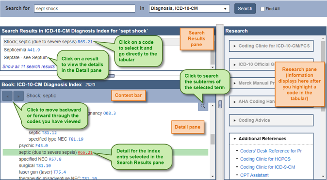
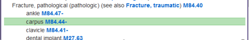
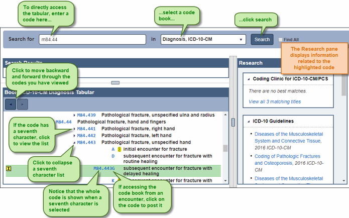

+++
title = "CodeBooks"
weight = 20
+++

The CodeBooks control is used to search for codes by terms or code. You can use the code books to locate codes and post them to encounters, or simply to view a code with its surrounding notes and codes in a code book. The following code books are included in the CodeBooks control:

- **ICD-10-CM Diagnosis and External Cause** – These books consist of an alphabetic index where you can look up terms and a tabular of codes which includes all instructional notes.
- **ICD-10-PCS Procedure** – This book consists of an alphabetic index where you can look up terms and a table where you choose the specifics of the procedure to construct the ICD-10-PCS procedure code.
- **ICD-9-CM Diagnosis, E Code, and Procedure** – These books consist of an alphabetic index where you can look up terms and a tabular of codes including all instructional notes.
- **CPT and HCPCS** – In these books, both the index and tabular are searched simultaneously and tabular results are displayed based upon the search.

### About the Indexes

When searching a code book by terms (except for the CPT and HCPCS books), the alphabetic index is searched and appears in the control. The following elements are shown:

- **Search Results pane** – This pane displays all index entries from the alphabetic index that match the search terms.
- **Context bar** – This bar shows the alphabetic index location of the index entry selected in the Detail pane. The Context bar changes when you focus on a different entry in the Detail pane.
- **Detail pane** – This pane displays the alphabetic index for the index entry selected in the Search Results pane.

The display includes the following features:

- **Backward and forward navigation** – Click   to move back and   to move forward through the codes you have viewed.
- **Subterm search** – A subterm search searches through the subterms of a selected term. This is useful when there is a long list of subterms, you can use the subterm search rather than scrolling through the long list to find the subterm for which you are searching. 
- **Shortcuts** – Keyboard shortcuts are available for some actions in the encoder. For example, you can press Ctrl + ↑ and Ctrl + ↓to move the cursor though the fields and panes. For a complete listing for keyboard shortcuts, see Keyboard Shortcuts on page 23.
- **Find All search** – A Find All search looks for terms outside of the structure of the index. The search results display all occurrences of the terms in the code book that is searched. See Searching for All Occurrences of a Term on page 22 for more information.
- **Table search** – You can search the Hypertension table, Neoplasm table, and the Table of Drugs and Chemicals. 
  - Hypertension table – In the ICD-9-CM diagnosis code book, this table lists diseases due to hypertension.
  - Neoplasm table – In the ICD-9-CM and ICD-10-CM diagnosis code books, this table lists anatomical sites alphabetically, with columns to indicate the code for each behavior type, such as primary, secondary, benign, etc.
  - Table of Drugs and Chemicals – In the ICD-9-CM and ICD-10-CM diagnosis code books, this table contains a classification of drugs and chemicals to identify poisoning states and external causes of adverse effects.
- **See and See Also cross-references** – The indexes include See and See also instructions which are cross-references to other areas of the index.
- **Synonym search** – Synonyms are acronyms, abbreviations and shortcuts you can use to search the alphabetic index. Performing a search using a Synonym is the same as a search using terms. The Synonyms list contains a list of Synonyms that can be used in a search.
- **Custom index lines** – Custom index lines are alphabetic index entries that have been added to the official ICD-9-CM indexes. These entries are noted with the   symbol before the alphabetic index line.

> [!note] 
> The source of the custom index line is noted in parentheses. 

- **E code search** – The E code index (external cause of injury index) functions the same as the other indexes. Like the other indexes, you access it from the code book drop-down list. Within the structure of ICD-9-CM and ICD-10-CM, there are many E codes with subterms of one or two words, such as by, with, due to, and from. You do not need to enter such terms in the encoder search.

> [!note]
> ICD-10-CM external cause of morbidity codes do not begin with an *E*. They begin with the characters *V, W,* and *X*.

- ** -  icon** – In the ICD-10-CM index, a - follows codes that require additional characters. To view the additional characters, click on the code to proceed to the tabular.

## About the Tabulars

The tabulars include all instructional notes, such as Includes, Excludes, Chapter, and Category notes. Codes included in the instructional notes, as well as in the tabular, are links that can be accessed.

The tabulars include the following features:

- **Instructional notes** – If a code has an instructional note, the   symbol appears to the left of the code when the code is highlighted. Instructional notes contain Includes, Excludes, and Notes from the chapter, section, and category levels.  To view the note, click on the   symbol
- <i class="fa-solid fa-arrow-left"></i> and <i class="fa-solid fa-arrow-right"></i> – Click to move backward and forward through the codes you have viewed or move back to the index.
- **Crosswalk** – Crosswalk is a mapping between ICD-9-CM procedure codes and associated CPT codes. Using crosswalk you can gather ICD-9-CM and CPT codes simultaneously. For information on using crosswalk, see Using Crosswalk on page 31.
- **Anesthesia Crosswalk** – Anesthesia Crosswalk is a mapping between CPT surgical codes and CPT anesthesia codes. Using anesthesia crosswalk you can gather CPT surgical and anesthesia codes simultaneously. For more information on using anesthesia, see Using Anesthesia Crosswalk on page 32.
- **Symbols** – Symbols are used in the tabular to provide additional information. For most symbols, when you rest your mouse pointer on it, a description of the symbol appears.
- **<i class="fa-solid fa-caret-down"></i>** - In the ICD-10-CM tabulars, click <i class="fa-solid fa-caret-down"></i>  following a code to expand the seventh character list, or click   following a code to collapse the seventh character list.
- **HCCs** – Category numbers (example,  ) for Hierarchical Condition Categories (HCCs) are shown by ICD-10-CM codes that are part of the HCC model. HCCs are used to risk-adjust population data for Medicare Managed Care programs. CMS is using two versions of the HCC model, versions 24 and 28. Both versions are in use and appear in the tabular until version 28 is fully implemented in 2026. You can view HCC details and the HCC version by resting your mouse pointer on a category number.
- **Shortcuts** – [Keyboard shortcuts](http://localhost:1313/fusion-cac-web-docs/trucode-user-guide/codebooks/#keyboard-shortcuts) are available for some actions in the code books. For example:
    - In the ICD-10-CM tabular, you can press the right → key to expand the seventh character list and the ← key to collapse the list.
    - Press Ctrl + ↓ to move forwards or press Ctrl + ↑ to move backward through the panes and resizers, and place the focus as appropriate.
- **Research pane** – The Research pane displays information about the selected code. 

## Keyboard Shortcuts

The following shortcuts can be used in the CodeBooks control:

|Shortcut|Location|Description|
|--------|--------|-----------|
|←  →    |ICD-10-CM Tabulars|With the focus on a code with a seventh character, press to expand or collapse the seventh character list.|
|←  →    |ICD-10-PCS index|Press to move between term and code in a see or see also note. Press Enter to then move to the new index location or the table.|
|←  →    |ICD-10-PCS table|Press to move between the columns in the table.|
|←  →    |ICD-9-CM and ICD-10-CM indexes|With the focus on a row in the Neoplasm table, Hypertension table, or Table of Drugs and Chemicals; press to move through the columns.|
|←  →    |Vertical splitter bar|With the focus on the splitter bar, press to resize the panes. Press Enter to confirm the new size.|
|↑ ↓     |Indexes and tabulars|Press to move backwards or forwards through the panes and resizers.| 
|↑ ↓     |ICD-10-PCS table|Press to move up and down through the items in a column.|
|↑ ↓     |Horizontal splitter bar|With the focus on the splitter bar, press to resize the panes. Press Enter to confirm the new size.|
|Ctrl + ↑, Ctrl + ↓|Indexes and tabulars|Press to move backwards or forwards through the panes and resizers.|
|F       |ICD-9 or ICD-10 index|Press to start a subterm search.|
|Esc|Subterm search field|Press to hide the subterm search field.|
|Backspace|ICD-10-PCS table|Press to move back a column.|
|Designated Key|ICD-10-PCS table|Press the letter or number key for the item in the highlighted column that you would like to select.|
|Enter|Indexes and tabulars|With the focus in the search bar, press to perform a search.|
|Enter|Tabulars|Press to post the highlighted code.|
|Enter|ICD-10-PCS table|Press to select the highlighted item in a column and move to the next column, or to post a completed code.|
|Enter|Splitter bar|When resizing a pane using keyboard shortcuts, press to confirm the change.|

|Icon|Location|Description|
|----|--------|-----------|
||All tabulars|Click to access Instructional Note|
||All tabulars|New code|
||All tabulars|Modified code|
||All tabulars|Modified note|
||ICD Diagnosis tabulars|Major Complication / Comorbid Condition|
||ICD Diagnosis tabulars|Complication / Comorbid Condition|
||ICD Diagnosis tabulars|Major Complication / Comorbid Condition, Patient Discharged Alive|
||ICD-10 Diagnosis tabular|Hierarchical Condition Category (HCC)|
|    |ICD-10-CM tabular|Access the seventh character of a code (click the **<i class="fa-solid fa-caret-down"></i>** to expand or collapse the list)|