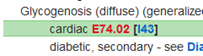

+++
title = "CodeBooks"
weight = 20
+++

The CodeBooks control is used to search for codes by terms or code. You can use the code books to locate codes and post them to encounters, or simply to view a code with its surrounding notes and codes in a code book. The following code books are included in the CodeBooks control:

- **ICD-10-CM Diagnosis and External Cause** – These books consist of an alphabetic index where you can look up terms and a tabular of codes which includes all instructional notes.
- **ICD-10-PCS Procedure** – This book consists of an alphabetic index where you can look up terms and a table where you choose the specifics of the procedure to construct the ICD-10-PCS procedure code.
- **ICD-9-CM Diagnosis, E Code, and Procedure** – These books consist of an alphabetic index where you can look up terms and a tabular of codes including all instructional notes.
- **CPT and HCPCS** – In these books, both the index and tabular are searched simultaneously and tabular results are displayed based upon the search.

### About the Indexes

When searching a code book by terms (except for the CPT and HCPCS books), the alphabetic index is searched and appears in the control. The following elements are shown:

- **Search Results pane** – This pane displays all index entries from the alphabetic index that match the search terms.
- **Context bar** – This bar shows the alphabetic index location of the index entry selected in the Detail pane. The Context bar changes when you focus on a different entry in the Detail pane.
- **Detail pane** – This pane displays the alphabetic index for the index entry selected in the Search Results pane.

The display includes the following features:

- **Backward and forward navigation** – Click   to move back and   to move forward through the codes you have viewed.
- **Subterm search** – A subterm search searches through the subterms of a selected term. This is useful when there is a long list of subterms, you can use the subterm search rather than scrolling through the long list to find the subterm for which you are searching. 
- **Shortcuts** – Keyboard shortcuts are available for some actions in the encoder. For example, you can press Ctrl + ↑ and Ctrl + ↓ to move the cursor though the fields and panes. For a complete listing for keyboard shortcuts, see Keyboard Shortcuts on page 23.
- **Find All search** – A Find All search looks for terms outside of the structure of the index. The search results display all occurrences of the terms in the code book that is searched. See Searching for All Occurrences of a Term on page 22 for more information.
- **Table search** – You can search the Hypertension table, Neoplasm table, and the Table of Drugs and Chemicals. 
  - Hypertension table – In the ICD-9-CM diagnosis code book, this table lists diseases due to hypertension.
  - Neoplasm table – In the ICD-9-CM and ICD-10-CM diagnosis code books, this table lists anatomical sites alphabetically, with columns to indicate the code for each behavior type, such as primary, secondary, benign, etc.
  - Table of Drugs and Chemicals – In the ICD-9-CM and ICD-10-CM diagnosis code books, this table contains a classification of drugs and chemicals to identify poisoning states and external causes of adverse effects.
- **See and See Also cross-references** – The indexes include See and See also instructions which are cross-references to other areas of the index.
- **Synonym search** – Synonyms are acronyms, abbreviations and shortcuts you can use to search the alphabetic index. Performing a search using a Synonym is the same as a search using terms. The Synonyms list contains a list of Synonyms that can be used in a search.
- **Custom index lines** – Custom index lines are alphabetic index entries that have been added to the official ICD-9-CM indexes. These entries are noted with the   symbol before the alphabetic index line.

> [!note] 
> The source of the custom index line is noted in parentheses. 

- **E code search** – The E code index (external cause of injury index) functions the same as the other indexes. Like the other indexes, you access it from the code book drop-down list. Within the structure of ICD-9-CM and ICD-10-CM, there are many E codes with subterms of one or two words, such as by, with, due to, and from. You do not need to enter such terms in the encoder search.

> [!note]
> ICD-10-CM external cause of morbidity codes do not begin with an *E*. They begin with the characters *V, W,* and *X*.

- ** -  icon** – In the ICD-10-CM index, a - follows codes that require additional characters. To view the additional characters, click on the code to proceed to the tabular.

### About the Tabulars

The tabulars include all instructional notes, such as Includes, Excludes, Chapter, and Category notes. Codes included in the instructional notes, as well as in the tabular, are links that can be accessed.

The tabulars include the following features:

- **Instructional notes** – If a code has an instructional note, the   symbol appears to the left of the code when the code is highlighted. Instructional notes contain Includes, Excludes, and Notes from the chapter, section, and category levels.  To view the note, click on the   symbol
- <i class="fa-solid fa-arrow-left"></i> and <i class="fa-solid fa-arrow-right"></i> – Click to move backward and forward through the codes you have viewed or move back to the index.
- **Crosswalk** – Crosswalk is a mapping between ICD-9-CM procedure codes and associated CPT codes. Using crosswalk you can gather ICD-9-CM and CPT codes simultaneously. For information on using crosswalk, see Using Crosswalk on page 31.
- **Anesthesia Crosswalk** – Anesthesia Crosswalk is a mapping between CPT surgical codes and CPT anesthesia codes. Using anesthesia crosswalk you can gather CPT surgical and anesthesia codes simultaneously. For more information on using anesthesia, see Using Anesthesia Crosswalk on page 32.
- **Symbols** – Symbols are used in the tabular to provide additional information. For most symbols, when you rest your mouse pointer on it, a description of the symbol appears.
- **<i class="fa-solid fa-caret-down"></i>** - In the ICD-10-CM tabulars, click <i class="fa-solid fa-caret-down"></i>  following a code to expand the seventh character list, or click   following a code to collapse the seventh character list.
- **HCCs** – Category numbers (example,  ) for Hierarchical Condition Categories (HCCs) are shown by ICD-10-CM codes that are part of the HCC model. HCCs are used to risk-adjust population data for Medicare Managed Care programs. CMS is using two versions of the HCC model, versions 24 and 28. Both versions are in use and appear in the tabular until version 28 is fully implemented in 2026. You can view HCC details and the HCC version by resting your mouse pointer on a category number.
- **Shortcuts** – [Keyboard shortcuts](http://localhost:1313/fusion-cac-web-docs/trucode-user-guide/codebooks/#keyboard-shortcuts) are available for some actions in the code books. For example:
    - In the ICD-10-CM tabular, you can press the right → key to expand the seventh character list and the ← key to collapse the list.
    - Press Ctrl + ↓ to move forwards or press Ctrl + ↑ to move backward through the panes and resizers, and place the focus as appropriate.
- **Research pane** – The Research pane displays information about the selected code. 

## Keyboard Shortcuts

The following shortcuts can be used in the CodeBooks control:

|Shortcut|Location|Description|
|--------|--------|-----------|
|←  →    |ICD-10-CM Tabulars|With the focus on a code with a seventh character, press to expand or collapse the seventh character list.|
|←  →    |ICD-10-PCS index|Press to move between term and code in a see or see also note. Press Enter to then move to the new index location or the table.|
|←  →    |ICD-10-PCS table|Press to move between the columns in the table.|
|←  →    |ICD-9-CM and ICD-10-CM indexes|With the focus on a row in the Neoplasm table, Hypertension table, or Table of Drugs and Chemicals; press to move through the columns.|
|←  →    |Vertical splitter bar|With the focus on the splitter bar, press to resize the panes. Press Enter to confirm the new size.|
|↑ ↓     |Indexes and tabulars|Press to move backwards or forwards through the panes and resizers.| 
|↑ ↓     |ICD-10-PCS table|Press to move up and down through the items in a column.|
|↑ ↓     |Horizontal splitter bar|With the focus on the splitter bar, press to resize the panes. Press Enter to confirm the new size.|
|Ctrl + ↑, Ctrl + ↓|Indexes and tabulars|Press to move backwards or forwards through the panes and resizers.|
|F       |ICD-9 or ICD-10 index|Press to start a subterm search.|
|Esc|Subterm search field|Press to hide the subterm search field.|
|Backspace|ICD-10-PCS table|Press to move back a column.|
|Designated Key|ICD-10-PCS table|Press the letter or number key for the item in the highlighted column that you would like to select.|
|Enter|Indexes and tabulars|With the focus in the search bar, press to perform a search.|
|Enter|Tabulars|Press to post the highlighted code.|
|Enter|ICD-10-PCS table|Press to select the highlighted item in a column and move to the next column, or to post a completed code.|
|Enter|Splitter bar|When resizing a pane using keyboard shortcuts, press to confirm the change.|

### Searching for an ICD-10-CM Code

1. Enter a term, terms, or code in the **Search For** field

> [!Tip] 
> The terms can be shortened to the first 3 or 4 letters and can be entered in any order. For a code, enter as little as the first 3 digits. 
>
> There are many E codes with subterms of 1 or 2 words (**by, with, due, to, from, etc.**). These terms do not need to be entered in the search.

2. Choose the **Diagnosis**, **ICD-10-CM** or **External Cause**, **ICD-10-CM** code book from the code book list. 
3. Click **Search** to view the search results. The Search Results pane displays the results. Several results may be shown due to the search terms being found in multiple places in the alphabetic index.

>[!Note]
>If you searched by a code you are taken directly to the tabular

4. If there are additional secondary results that you want to view, click the Show all x search results link

>[!Tip]
>The first results are the best results based upon the search terms uses. The secondary results are particularly helpful when you are unsure of the terms to enter for a disease.

5. To view the detail for a term in the **Search Results** pane, click on it

6. If a cross-reference (see or see also note) is listed and you want to view it, click the link to view the related term.

>[!Tip]
>For conditions that involve more than one code, the additional codes are listed in brackets. To view the first code in the tabular, press **Enter**. Then press **Enter** again to view the second code in the tabular. If there is a third code, press **Enter** again to view the third code. When you press **Enter** one more time, the codes are posted.
>

7.	To select a code and open the tabular, click on the code in either the **Search Results** or the **Detail** pane.

>[!Note]
>ICD-10-CM external cause of morbidity codes do not begin with an **E**. They begin with the characters **V,W,** or **X**.

8.	In the tabular, check any instructional notes. To do so, click on the symbol to the left of the code to open the instructional notes.

9.	Perform any needed research.

10.	The code may require a seventh character, a character that provides additional information about the diagnosis and the encounter. If this is the case, a   appears to the left of the code. Do the following to select the seventh character for the code:
    -	Click to expand the list of seventh characters.
    >[!Tip]
    >To expand a list of 7th characters, click the arrow to the left of the code, or when the code for which you want to view the 7th characters is highlighted, press the right arrow key.

    >[!Note]
    >Some codes that require a 7th character do not contain six characters. When that is the case, an **X** fills and missing characters. 

    - Locate the applicable 7th character for the code
    

11.	If the code book was accessed from an encounter, click on a code to post it

>[!Tip]
>When the code is highlighted, you can press **Enter** to post the code.

### Searching for an ICD-10-PCS Procedure Code

1.	Enter the term, terms, or code in the Search for field. 

>[!Tip]
>Multiple terms can be entered in the **Search for** field. Terms can be shortened and entered in any order. For a code, you can enter as little as the first digit of the code. 

2.	Choose the Procedure, ICD-10-PCS code book from the code book list. 

>[!Tip]
>With the focus on the code book list, you can press the down arrow to scroll through the list of books.

3.	Click **Search** or press **Enter** to view the search results. The **Search Results** pane displays the results. Several results may be shown due to the search terms being found in multiple places in the alphabetic index.

>[!Note]
>If you search by a code, you are taken directly to the ICD-10-PCS table. If your search could be the start of either a code *or* a term, search results appear for both the partial code match and the index entries. 
>

4.	If there are additional secondary results that you want to view, click the **Show all** *x* **search results** link. 

>[!Tip]
>The first results are the best results based upon the search terms used. The secondary results are particularly helpful when you are unsure of the terms to enter.

5.	To view the detail for an index entry in the **Search Results** pane, click on it.
6.	If a cross-reference (**see** or **see also** note) is listed and you want to view it, click the link to view the related term.
7.	To select a code and open the ICD-10-PCS table, click on the code in either the **Search Results** or the **Detail** pane.
8.	Perform any needed research. 

9.	In the Body Part column of the ICD-10-PCS table, verify that the correct body part on which the procedure was performed is selected. If needed, click on a different body part. 

>[!Tip]
>Notice that the beginning of the code, the part selected in the index, appears in the **Search Results** pane.

10. In the **Approach** column, the procedure approaches for the selected body part, if any, are now listed. 

>[!Note]
>The column headings may be different than the ones listed in this example, depending upon the procedure.

11. Choose an approach. 
    -  In the **Device** column, the devices for the selected approach, if any, are now listed. 

>[!Tip]
>To make changes to the **Section, Body System,** or **Operation** dor the code click the back arrow in the **Body Part** column heading or with the **Body Part** column selected, press the left arrow key. To move back to the last four columns in the table, click on the forward arrow in the **Body Part** column heading or with the **Body Part** column selected, press the right arrow key.

12. Choose a device.
    - In the **Qualifier** column, the qualifiers for the procedure, if any, are now listed.

13. Choose a qualifier. 
14. When you are finished selecting the aspects of the code, press **Enter**, or click **Add Code** in the **Code Description** pane or the 7th character column to post the code. 

###  Searching for a CPT or HCPCS Code

The CPT and HCPCS index search uses both the index and tabular books simultaneously and displays tabular results based upon that search.

1. Enter terms or a code in the **Search for** field

>[!Tip]
>The terms can be shortened to the first 3 or 4 letters and can be entered in any order. For a code, you can enter as little as the first two digits of the code.

2. Choose the **CPT Tabular** or **HCPCS Tabular** from the list of code books.

>[!Tip]
>You can tab to the code book field and press **C** to select the CPT tabular or **H** to select the HCPCS tabular. 

3. If you want anesthesia codes to be included in the search results, click the **Include Anesthesia Codes** check box.
4. Click **Search** to view the search results in the **Search Results** pane. The best matches are listed first.

>[!Tip]
>The first results are the best results based upon the search terms used. The secondary results are particularly helpful when you are unsure of the terms to enter for a disease. 

5. To view the CPT and HCPCS modifiers with long descriptions, click the **Modifiers** link.
   

6.	Check any instructional notes. To do so, click on the symbol to the left of the code.

7.	Perform any needed research. If there are additional crosswalk results and you want to view them:
     - Click the **View all crosswalk results** link in the **Crosswalk** section of the **Research** pane to view all crosswalk results.
     - To view a code in the tabular, click on it.

     - If you accessed the code book from an encounter, press **Enter** to post both the CPT code and the ICD-9-CM procedure code.

1. If you accessed the code book from an encounter, click on a code to post it. 

>[!Tip]
>When the code you want to add is highlighted, you can press **Enter** to post it.

### Searching the Neoplasm, Drug, or Hypertension Table

1.	To access a table, do one of the following:
     - To access the Neoplasm table, enter the term Neoplasm or a shortened version of neoplasm, such as Neop, and the site of the neoplasm in the Search for field. 
     - To access the Table of Drugs and Chemicals, enter the term Table and the drug name or partial name in the Search for field.
     - To access the Hypertension table, enter the term hypertension or htn and a term in the Search for field. 

>[!Note]
>The Hypertension table is only in the ICD-9-CM Diagnosis code book

2.	Select **Diagnosis**, **ICD-9-CM** or **Diagnosis**, **ICD-10-CM** from the code book list.
3.	Click **Search** to view the search results.
4.	If there are additional secondary results that you want to view, click the **Show all x search results** link.

>[!Tip]
>The first results are the best results based upon the search terms used. The secondary results are particularly helpful when you are unsure of the terms to enter.

5.	To view the detail for a term in the **Search Results** pane, click on it.

>[!Tip]
>If you scroll through a table, the column headers follow so you always see the description of the columns.

6.	To move through the columns, press → or ← key. The selected code is red.
7. If a cross-reference (**see** or **see also** note) is listed and you want to view it, click the link to view the related term.

>[!Tip]
>In the ICD-9-CM Table of Drugs and Chemicals, when appropriate, the poisoning code is highlighted in red as well as the external cause code. This indicates that both of the codes are required to fully code the condition. When you press Enter both of these codes are posted. Note that this does not apply to the ICD-10-CM Table of Drugs and Chemicals; only a single code is needed to fully identify both the agent and the circumstances.
>

8.	To select a code and open the tabular, click on the code in either the **Search Results** or the detail pane.
9.	In the tabular, check any instructional notes. To do so, click on the symbol to the left of the code to open the instructional notes.

10.	Perform any needed research. 
11.	If you accessed the code book from an encounter, click on a code to post it.

### Searching for All Occurrences of a Term

The Find All search provides the ability to search for terms outside of the structure of the ICD-9-CM or ICD-10-CM /PCS index. The search results display all occurrences of the terms in the code book that is searched, no matter where in the code book the terms are found.

1.	Enter the term or terms in the **Search for** field.

>[!Tip]
>The term can be shortened to the first three or four letters and can be entered in any order. 

2.	If you need to change code books, select the book from the list.
3.	Click the **Find All** check box to select it.
4.	Click **Search** to view the search results. In the Search Results pane, all index entries containing the terms are shown.

>[!Note]
>Find All remains active until you remove the check from the Find All check box.

5.	If there are additional secondary results that you want to view, click the Show all x search results link. 

>[!Tip]
>The first results are the best results based upon the search terms used. The secondary results are particularly helpful when you are unsure of the terms to enter.

6.	Proceed with your search as usual. See the steps for the specific code book you are searching for additional information. 

### Searching for a Subterm

The Subterm search provides the ability to search for the subterm of a selected term in an ICD-9-CM and ICD-10-CM/PCS index (this type of search does not apply to the CPT or HCPCS code books). The subterm search is particularly useful when a term has many subterms.

1.	Click the icon or press the **F** key.

2.	Enter the subterm in the **Search subterms** field and press **Enter** or click the up or down arrow.

3.	To continue searching for the subterm, press **Enter** or click the up or down arrow again.
4.	Click the **x** to close the subterm search.
5.	Proceed with your search as usual. See the steps for the specific code book you are searching for additional information. 

## Codebook Symbols

The following symbols appear in the CodeBooks control. For most symbols, when you rest your mouse pointer on the symbol, a description appears.

|Icon|Location|Description|
|----|--------|-----------|
||All tabulars|Click to access Instructional Note|
||All tabulars|New code|
||All tabulars|Modified code|
||All tabulars|Modified note|
||ICD Diagnosis tabulars|Major Complication / Comorbid Condition|
||ICD Diagnosis tabulars|Complication / Comorbid Condition|
||ICD Diagnosis tabulars|Major Complication / Comorbid Condition, Patient Discharged Alive|
||ICD-10 Diagnosis tabular|Hierarchical Condition Category (HCC)|
||ICD-10-CM tabular|Access the seventh character of a code (click the **<i class="fa-solid fa-caret-down"></i>** to expand or collapse the list)|
||CPT|Click to view the image|
||CPT|Code appearing out of numerical order|
||CPT|Modifier 51 exempt|
||CPT|Conscious sedation|
||CPT|Add-on code|
||CPT|Pending FDA Approval|
||CPT|Telemedicine Service|
||CPT|Proprietary Laboratory Analyses (PLA) code|
||CPT|Satisfies Category 1 Criteria|
||CPT|Code may be used for reporting audio-only services when appended with modifier 93|
||ICD indexes|Custom TruCode content (view the tooltip for details about the type of custom content)|
||ICD-10-CM index|Code has a seventh character|
||Crosswalk|Best match (most common match or major topic)|
||Crosswalk|Other match (less common match or minor topic)|