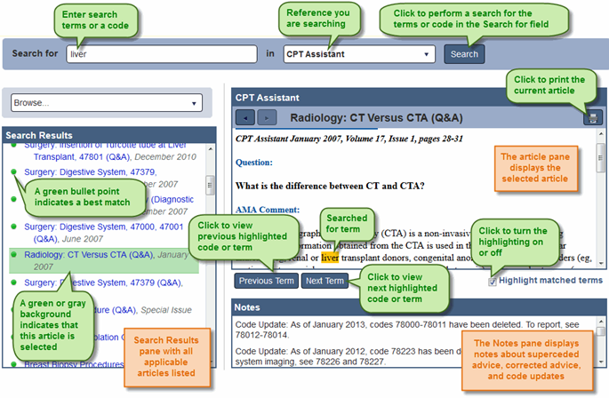
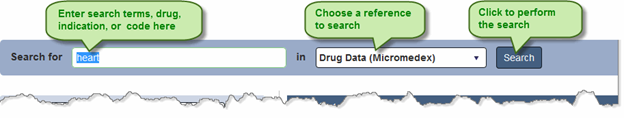
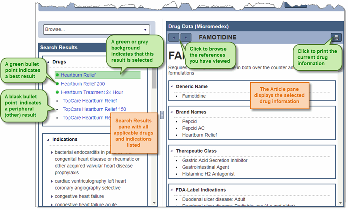
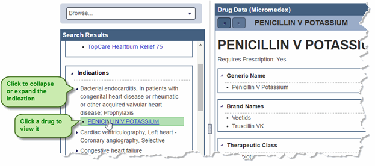
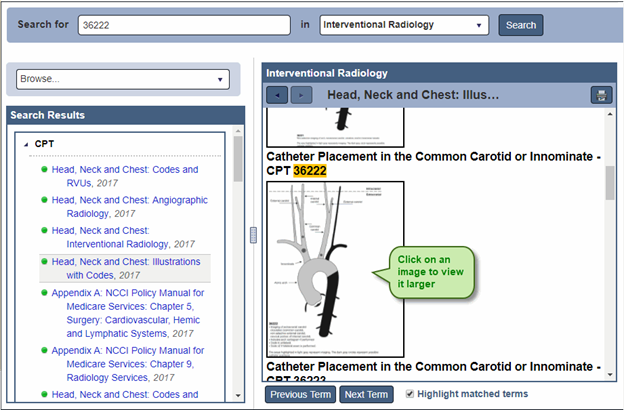
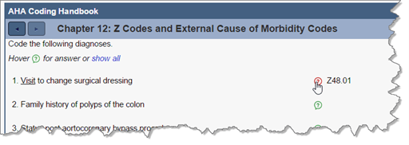
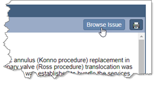
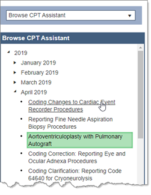
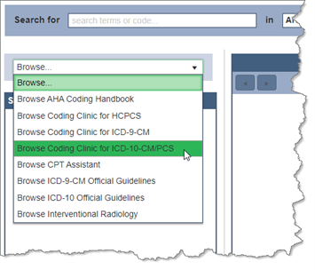
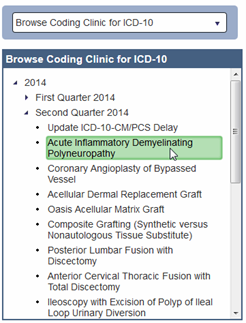

+++
title = "References"
weight = 23
+++

The References control contains the following references and features:

|Reference|Description|
|---------|-----------|
|AHA Coding Handbook|AHA ICD-10-CM and ICD-10-PCS Coding Handbook is a guide to ICD-10-CM and ICD-10-PCS coding.|
|Coders’ Desk Reference|Optum Coders’ Desk Reference for Procedures provides descriptions of CPT codes.|
|Coding Clinic|American Hospital Association (AHA) Coding Clinic for ICD-9-CM, Coding Clinic for HCPCS, and Coding Clinic for ICD-10-CM / PCS provide coding advice.|
|CPT Assistant®|AMA CPT Assistant® provides CPT and HCPCS coding guidance.|
|Drug Data (Micromedex)|Micromedex Drug Database contains brand name and generic drug information.|
|Official Guidelines|Guidelines for ICD-9-CM and ICD-10 coding approved by the cooperating parties: the American Hospital Association, the American Health Information Management Association, the Centers for Medicare and Medicaid Services, and the National Center for Health Statistics.|
|Interventional Radiology|MedLearn Interventional Radiology provides CPT and HCPCS procedure coding information.|
|Medical Dictionary (Dorland)|Dorland Illustrated Medical Dictionary contains definitions of medical terms and illustrations.
|*Search for* field|To perform a new search, enter search terms or a code in this field.|
|References list|Choose the reference you want to search from this list.|  
|Search|When you are ready to perform a search, click Search.|
|Browse reference library list|Click to choose a reference to browse in its entirety from the list.|
|Browse Issue link|Click this link to display the complete list of articles in the same issue as the currently-shown article.|
|Search Results pane|Lists the matches for your search. Click on a match to view it in the article pane.| 
||Best match results are identified with a green bullet point. A best match result is an article for which the searched-for code or term is a major topic of the article.|
||Other results are identified with a black bullet point. These results are similar to the results of a Find All search; the code or term is found in the article, but is not the major topic of the article.|
|Article pane|Pane that displays the selected article.|
|← and →|Click to move backward and forward through the articles you have viewed.|
||Click to view the next or previous term or code in the article that matches the search criteria. These buttons are active when the Highlight matched terms check box is selected.|
|Highlight matched terms check box|Remove the check from this box to view the article without highlighting the terms or code that match the search criteria. Check this box to highlight the terms or code that match the search criteria and to use the *Previous Term* and *Next Term*  buttons.|
|Notes pane|Some articles include a **Notes** pane below the article which contains information about superseded advice, corrected advice, and code updates.|

>[!Note]
>The last used reference is remembered. The next time the Reference control is visited the most recently used reference is automatically selected in the references list.

### Searching the References 

1.	From the References control, enter search terms or a code in the **Search for** field using the guidelines below:
    - For AHA Coding Handbook, Coding Clinic, CPT Assistant, Interventional Radiology, or Official Guidelines, enter terms or a code.
    - For the Drug Data reference, enter terms, drug name (generic or brand name), or an indication.
    - For the Coders’ Desk Reference, enter a CPT code.
    - For the Medical Dictionary, enter terms.

>[!Note]
>You can also access the References control from the Research control. To do so, click on an article title in the Research control, or click on a reference in the Additional References list.

2. Choose a reference from the list.

3.	Then click Search. The search results appear with the article for the first result displaying in the Article pane. 

>[!Note]
>If you opened the References control by clicking on an article title in the Research pane, the article you selected displays in the Article pane; you do not need to search for it.

4.	To view a different article, click on the article in the Search Results pane to display it in the Article pane.
5.	In Drug Data, do the following to view a drug listed in the indications:
      - Click the   next to an indication to expand it.
      - Then click on a drug name to view that drug.

6.	In Interventional Radiology, click on an image in an article to view it larger. 

7.	In the AHA Coding Handbook, you can show or hide answers to exercises:
      - To show a specific answer in the exercise, rest your moue pointer on the **?** icon for the question.
      - To show all answers for the exercise, click show all.

8.	When viewing an article in the AHA Coding Handbook, Coding Clinic, CPT Assistant, Official Guidelines, or Interventional Radiology reference, you can browse the other articles in the issue: 

      - Click Browse Issue to display the articles in the issue in the Search Results pane.
        
      - Click on an article title to view it or choose a different year and issue in the Search Results pane.
        

>[!Note]
>Browsing an issue is only available when you have searched for a code or term before selecting an article. It is not available when you are already browsing.

9.	To browse the AHA Coding Handbook, Coding Clinic, CPT Assistant, Official Guidelines, or Interventional Radiology reference:
      - Click Browse and choose a reference to browse from the list.
        
      - In the Search Results pane, click on the year for the issue you want to browse.
      - Then click on the issue you want to browse.
      - Click on an article title to view it.
        

## Reference Keyboard Shortcuts and Symbols

The following shortcuts can be used in the References control:

|Shortcut|Location|Description|
|--------|--------|-----------|
|← →     |Splitter bar|With the focus on a splitter bar, changes the size of a pane. Press Enter to confirm the size change.|
|← →     |Search Results pane|Expands or collapse Drug Data indications and issues you are browsing.|
|↑ ↓     |Search Results pane|Move up or down through the list of entries. Press Enter to view an entry in the Article pane.|
|↑ ↓     |Article pane|Move up or down through the article.|
|Enter   |Search Results pane|When the focus is on an article title in the Search Results pan, press to view the entry in the Article pane.|
|Enter   |Splitter bar|When resizing a pane using keyboard shortcuts, press to confirm the change.|
|Ctrl + ↑|References control|Press to move backwards or forwards through the panes and resizers, and place the focus as appropriate.|
|Ctrl + ↓|References control|Press to move backwards or forwards through the panes and resizers, and place the focus as appropriate.|

The following symbols appear in the References control:
|Symbol|Location|Description|
|------|--------|-----------|
||Search Results pane|Best match results are identified with a green bullet point. A best match result is an article for which the searched-for code or term is a major topic of the article.|
||Search Results pane|Other results are identified with a black bullet point. These results are similar to the results of a find all search; the code or term is found in the article, but is not the major topic of the article.|
||Article pane|Rest your mouse pointer on this icon to view an exercise answer.|