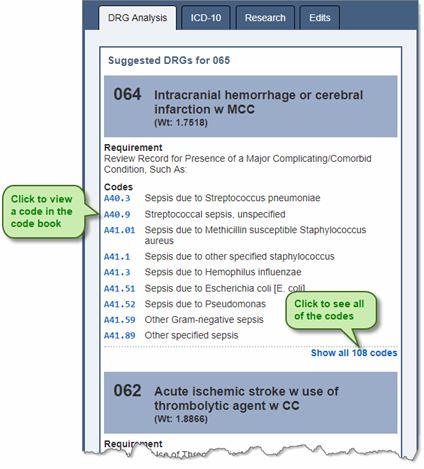
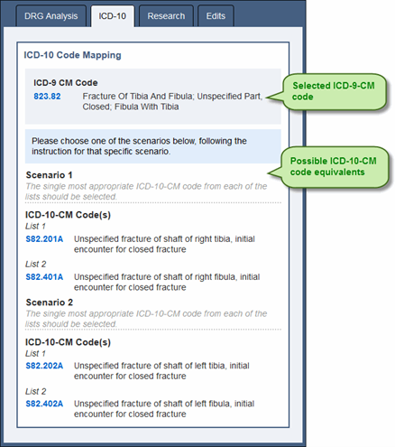
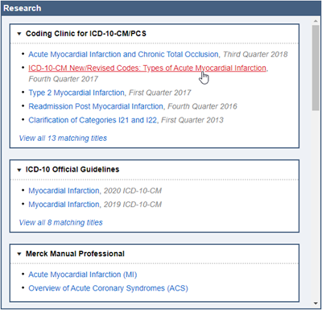
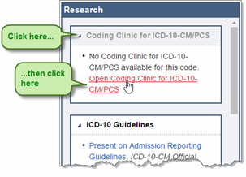
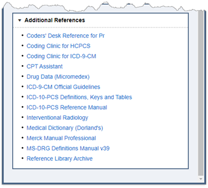
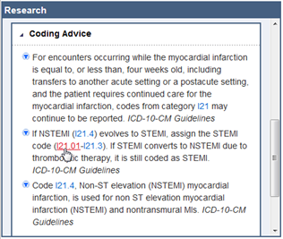
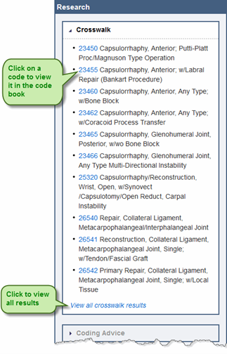
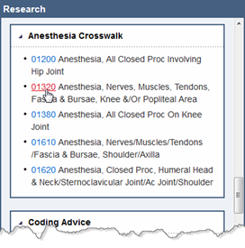
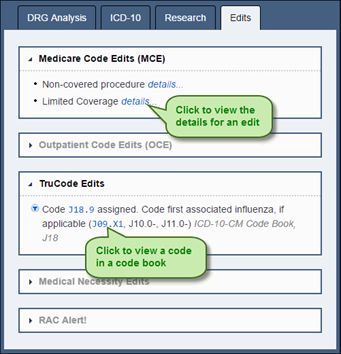
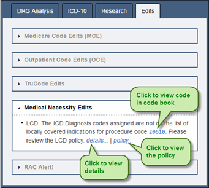

+++
title = "Research"
weight = 22
+++

The Research control consists of the following panes:

- **DRG Analysis** – This pane displays alternate DRGs based upon the current DRG, codes present in the encounter, and the patient status.
- **ICD-10** –This pane displays equivalent ICD-10-CM / PCS codes for a selected ICD-9-CM code.
- **Research** –This pane contains reference and coding information applicable to a selected code.
- **Edits** – This pane displays edits for an encounter.

### Using the DRG Analysis Pane

This tool suggests alternate DRGs based upon the current DRG, codes present in the encounter, and the patient status. The list of possible alternate DRGs includes the requirements that would need to be met and the applicable codes to add to the encounter if the documentation supports these changes. 

1. Code the encounter.
2. Click on the DRG Analysis tab.

3.	To show all of the applicable codes for the suggested DRG and requirements, click the **Show all codes...** link at the end of the **Codes** list.
4.	If you want to view more information about a code, click on the code to view it in the code book.

### Using the ICD-10 Pane

The **ICD-10** pane displays equivalent ICD-10-CM / PCS codes for a selected ICD-9-CM code, and equivalent ICD-9-CM codes for a selected ICD-10-CM / PCS code. ICD-10-CM / PCS will replace ICD-9-CM under CMS mandate; to help you familiarize yourself with the new ICD-10 codes, you can view code equivalents in the **ICD-10** pane. Because of the differences in the ICD-9 and ICD-10 classifications, there are only a few instances where a one-to-one code match occurs.  There are also times when there is no code equivalent, and sometimes there is a choice of one of many codes, or one of many of several groups of codes. Read the instructions provided in each message in the **ICD-10** pane for detailed information.

1.	Click on a code in an encounter to select it.
2.	Click on the **ICD-10** tab to display equivalent codes for the selected code.

*Example of ICD-10-CM / PCS equivalents for a selected ICD-9-CM code:*

### Using the Research Pane

The Research pane contains information applicable to the selected code. The following information is shown in the Research pane as applicable:

- **AHA Coding Handbook** – AHA ICD-10-CM and ICD-10-PCS Coding Handbook is a guide to ICD-10-CM and ICD-10-PCS coding.
- **Anesthesia Crosswalk** – Anesthesia Crosswalk is a mapping between surgical CPT and HCPCS codes and anesthesia CPT and HCPCS codes. Using anesthesia crosswalk you can gather surgical and anesthesia CPT or HCPCS codes simultaneously.
- **Coders’ Desk Reference** – Optum Coders’ Desk Reference for Procedures provides descriptions of CPT codes.
- **Coding Advice** – Coding Advice is additional coding instructions, authored by TruCode and based on official sources. 
- **Coding Clinic** – American Hospital Association (AHA) Coding Clinic for ICD-9-CM, Coding Clinic for HCPCS, and Coding Clinic for ICD-10-CM / PCS provide coding advice. The articles related to the selected code appear in reverse chronological order.
- **CPT Assistant®** – American Medical Association (AMA) CPT Assistant® provides CPT and HCPCS coding guidance. The articles related to the selected code appear in reverse chronological order. 
- **Crosswalk** – Crosswalk is a mapping between ICD-9-CM procedure codes and associated CPT codes. Using crosswalk you can gather ICD-9-CM and CPT codes simultaneously.
- **Interventional Radiology** – MedLearn Interventional Radiology provides CPT and HCPCS procedure coding information. The articles related to the selected CPT or HCPCS code are shown. The articles related to the selected code appear in reverse chronological order.
- **Official Guidelines** – Guidelines for ICD-9-CM and ICD-10-CM coding approved by the cooperating parties: the American Hospital Association, the American Health Information Management Association, the Centers for Medicare and Medicaid Services, and the National Center for Health Statistics. The articles related to the selected code appear in reverse chronological order.
- **Merck Manual Professional** – Merck Manual Professional provides detailed information to enhance ICD-10-CM and ICD-9-CM coding, including descriptions, etiologies, classifications, signs and symptoms, diagnoses, prognoses, and treatment information. The material is presented in articles, tables, videos, audio, 3D models, calculators, images, lab tests, and sidebars.

>[!Note]
>Merck Manual Professional opens in the Merck manuals web site.

- **Additional References** – Other references, such as Dorland Medical Dictionary and Micromedex Drug Data. Also, references that do not pertain to the selected code appear here. For example, when an ICD-10-CM code is selected, Coders’ Desk Reference, Coding Clinic for HCPCS, Coding Clinic for ICD-9-CM, CPT Assistant, ICD-9-CM Official Guidelines, and Interventional Radiology appear in the additional references since they do not pertain to an ICD-10-CM code. 

### Using the References in the Research Pane

1. In the **Research** pane, review any reference information that appears for a code. 
2. To read an article, click on the title to open the References control. 

>[!Note]
>Merck Manual Professional opens in the Merck manuals web site.

3. To view a reference that contains no articles for the selected code (greyed out reference), expand the reference and click the link to open the References control.

4.	To view other reference information, click on the title of the reference in the **Additional References** section to open the References control and access the reference.

>[!Note]
>The ICD-10-PCS Definitions, Keys and Tables and ICD-10-PCS Reference Manual are PDF files and open in a browser window rather than in the References control. The MS-DRG Definitions Manuals, Merck Manual Professional, and Reference Library Archive link to websites and also open in your browser.

### Using Coding Advice

1.	In the Research pane, review the advice in the Coding Advice section. This advice pertains to the selected code in the code book or an encounter.
2.	If the advice includes links to codes, click on the code to view it in the code book.

3.	From the code book, press Enter to post the code.

### Using Crosswalk

1.	With a CPT code or an ICD-9-CM procedure code highlighted in the code book or in an encounter, notice that any potential code matches appear in the Crosswalk section of the Research pane.

*Crosswalk for an ICD-9-CM procedure code:*

2.	Click on a code in the **Crosswalk** section of the **Research** pane to view that code in the tabular. If you accessed the code book from an encounter, press **Enter** to post both the CPT code and the 
ICD-9-CM procedure code.
3.	If there are additional crosswalk results and you want to view them, click the **View all crosswalk results** link in the **Crosswalk** section of the **Research** pane to view all of the crosswalk results. 

### Using Anesthesia Crosswalk

If a surgical CPT code has potential corresponding anesthesia CPT codes, the codes appear in the **Anesthesia Crosswalk** section of the **Research** pane.

1.	With a CPT code highlighted in the code book or in an encounter, notice that any potential anesthesia CPT code matches appear in the **Anesthesia Crosswalk** section of the **Research** pane.
2.	Click on a code in the **Anesthesia Crosswalk** section of the **Research** pane to view that code in the code book. If you accessed the encoder from an encounter, press **Enter** to post both the surgical CPT code and the anesthesia CPT code.

### Using the Edits Pane

Edits for an encounter are shown on the Edits pane and are separated into the following categories:

- **Medicare code edits** – These edits are developed by CMS for inpatient encounters.
- **Outpatient code edits** – These edits are developed by CMS for outpatient encounters. Either the Outpatient Prospective Payment System (OPPS) or non-OPPS version of the Outpatient Code Editor (OCE) is used to generate these edits. By default the OPPS edits display here. 
- **TruCode edits** – These edits include proprietary edits developed by TruCode as well as edits provided by regulatory and other agencies. 
- **Medical Necessity Edits** – These are LCD / NCD (Local Coverage Determination and National Coverage Determination) edits. 
- **RAC Alert!** – Information appears here to alert you that a CMS approved audit issue, in your facility’s recovery audit contractor (RAC) region, has been identified on the patient record. The RAC information shown is based on the facility MPN. The following types of CMS approved RAC targets are included:
  - DRG validation
  - HCPCS code vulnerability
  - Inpatient medical necessity
As the RACs expand their targets, the RAC targets will be updated accordingly. 

- Validation – These are edits related to the general validity of field values in the encounter. This includes edits for invalid and out-of-range numbers and dates.

The following information is included for each edit:
- Edit message – A brief description of the edit.
- Source – For TruCode edits, the official source of the edit is listed, such as Coding Clinic, the CPT book, etc.
- Details link – When clicked, additional information about the edit is shown.

1.	Click on the Edits tab to view the edits for the encounter.
2.	To view edit details, click the details link.
3.	To view a code in the code book, click a code link in an edit message.

If the encounter has Medical Necessity Edits, you can also view the policy by clicking the policy link.

## Research Keyboard Shortcuts and Symbols

The following shortcuts can be used in the Research control:

|Shortcut|Location|Description|
|--------|--------|-----------|
|← →     |Tabs of Research control|When the focus is on the tabs, press to switch between the tabs (**DRG Analysis, ICD-10, Research,** and **Edits**).|
|Enter   |Research pane|Press to collapse or expand a section.|
|↑ ↓     |Research pane|Press to move between sections.|

The following symbols appear in the Research control:

|Shortcut|Location|Description|
|--------|--------|-----------|
||Edits|Recovery audit contractor (RAC) region alert|
||Coding Advice, Edits|Custom coding advice or custom edit|